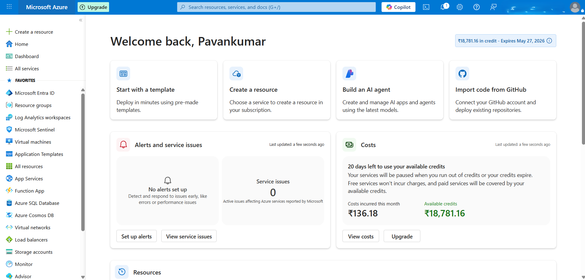
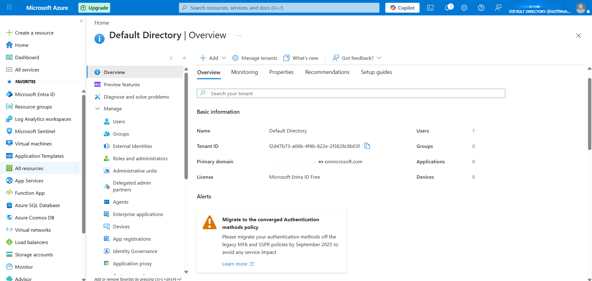
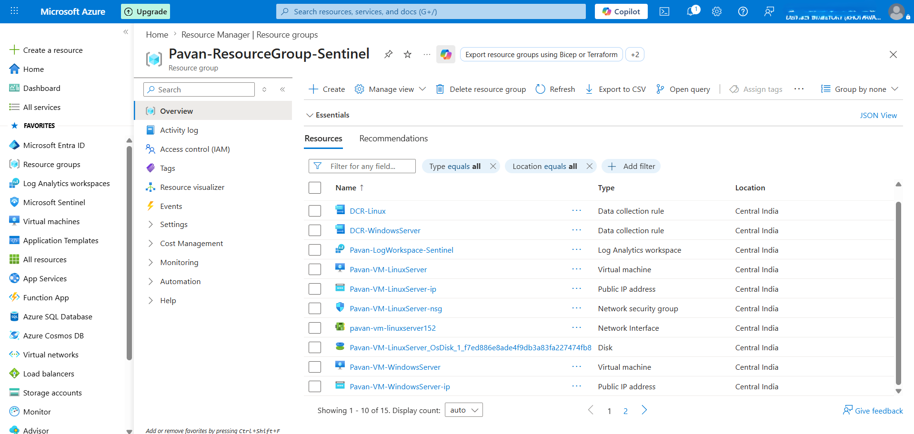

# Azure Environment Setup

## 🎯 Objective
To establish a secure and well-structured Azure environment for building a SOC lab, with proper identity management and resource organization.

---

## 🛠️ Steps Performed

### 1. Azure Account Setup
- Created a Microsoft Azure account using the free trial subscription
- Verified billing and subscription access
  

### 2. Identity Configuration (Microsoft Entra ID)
- Accessed Microsoft Entra ID (formerly Azure Active Directory)
- Reviewed tenant details and default directory configuration
- Explored user and role management features
- Understood role-based access control (RBAC) for secure administration

### 3. Resource Group Creation
- Created a dedicated Resource Group for the SOC lab
- Selected appropriate region based on availability and latency
- Used naming conventions for better resource management

---

## ⚙️ Configuration Details

- Resource Group Name: Pavan-ResourceGroup-Sentinel
- Region: Central India
- Subscription: Azure Free Trial
- Tenant: Default Directory (Microsoft Entra ID)

---

## 🗺️ Resource Visualizer

The following diagram represents the logical structure of resources within the Azure environment, as generated from the Azure Resource Visualizer.

It provides a clear view of how resources are organized and connected within the Resource Group.

---

## 🔐 Security Considerations

- Ensured least privilege access using RBAC principles
- Avoided using owner-level permissions unnecessarily
- Planned logical separation of resources using Resource Groups
- Prepared environment for secure log collection and monitoring

---

## ✅ Outcome
Successfully established a structured Azure environment with identity management and resource organization, forming the foundation for SOC lab deployment.

---

## 🧠 Learnings

- Importance of identity and access management in cloud security
- Role of Microsoft Entra ID in authentication and authorization
- Resource Groups help in organizing and managing cloud assets efficiently
- Proper setup is critical for scalable monitoring and security operations

---

## 🔗 Next Step
Proceeding to configure Microsoft Sentinel to establish a centralized monitoring and SIEM capability.
