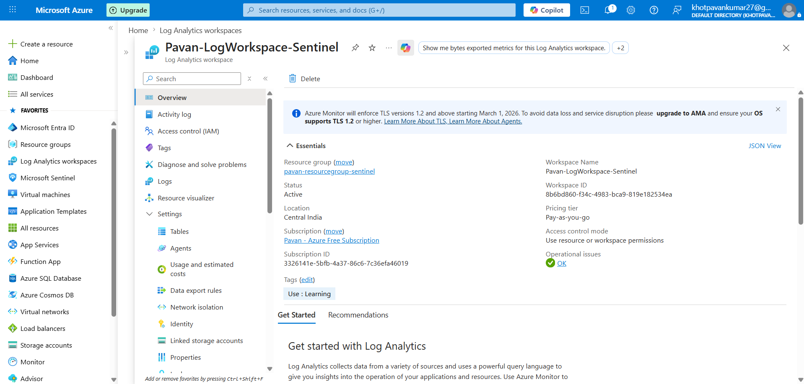
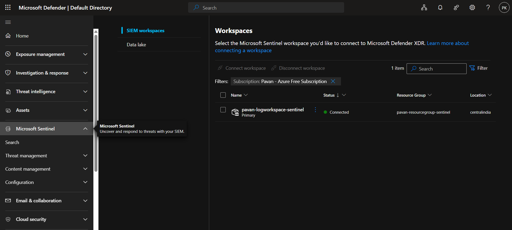
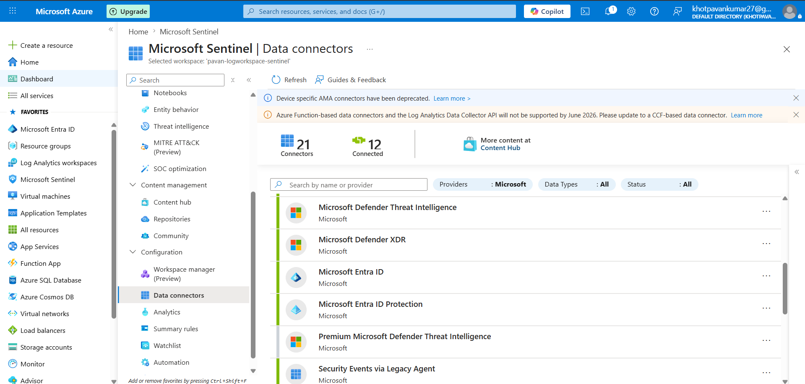

# Microsoft Sentinel Configuration

## 🎯 Objective
To deploy and configure Microsoft Sentinel as a SIEM platform for centralized log collection, monitoring, and threat detection.

---

## 🛠️ Steps Performed

### 1. Log Analytics Workspace Creation
- Created a Log Analytics Workspace to store and analyze security logs
- Ensured it is aligned with the existing Resource Group

### 2. Microsoft Sentinel Enablement & Configuration

- Enabled Microsoft Sentinel on the Log Analytics Workspace to activate SIEM capabilities
- Verified successful onboarding of the workspace into Sentinel

- **Configuration Performed**
  - Explored general settings of Microsoft Sentinel
  - Reviewed workspace configuration and linkage
  - Verified that the environment is ready for data ingestion

- **Feature Exploration**
  - Data Connectors – identified available sources for log ingestion
  - Analytics – reviewed rule templates (no rules deployed yet)
  - Incidents – observed incident management interface (no incidents generated yet)
  - Workbooks – explored built-in dashboards for future visualization

- **Understanding SIEM Architecture**
  - Log Analytics Workspace acts as the central log storage
  - Microsoft Sentinel sits on top of the workspace for monitoring and analysis
  - Detection and alerting depend on incoming data from connected sources

- **Security Considerations**
  - Reviewed role-based access control (RBAC) for Sentinel operations
  - Understood importance of controlled access to security data
  - Recognized need for proper data retention planning

- **Key Observation**
  - No logs are ingested at this stage
  - No alerts or incidents are generated yet
  - Detection capabilities will be implemented after connecting data sources
 

 
### 3. Initial Exploration
- Navigated through Sentinel dashboard
- Reviewed sections like:
  - Data Connectors
  - Analytics
  - Incidents
  - Workbooks

---

## ⚙️ Configuration Details

- Workspace Name: Pavan-LogWorkspace-Sentinel
- Region: Central India
- Resource Group: Pavan-ResourceGroup-Sentinel

---

## 🧠 Key Concepts

- Microsoft Sentinel is a **cloud-native SIEM**
- Log Analytics Workspace acts as the **data storage layer**
- Sentinel provides:
  - Threat detection
  - Log analysis
  - Incident management

---

## 🔌 Data Connectors Overview

- Explored available connectors
- Identified Windows Security Events as primary data source (to be configured in next phase)

---

## ✅ Outcome
Successfully deployed Microsoft Sentinel and prepared the environment for ingesting security logs.

---

## 🔐 Security Perspective

- Centralized logging is essential for SOC visibility
- Without log ingestion, detection is not possible
- Sentinel enables proactive threat monitoring

---

## 🔗 Next Step
Proceeding to configure data connectors to enable log ingestion into Microsoft Sentinel.
