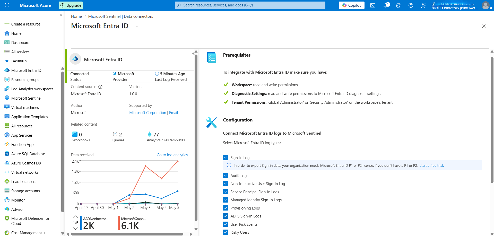
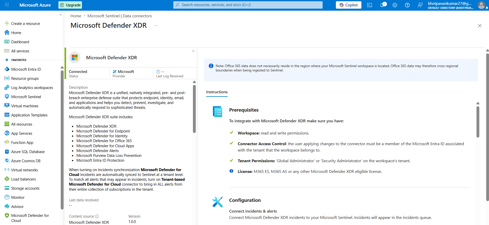
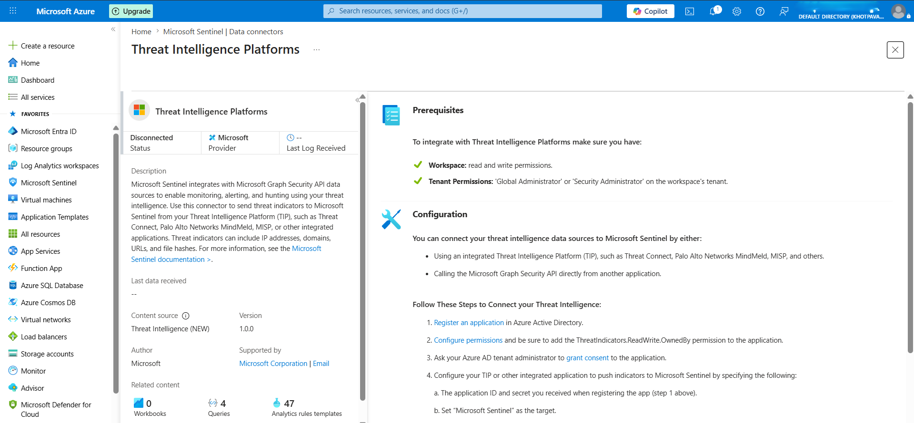
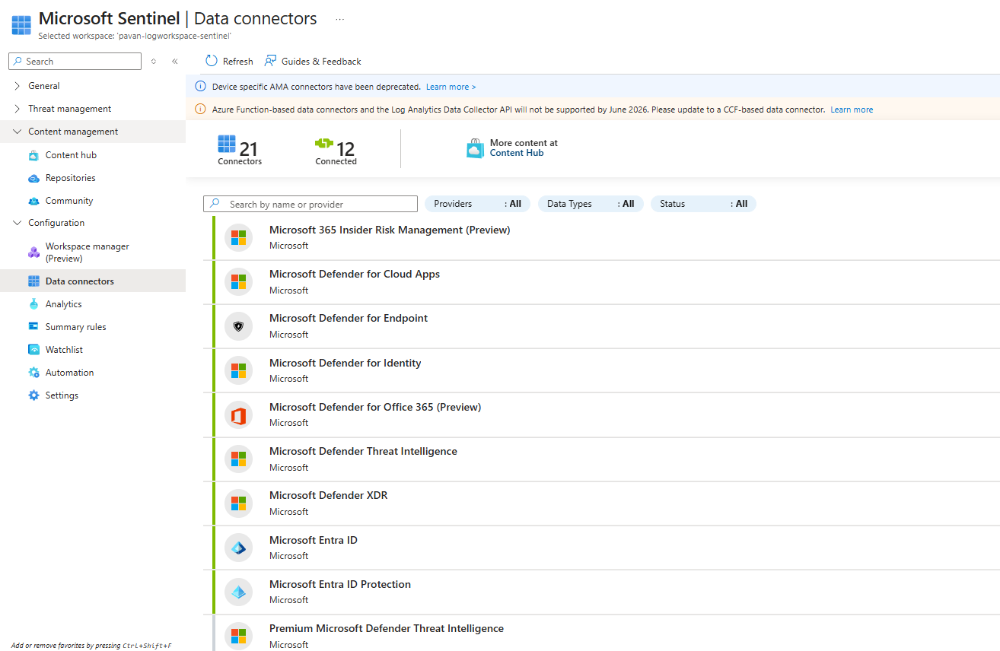

# Data Connectors Configuration

## 🎯 Objective
To integrate multiple data sources with Microsoft Sentinel in order to enable centralized log collection and visibility across identity, endpoint, and threat intelligence domains.

---

## 🛠️ Connectors Configured

### 1. Microsoft Entra ID

- Enabled Microsoft Entra ID connector to ingest identity-related logs
- Configured collection of:
  - Sign-in logs
  - Audit logs

#### 🔍 Importance
- Helps detect suspicious login attempts
- Enables monitoring of identity-based attacks
- Provides visibility into authentication patterns

---

### 2. Microsoft Defender XDR

- Connected Microsoft Defender XDR to Microsoft Sentinel
- Enabled ingestion of security alerts and incidents

#### 🔍 Importance
- Provides endpoint-level visibility
- Enables correlation between endpoint activity and other logs
- Useful for detecting malware, suspicious processes, and device anomalies

---

### 3. Threat Intelligence Platforms

- Enabled Threat Intelligence connector
- Ingested indicators such as:
  - Malicious IP addresses
  - Suspicious domains
  - Known threat indicators
 

#### 🔍 Importance
- Enhances detection by correlating logs with known threats
- Supports proactive threat hunting
- Helps identify communication with malicious entities

---

### 4. Additional Connectors Explored

- Reviewed other available connectors in Sentinel
- Identified potential future integrations (e.g., Azure Activity, Office 365)

---

## 🔌 Configuration Summary

- All connectors were successfully enabled in Microsoft Sentinel
- Data ingestion has been initiated (varies by connector type)
- Verified connector status from Data Connectors dashboard

---

## ✅ Outcome
Successfully integrated multiple data sources into Microsoft Sentinel, enabling the foundation for centralized monitoring and future threat detection.

---

## 🧠 Key Learnings

- Data connectors are critical for SIEM effectiveness
- Different connectors provide visibility across different attack surfaces:
  - Identity (Entra ID)
  - Endpoint (Defender XDR)
  - External Threats (Threat Intelligence)
- Detection capability improves with diverse and high-quality data sources

---

## ⚠️ Current Limitation

- Full detection capability is still dependent on:
  - Volume of ingested logs
  - Creation of analytics rules (next phase)

---

## 🔗 Next Step
Proceeding to validate connector functionality and verify security data ingestion using KQL queries within Microsoft Sentinel.
