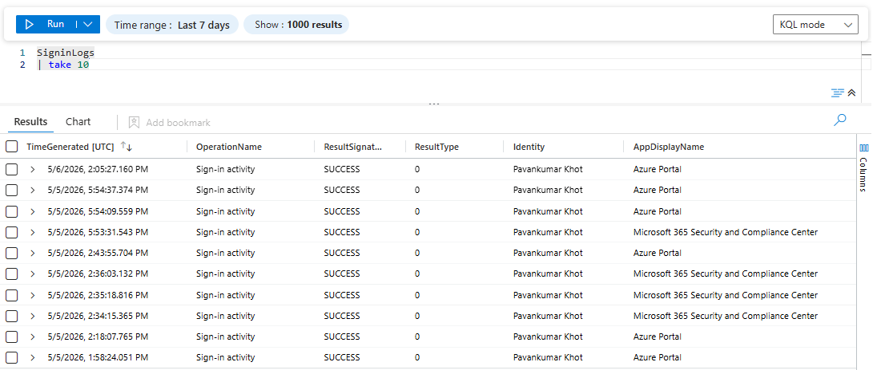
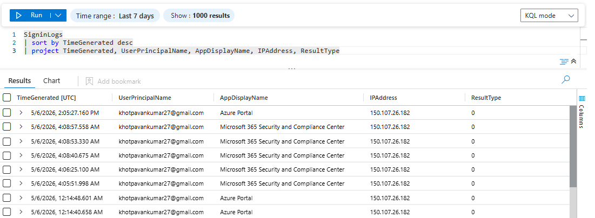
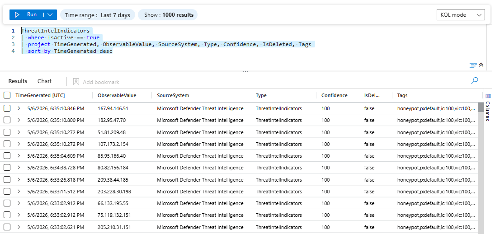
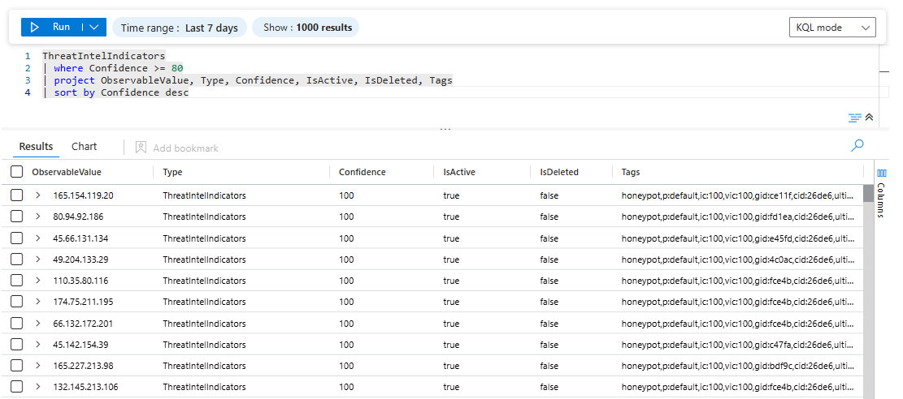

# Security Data Validation & Log Exploration

## 🎯 Objective
To validate that security data from configured connectors is successfully ingested into Microsoft Sentinel and available for analysis.

This step focuses on verifying data availability, understanding log structure, and performing initial exploration using Kusto Query Language (KQL).

---

## 🔍 Validation Approach

- Verified log ingestion across multiple tables
- Explored data from configured connectors:
  - Microsoft Entra ID (SigninLogs, AuditLogs)
  - Threat Intelligence (ThreatIntelligenceIndicator)
- Ensured logs are queryable within Log Analytics Workspace

---

## 🛠️ Queries Executed

### 1. Validate Sign-in Logs Ingestion
#### 📌 Purpose
To confirm that identity logs from Microsoft Entra ID are being ingested into the workspace.
```kql
SigninLogs
| take 10
```


### 2. Recent Sign-in Activity
#### 📌 Purpose
To review recent authentication activity and understand log structure including user, application, and source IP.
```kql
SigninLogs
| sort by TimeGenerated desc
| project TimeGenerated, UserPrincipalName, AppDisplayName, IPAddress, ResultType
```


### 3. Active Threat Intelligence Indicators Overview
#### 📌 Purpose
To retrieve and review all active threat intelligence indicators, including their source, type, and confidence level.
```kql
ThreatIntelIndicators
| where IsActive == true
| project TimeGenerated, ObservableValue, SourceSystem, Type, Confidence, IsDeleted, Tags
| sort by TimeGenerated desc
```


### 4. High Confidence Threats
#### 📌 Purpose
To identify high-confidence threat intelligence indicators that are more likely to represent genuine threats. This helps prioritize analysis and enables focused detection on the most reliable and critical threat data.
```kql
ThreatIntelIndicators
| where Confidence >= 80
| project ObservableValue, Type, Confidence, IsActive, IsDeleted, Tags
| sort by Confidence desc
```


