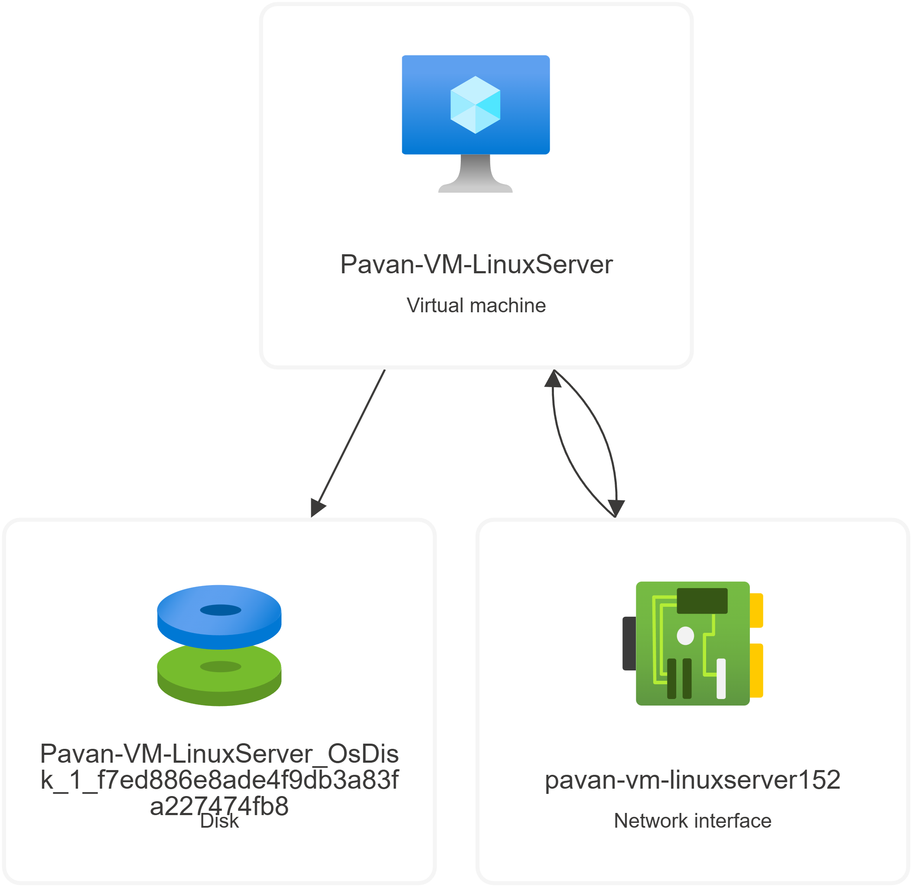
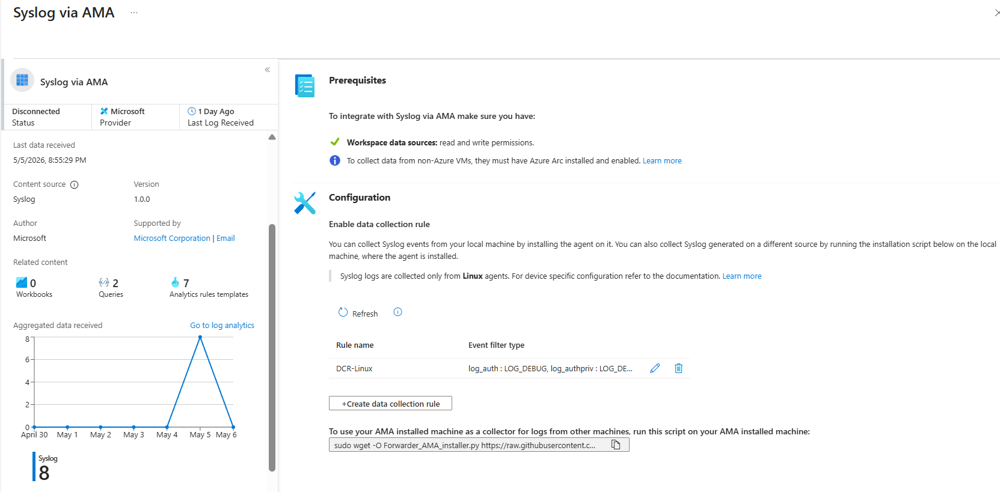
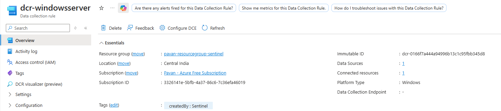
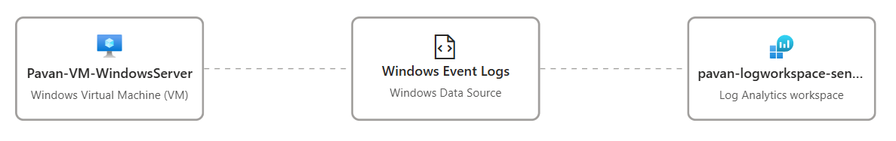
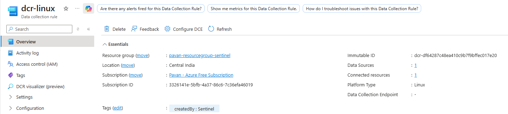
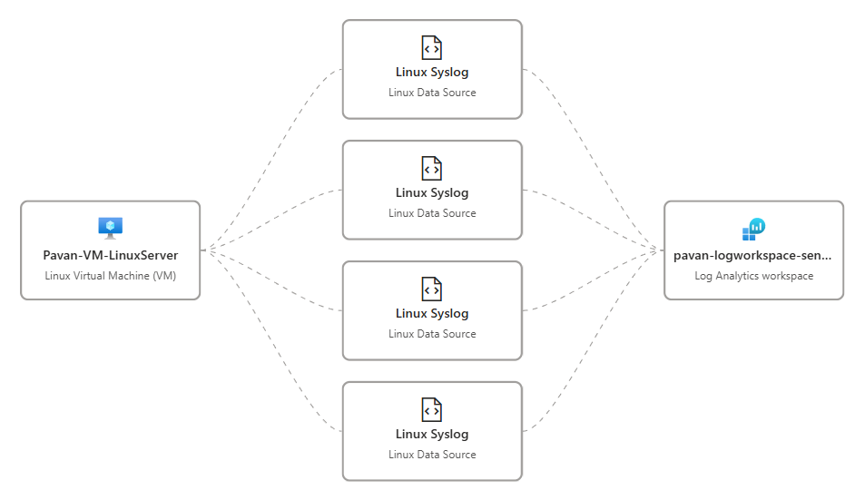
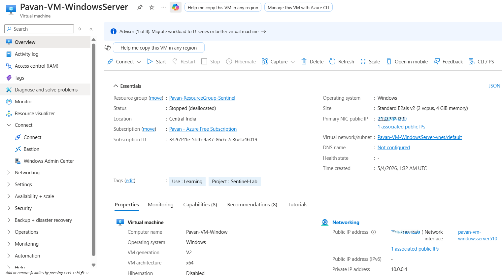
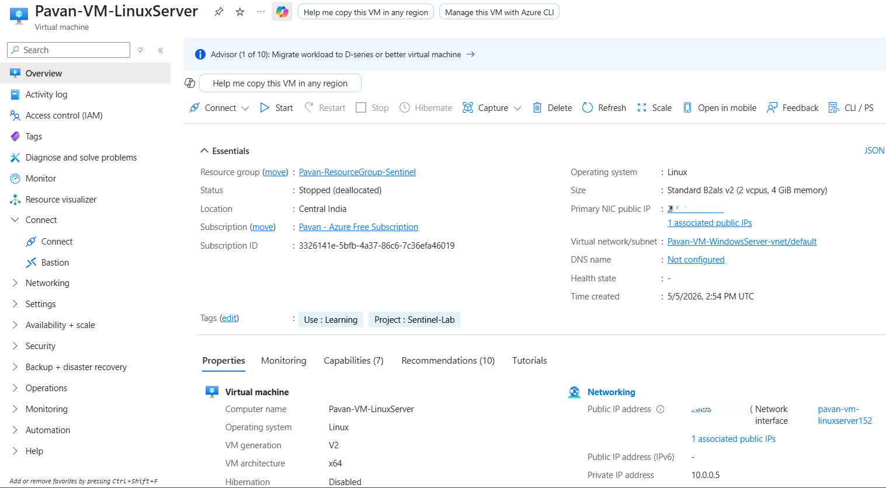
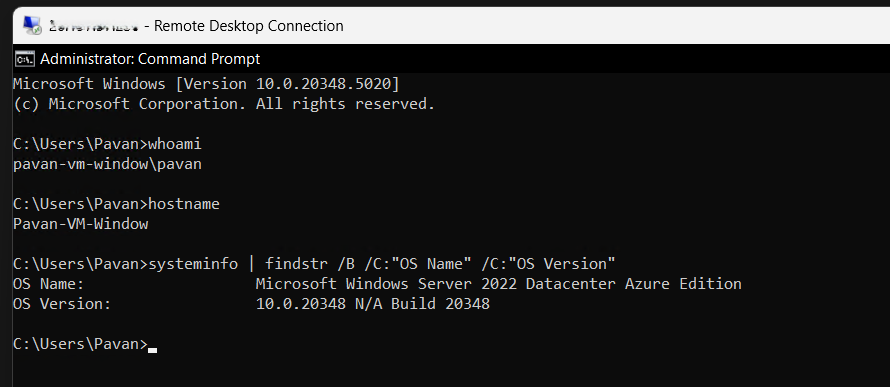
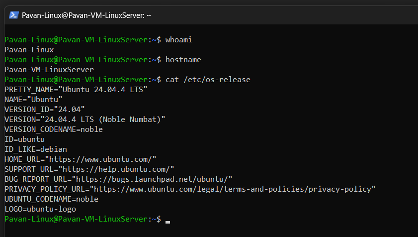

# Virtual Machine Deployment & Log Source Configuration

## 🎯 Objective
To deploy and configure Virtual Machines (Windows and Linux) as monitored endpoints for generating security events and enabling log ingestion into Microsoft Sentinel.

This step establishes the foundation for endpoint-level visibility and future attack simulation.

---

## 🏗️ Architecture Overview

- Deployed two Virtual Machines:
  - **Windows Server 2022 (Azure Edition)**
  - **Ubuntu 24.04 LTS**
- Both machines are configured to send logs to Log Analytics Workspace using Azure Monitor Agent (AMA)

#### 📸 Architecture Overview
<p align="center">
  
  
</p>

---

## 🛠️ Implementation Steps

### 1. Azure Monitor Agent (AMA) Configuration

- Installed and configured **Azure Monitor Agent (AMA)**:
  - Windows Security Events (For Windows)
  - Syslog (For Linux)



 

#### 📌 Purpose
To enable secure and scalable log collection from both Windows and Linux systems into Microsoft Sentinel.

---

### 2. Data Collection Rule (DCR) Creation

- Created Data Collection Rules to define:
  - What logs to collect
  - From which machines
  - Destination (Log Analytics Workspace)

#### 📌 Configuration Highlights
- Windows:
  - Security Event Logs (login events, account activity)
    
    
    
    
- Linux:
  - Syslog (auth, system logs)
    
    
    


#### 📌 Purpose
To control and standardize log ingestion from multiple sources.

---

### 3. Virtual Machine Deployment

#### 🖥️ Windows VM
- OS: Windows Server 2022 Datacenter (Azure Edition)
- Size: Standard B2als v2 (2 vCPUs, 4 GB RAM)

  

---

#### 🐧 Linux VM
- OS: Ubuntu 24.04 LTS
- Size: Standard B2als v2 (2 vCPUs, 4 GB RAM)
  
  

#### 📌 Purpose
To act as log-generating endpoints for authentication events, system activity, and future attack simulations.

---

### 4. Azure Arc Exploration (Non-Azure Machines)

- Explored onboarding of non-Azure machines using **Azure Arc**
- #### 📌 Note
  While Azure Arc enables onboarding of non-Azure machines (such as personal or on-premises systems) for centralized monitoring, a personal device was not onboarded in this project due to privacy and security considerations.  

  Ingesting logs from a personal machine may expose sensitive user activity, installed applications, and system behavior. Therefore, a controlled Azure Virtual Machine environment was preferred to ensure isolation, data safety, and repeatability of security testing.

#### 📌 Understanding
- Azure Arc enables onboarding of on-prem or external machines
- Extends monitoring and log ingestion to hybrid environments

#### 📌 Purpose
To understand how Sentinel can monitor non-Azure resources.

---

### 5. Connection Validation

Successfully connected to both Virtual Machines to verify accessibility, operating system details, and endpoint readiness for security monitoring.

### 🖥️ Windows Server Connection

  #### Commands Executed
  ```powershell
  whoami
  hostname
  systeminfo | findstr /B /C:"OS Name" /C:"OS Version"
  ```
  

### 🐧 Linux Server Connection

  #### Commands Executed
  ```powershell
  ssh azureuser@<public-ip of linux VM>
  
  whoami
  hostname
  cat /etc/os-release
  ```
  
  

## 🔍 Validation Approach

- Verified VM deployment and accessibility (RDP/SSH)
- Confirmed AMA installation and status
- Ensured DCR association with both machines
- Prepared environment for log ingestion

---

## ⚠️ Observations

- Azure Monitor Agent (AMA) replaces legacy Log Analytics Agent (MMA)
- Data Collection Rules provide flexible and granular control over log ingestion
- Separate configurations are required for Windows and Linux log sources

---

## 🔐 Security Relevance

- VMs act as primary sources of endpoint telemetry
- Windows logs enable detection of authentication-based attacks
- Linux syslogs provide visibility into system-level activity
- Enables realistic attack simulation scenarios

---

## ✅ Outcome

- Successfully deployed Windows and Linux Virtual Machines
- Configured Azure Monitor Agent for log collection
- Implemented Data Collection Rules for structured ingestion
- Established endpoint-level log sources for Microsoft Sentinel

---

## 🔗 Next Step

Proceeding to validate log ingestion from Virtual Machines and analyze endpoint security events using KQL queries.
