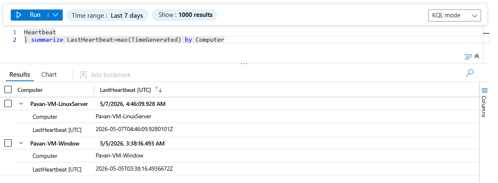
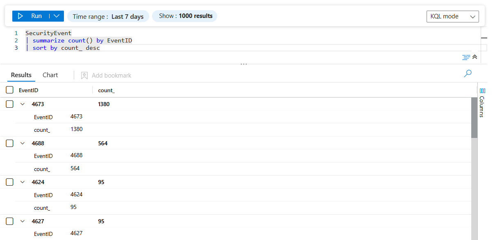
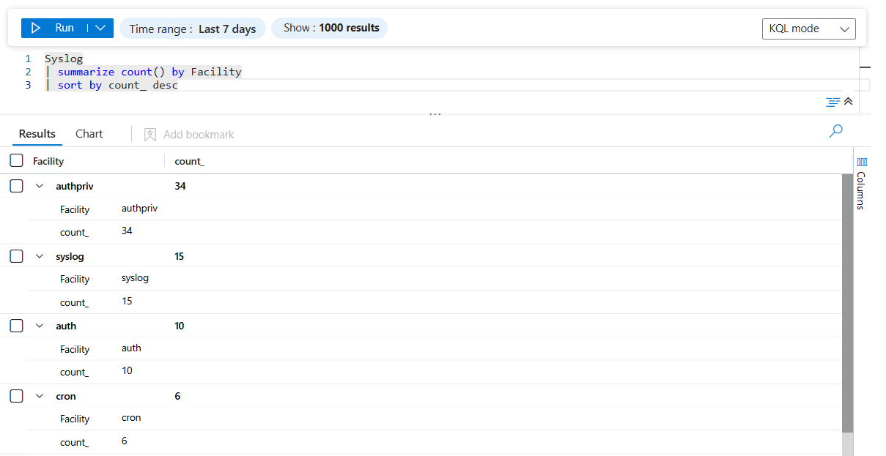
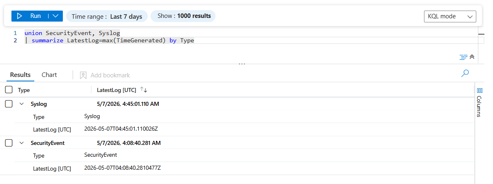

# Endpoint Telemetry Validation

## 🎯 Objective
To validate successful telemetry ingestion from Windows and Linux Virtual Machines into Microsoft Sentinel using Azure Monitor Agent (AMA) and Data Collection Rules (DCR).

This phase confirms that endpoint-generated security events are successfully collected, transmitted, and made available for monitoring and analysis within the SIEM environment.

---

## 🏗️ Telemetry Flow Architecture

```plaintext
Windows/Linux VM
        ↓
Azure Monitor Agent (AMA)
        ↓
Data Collection Rules (DCR)
        ↓
Log Analytics Workspace
        ↓
Microsoft Sentinel
        ↓
KQL Validation
```

---

## 📡 Telemetry Sources

| Endpoint | Telemetry Type | Destination Table |
|---|---|---|
| Windows Server 2022 | Security Events | SecurityEvent |
| Ubuntu 24.04 LTS | Syslog Events | Syslog |
| Both Endpoints | Heartbeat | Heartbeat |

---

## 🔍 Validation Approach

The validation process included:

- Verifying endpoint connectivity using Heartbeat telemetry
- Confirming Windows Security Event ingestion
- Confirming Linux Syslog ingestion
- Reviewing telemetry freshness and availability
- Validating end-to-end telemetry flow into Microsoft Sentinel
- Ensuring cross-platform monitoring visibility

---

## ❤️ Heartbeat Telemetry Validation

### KQL Query
```kql
Heartbeat
| summarize LastHeartbeat=max(TimeGenerated) by Computer
```

#### 📸 Screenshot


#### 📌 Purpose
To verify that monitored endpoints are actively communicating with the Log Analytics Workspace through Azure Monitor Agent.

#### 📌 Operational Validation
Confirmed healthy telemetry connectivity and active heartbeat communication from both Windows and Linux endpoints.

#### 📌 Observation
Heartbeat telemetry was successfully received from all monitored endpoints, validating operational agent connectivity.

---

## 🖥️ Windows Endpoint Telemetry Validation

### KQL Query
```kql
SecurityEvent
| summarize count() by EventID
| sort by count_ desc
```

#### 📸 Screenshot


#### 📌 Purpose
To validate successful ingestion of Windows Security Events generated from the Windows Server endpoint.

#### 📌 Operational Validation
Confirmed that Windows authentication and system security events are searchable and retained within Microsoft Sentinel.

#### 📌 Observation
Security events were successfully visible within the SecurityEvent table, confirming proper AMA and DCR configuration.

---

## 🐧 Linux Endpoint Telemetry Validation

### KQL Query
```kql
Syslog
| summarize count() by Facility
| sort by count_ desc
```

#### 📸 Screenshot


#### 📌 Purpose
To validate successful ingestion of Linux Syslog events from the Ubuntu Virtual Machine.

#### 📌 Operational Validation
Confirmed that Linux authentication and system-level logs are successfully ingested and queryable within Microsoft Sentinel.

#### 📌 Observation
Linux Syslog telemetry was successfully collected and mapped into the Syslog table.

---

## 🕒 Telemetry Freshness Validation

### KQL Query
```kql
union SecurityEvent, Syslog
| summarize LatestLog=max(TimeGenerated) by Type
```

#### 📸 Screenshot


#### 📌 Purpose
To verify near real-time telemetry ingestion from monitored endpoints.

#### 📌 Operational Validation
Confirmed continuous ingestion and availability of recent endpoint telemetry data.

#### 📌 Observation
Recent timestamps verified active and continuous telemetry flow into the Log Analytics Workspace.

---

## 🔄 Data Flow Validation

Validated end-to-end telemetry pipeline from endpoint generation to SIEM visibility:

```plaintext
Endpoint → AMA → DCR → Log Analytics Workspace → Sentinel → KQL Query Results
```

This confirmed successful operational telemetry flow across all configured components.

---

## 🌐 Cross-Platform Monitoring

Successfully validated telemetry ingestion from both:
- Windows-based endpoints
- Linux-based endpoints

This establishes centralized visibility across heterogeneous operating systems within Microsoft Sentinel.

---

## 🛡️ Monitoring Readiness

The environment is now capable of:

- Monitoring authentication activity
- Detecting failed login attempts
- Observing endpoint connectivity status
- Supporting attack simulation scenarios
- Enabling future analytics rule creation
- Supporting threat hunting workflows

---

## 📈 Key Observation

Telemetry ingestion latency was minimal, and logs from both operating systems became queryable within Microsoft Sentinel shortly after generation.

---

## ⚠️ Observations

- Azure Monitor Agent (AMA) successfully forwarded logs from both operating systems
- Data Collection Rules controlled telemetry ingestion behavior
- Windows and Linux endpoints generated distinct telemetry types
- Heartbeat telemetry proved useful for validating endpoint connectivity and health status

---

## 🔐 Security Relevance

- Windows Security Events provide visibility into authentication activity and endpoint security events
- Linux Syslog events support monitoring of authentication and system-level activity
- Centralized telemetry collection enables correlation, detection engineering, and threat hunting within Microsoft Sentinel

---

## ✅ Outcome

Successfully established and validated centralized telemetry ingestion across Windows and Linux endpoints within Microsoft Sentinel.

The environment is now operational for:
- attack simulation
- detection engineering
- threat hunting
- incident generation
- advanced security monitoring workflows

---

## 🔗 Next Step

Proceeding to implement custom log ingestion using Data Collection Endpoints (DCE), Data Collection Rules (DCR), Microsoft Entra ID App Registration, and the Azure Monitor Logs Ingestion API.
