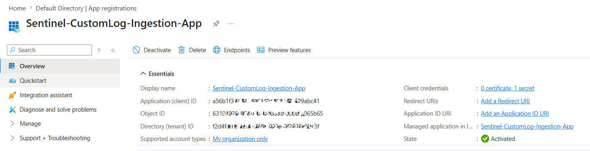

# 🚀 Milestone 07 — Custom Log Ingestion using DCE, DCR & Logs Ingestion API

## 📌 Objective

The objective of this milestone was to simulate real-world custom telemetry ingestion into Microsoft Sentinel using the modern Azure Monitor ingestion pipeline.

This implementation demonstrates how external or non-native security logs can be onboarded into Sentinel using:

- Microsoft Entra ID App Registration
- OAuth 2.0 Authentication
- Data Collection Endpoint (DCE)
- Data Collection Rule (DCR)
- Custom Log Table
- Azure Monitor Logs Ingestion API
- Postman-based API requests
- KQL Validation

This milestone represents advanced Sentinel engineering capabilities beyond default connector onboarding.

---

# 🏗️ Architecture Overview

```text
Custom JSON Logs
        ↓
Postman API Request
        ↓
OAuth 2.0 Authentication
        ↓
Microsoft Entra ID App Registration
        ↓
Data Collection Endpoint (DCE)
        ↓
Data Collection Rule (DCR)
        ↓
Custom Log Table
        ↓
Microsoft Sentinel
```

---

# 🔐 Microsoft Entra ID — App Registration Configuration

As part of the custom log ingestion pipeline, an App Registration was created in Microsoft Entra ID to securely authenticate requests sent to the Azure Monitor Logs Ingestion API.

This implementation helped in understanding how service principals and OAuth-based authentication are used in Azure environments for secure API communication.

---

## 📌 Objectives

The App Registration was configured to:

- Authenticate API requests from Postman
- Authorize access to the Data Collection Rule (DCR)
- Securely send custom telemetry to Microsoft Sentinel
- Implement OAuth 2.0 Client Credentials authentication flow

---

# ⚙️ Configuration Steps Performed

## ✅ Created App Registration

A dedicated application registration was created in Microsoft Entra ID.

### Configured Details

| Setting | Value |
|---|---|
| Application Type | Single Tenant |
| Authentication Method | OAuth 2.0 |
| Usage | Logs Ingestion API Authentication |

---

### 📸 App Registration Overview

_Add screenshot here_



---

## ✅ Generated Client Secret

A client secret was created for secure authentication.

The following values were collected and securely stored:

- Application (Client) ID
- Directory (Tenant) ID
- Client Secret Value

---

### 📸 Client Secret Configuration

_Add screenshot here_

```md

```

---

## ✅ Assigned Required Permissions

The following IAM role was assigned on the Data Collection Rule (DCR):

```text
Monitoring Metrics Publisher
```

### Purpose of Role Assignment

This permission allows the application to push telemetry data into Azure Monitor through the configured DCR pipeline.

---

### 📸 IAM Role Assignment

_Add screenshot here_

```md

```

---

# 🔄 OAuth Authentication Flow

```text
Postman Request
       ↓
OAuth 2.0 Authentication
       ↓
Microsoft Entra ID
       ↓
Bearer Access Token
       ↓
Azure Monitor Logs Ingestion API
       ↓
DCE → DCR → Sentinel
```

---

## ✅ OAuth Token Generation in Postman

The OAuth 2.0 Client Credentials flow was configured in Postman to generate bearer access tokens dynamically.

### Configured Parameters

| Parameter | Purpose |
|---|---|
| Tenant ID | Identifies Azure tenant |
| Client ID | Identifies application |
| Client Secret | Secure authentication |
| Scope | Azure Monitor authorization |

---

### 📸 OAuth Token Generation

_Add screenshot here_

```md

```

---

# 🏗️ Data Collection Endpoint (DCE)

A dedicated Data Collection Endpoint (DCE) was configured to securely receive custom telemetry from external sources.

### Purpose

- Receives API-based telemetry
- Acts as ingestion endpoint
- Connects DCR with Log Analytics Workspace

---

### 📸 DCE Overview

_Add screenshot here_

```md

```

---

# 🏗️ Data Collection Rule (DCR)

A Data Collection Rule (DCR) was configured to define ingestion behavior and route incoming logs to the custom table.

### Configured Capabilities

- Schema mapping
- Data transformation
- Stream declaration
- Destination routing
- Table mapping

---

## ✅ Custom Stream Used

```text
Custom-SecurityLogs
```

---

### 📸 DCR Overview

_Add screenshot here_

```md

```

---

# 📄 Custom Log Table Configuration

A DCR-based custom log table was created in Log Analytics Workspace for storing custom telemetry.

---

## ✅ Configured Fields

| Field | Type |
|---|---|
| TimeGenerated | datetime |
| User | string |
| Activity | string |
| ip_address | string |
| destination_ip | string |
| Profile | string |

---

### 📸 Custom Table Schema

_Add screenshot here_

```md

```

---

# 📄 Sample JSON Payload

The following sample telemetry was used for ingestion testing.

```json
{
  "TimeGenerated": "2026-05-09T08:00:12Z",
  "User": "alex.johnson@contoso.com",
  "Activity": "Failed Login Attempt",
  "ip_address": "192.168.1.15",
  "destination_ip": "10.0.0.8",
  "Profile": "SOC Analyst"
}
```

---

# 🚀 Sending Logs using Postman

Postman was used to send custom telemetry to the Azure Monitor Logs Ingestion API endpoint.

### Configured Components

- Authorization Header
- OAuth Bearer Token
- JSON Request Body
- DCE Ingestion Endpoint
- DCR Stream Configuration

---

### 📸 Postman Request Configuration

_Add screenshot here_

```md

```

---

# ✅ Successful API Response

The ingestion request successfully returned:

```text
204 No Content
```

which confirms that Azure accepted the logs successfully.

---

### 📸 Successful API Response

_Add screenshot here_

```md

```

---

# 🔎 KQL Validation Queries

## 📌 Query 1 — Validate Custom Log Ingestion

```kql
CustomDataIngestionTable_CL
| where TimeGenerated > ago(7d)
| project TimeGenerated, User, Activity, ip_address, destination_ip, Profile
| sort by TimeGenerated desc
```

### 📌 Purpose

To verify that custom telemetry is being successfully ingested into Microsoft Sentinel through the DCE/DCR pipeline.

---

## 📌 Query 2 — Activity Distribution

```kql
CustomDataIngestionTable_CL
| summarize EventCount=count() by Activity
| sort by EventCount desc
```

### 📌 Purpose

To analyze the distribution of activities present in the ingested custom telemetry.

---

## 📌 Query 3 — High Privilege Activity Monitoring

```kql
CustomDataIngestionTable_CL
| where Profile == "Admin"
| project TimeGenerated, User, Activity, ip_address
| sort by TimeGenerated desc
```

### 📌 Purpose

To monitor activities performed by privileged users and administrators.

---

## 📌 Query 4 — Failed Login Detection

```kql
CustomDataIngestionTable_CL
| where Activity contains "Failed Login"
| project TimeGenerated, User, ip_address
| sort by TimeGenerated desc
```

### 📌 Purpose

To identify suspicious authentication attempts and failed login activity.

---

## 📌 Query 5 — Ingestion Timeline Visualization

```kql
CustomDataIngestionTable_CL
| summarize Events=count() by bin(TimeGenerated, 1h)
| render timechart
```

### 📌 Purpose

To visualize custom log ingestion trends over time.

---

# 📸 KQL Validation Results

_Add screenshots here_

```md

```

---

# 🎯 Skills Demonstrated

- Microsoft Sentinel Engineering
- Microsoft Entra ID Administration
- OAuth 2.0 Authentication
- Azure IAM & RBAC
- Service Principal Configuration
- Custom Log Onboarding
- Azure Monitor Logs Ingestion API
- Data Collection Rules (DCR)
- Data Collection Endpoints (DCE)
- KQL Querying & Validation
- Custom Telemetry Simulation
- Log Pipeline Troubleshooting

---

# 🧠 Key Learnings

- Understood modern Azure Monitor ingestion architecture
- Learned schema mapping using DCR
- Implemented secure API-based ingestion workflow
- Configured OAuth 2.0 authentication using App Registration
- Troubleshooted authentication and ingestion issues
- Validated telemetry using KQL queries
- Simulated real-world SOC telemetry ingestion scenarios

---

# 🔗 Next Step

Proceeding to simulate attack scenarios between Linux and Windows virtual machines to generate real security telemetry for threat detection and incident investigation.
