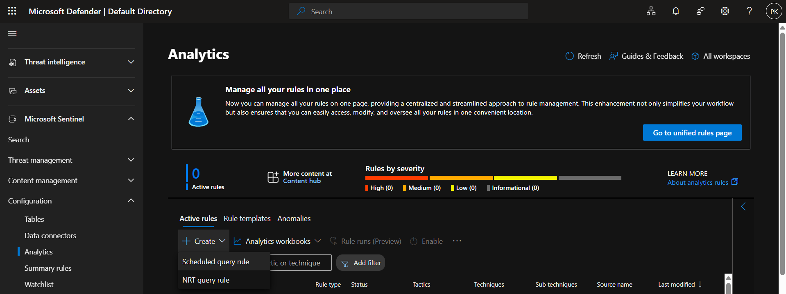
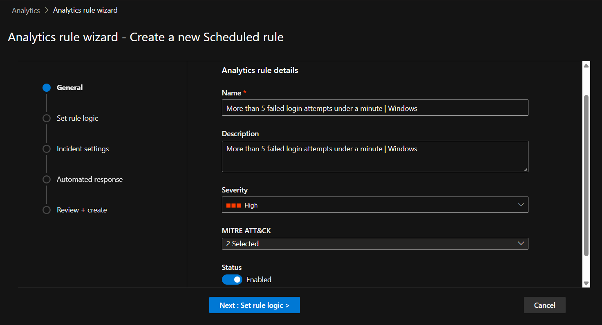
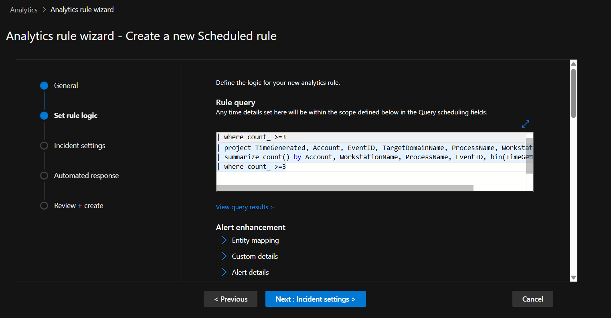
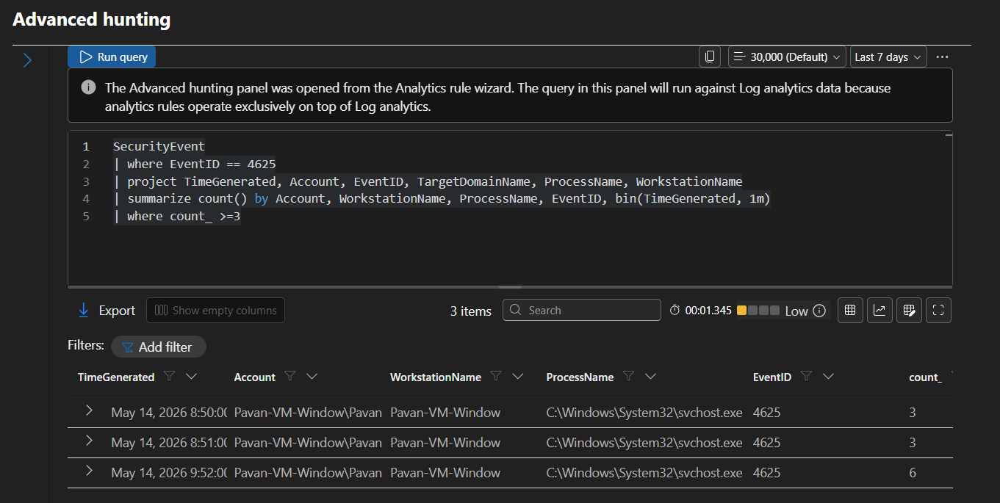
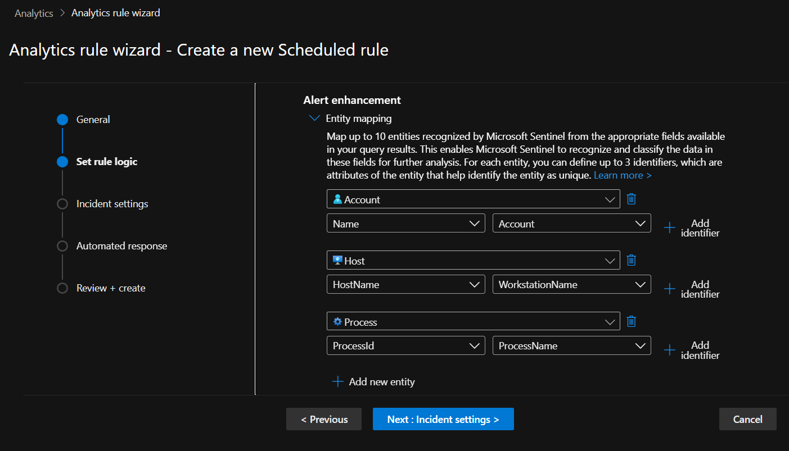
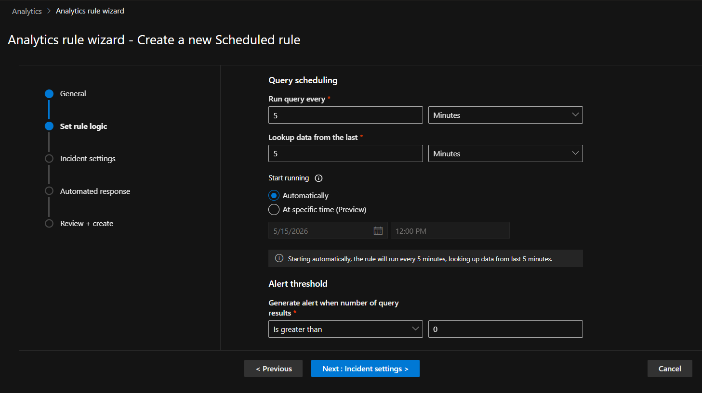
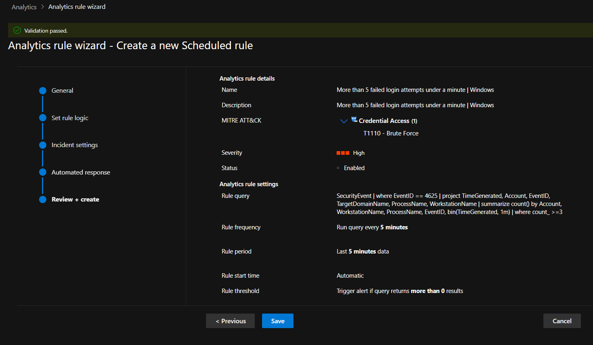
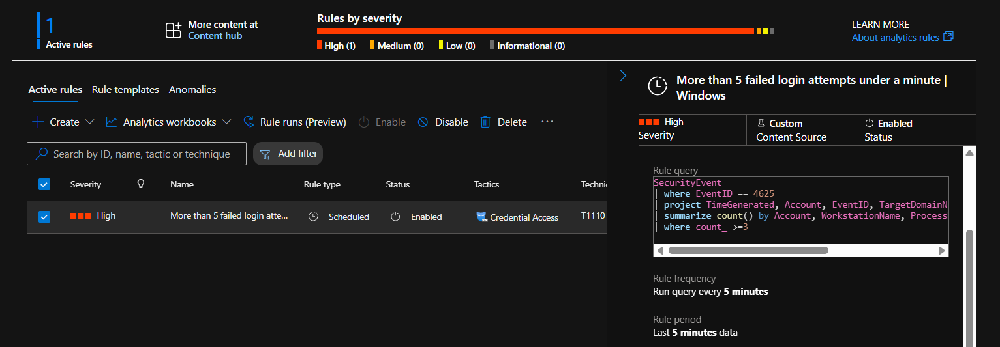
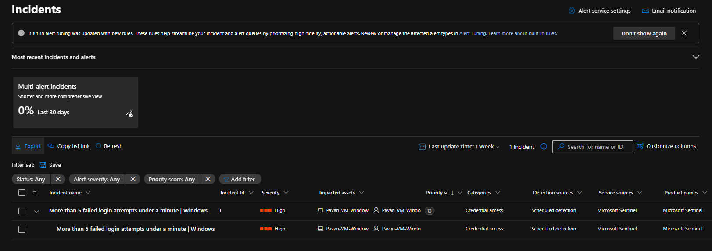

# 🚨 Scheduled Query Rule & Incident Creation

## 📌 Objective

The objective of this milestone was to create a Scheduled Query Analytics Rule in Microsoft Sentinel using KQL-based detection logic and validate the end-to-end alerting workflow from rule creation to incident generation.

This milestone focused on:

- Detection engineering fundamentals
- KQL-based rule creation
- MITRE ATT&CK mapping
- Entity mapping
- Rule scheduling
- Analytics rule validation
- Incident generation in Microsoft Sentinel

---

# 🏗️ Detection Workflow

```text
Windows Security Logs
        ↓
KQL Detection Query
        ↓
Scheduled Query Rule
        ↓
Rule Evaluation
        ↓
Alert Triggered
        ↓
Incident Created
```

---

# ⚙️ Step 1 — Creating a Scheduled Query Rule

A new analytics rule was created using the **Scheduled Query Rule** template available in Microsoft Sentinel.

### Purpose

To continuously evaluate Windows Security Events and identify suspicious authentication activity.

---

### 📸 Rule Creation



---

# ⚙️ Step 2 — Configuring General Details

The following rule configuration was implemented:

| Setting | Value |
|---|---|
| Rule Name | More than 5 failed login attempts under a minute \| Windows |
| Severity | High |
| MITRE Tactic | Credential Access |
| MITRE Technique | T1110 - Brute Force |

---

### 📌 Purpose

To classify the detection under the MITRE ATT&CK framework and prioritize the alert severity appropriately.

---

### 📸 General Details Configuration



---

# ⚙️ Step 3 — Configuring Rule Logic

The following KQL query was used to detect multiple failed login attempts occurring within a short time window.

## 📌 KQL Query

```kql
SecurityEvent
| where EventID == 4625
| project TimeGenerated, Account, EventID, TargetDomainName, ProcessName, WorkstationName
| summarize count() by Account, WorkstationName, ProcessName, EventID, bin(TimeGenerated, 1m)
| where count_ >= 3
```

---

### 📌 Purpose

To detect repeated failed authentication attempts that may indicate brute-force login activity against Windows systems.

---

### 📸 Rule Logic Configuration




---

# ⚙️ Step 4 — Entity Mapping

Entity mapping was configured to enrich investigation workflows and improve incident context.

### Configured Entities

| Entity Type | Mapped Field |
|---|---|
| Account | Account |
| Host | WorkstationName |
| Process | ProcessName |

---

### 📌 Purpose

To enable Microsoft Sentinel to associate alerts with related users, hosts, and processes during investigations.

---

### 📸 Entity Mapping



---

# ⚙️ Step 5 — Query Scheduling Configuration

The Scheduled Query Rule was configured with the following execution settings:

| Setting | Value |
|---|---|
| Run Query Every | 5 Minutes |
| Lookup Data From Last | 5 Minutes |
| Start Running | Automatically |

---

### 📌 Purpose

To continuously monitor incoming telemetry and evaluate failed login activity in near real-time.

---

### 📸 Query Scheduling



---

# ⚙️ Step 6 — Reviewing the Rule

Before deployment, the analytics rule configuration was reviewed to validate:

- Detection logic
- Entity mapping
- Severity configuration
- Query scheduling
- MITRE ATT&CK classification

---

### 📸 Review Configuration



---

# ⚙️ Step 7 — Validating Active Rule

After deployment, the Scheduled Query Rule was successfully validated in the **Active Rules** section of Microsoft Sentinel.

### Validation Performed

- Rule enabled successfully
- Rule status verified
- Query scheduling confirmed
- Detection configuration validated

---

### 📸 Active Rules Validation



---

# 🚨 Step 8 — Incident Creation

After generating multiple failed login attempts on the Windows VM, Microsoft Sentinel successfully triggered the analytics rule and created a security incident automatically.

### Detection Trigger

- Windows Event ID: 4625
- Multiple failed login attempts within one minute

---

### 📌 Purpose

To validate the complete detection pipeline from telemetry ingestion to incident generation.

---

### 📸 Incident Created



---

# 🎯 Skills Demonstrated

- Microsoft Sentinel Analytics Rules
- Scheduled Query Rule Configuration
- KQL-based Detection Engineering
- Windows Security Event Monitoring
- MITRE ATT&CK Mapping
- Entity Mapping
- Incident Generation
- Security Monitoring
- Authentication Threat Detection
- SOC Detection Workflow

---

# 🧠 Key Learnings

- Learned how Scheduled Query Rules work in Microsoft Sentinel
- Configured KQL-based detection logic for failed authentication activity
- Implemented MITRE ATT&CK mapping for detections
- Understood entity mapping and investigation enrichment
- Configured rule scheduling and alert evaluation intervals
- Validated incident creation workflow within Microsoft Sentinel

---

# 🔗 Next Step

Proceeding to investigate generated incidents and perform threat hunting using KQL queries within Microsoft Sentinel.
