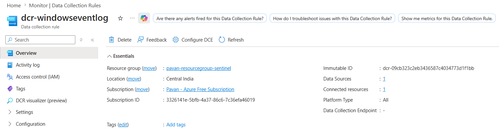
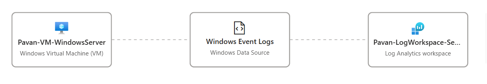

# 🚨 NRT Analytics Rule & Incident Creation

## 📌 Objective

The objective of this milestone was to implement a Near Real-Time (NRT) Analytics Rule in Microsoft Sentinel for rapid detection of Windows log-clearing activity and automatic incident generation.

This milestone focused on:

- Windows Event Log ingestion
- Separate DCR configuration for Event table telemetry
- Understanding `Event` vs `SecurityEvent` tables
- NRT Analytics Rule creation
- Event ID 104 detection
- MITRE ATT&CK mapping
- Entity mapping
- Incident generation

---

# 🏗️ Detection Workflow

```text
Windows Event Logs
        ↓
AMA + DCR (dcr-windowseventlog)
        ↓
Event Table
        ↓
NRT Analytics Rule
        ↓
Alert Triggered
        ↓
Incident Created
```

---

# 📌 Why a Separate DCR Was Created

A separate Data Collection Rule named:

```text
dcr-windowseventlog
```

was created specifically for collecting Windows Event Logs into the `Event` table.

This was necessary because the previously configured connector:

```text
Windows Security Events via AMA
```

primarily ingests telemetry into the `SecurityEvent` table and does not fully support broader Windows Event Log collection scenarios required for Event ID `104`.

---

# 📌 Event Table vs SecurityEvent Table

Understanding the difference between these tables is important while designing detections in Microsoft Sentinel.

| Table | Purpose |
|---|---|
| SecurityEvent | Security auditing events such as logon attempts, account activity, authentication events |
| Event | General Windows Event Logs including System, Application, and additional Windows operational logs |

---

# 📌 Why Event Table Was Required

Event ID `104` is generated when Windows System/Application logs are cleared.

These events are commonly ingested into the:

```text
Event
```

table instead of:

```text
SecurityEvent
```

Therefore, a dedicated DCR was required to onboard these telemetry sources properly.

---

# ⚙️ DCR Configuration — dcr-windowseventlog

The following Windows Event Log collection points were configured within the DCR:

| Collection Point |
|---|
| System |
| Application |
| Security |

These logs were forwarded to the Log Analytics Workspace connected to Microsoft Sentinel.

---

# 📸 DCR Configuration





---

# ⚙️ DCR Validation

After configuring the DCR, telemetry ingestion was validated using KQL queries against the `Event` table.

## 📌 Validation Query

```kql
Event
| where EventID == 104
| sort by TimeGenerated desc
```

This confirmed:
- AMA connectivity
- successful DCR deployment
- Windows Event Log ingestion
- Event table telemetry availability

---

# 📸 Event Table Validation


---

# 📌 Understanding Event ID 104

Event ID `104` indicates that a Windows log file has been cleared.

This activity is security-relevant because attackers may attempt to clear logs to hide malicious actions and remove forensic evidence.

---

# 📌 Security Relevance

Mapped MITRE ATT&CK Technique:

| MITRE Category | Value |
|---|---|
| Tactic | Defense Evasion |
| Technique | T1070 — Indicator Removal on Host |

---

# ⚙️ Step 1 — Creating NRT Analytics Rule

A Near Real-Time Analytics Rule was created in Microsoft Sentinel.

### Rule Configuration

| Setting | Value |
|---|---|
| Rule Name | Log cleared on critical asset \| Windows Server |
| Severity | High |
| MITRE Tactic | Defense Evasion |
| MITRE Technique | T1070 — Indicator Removal on Host |

---

# 📸 NRT Rule Creation

_Add screenshot here_

```md

```

---

# ⚙️ Step 2 — Configuring Rule Logic

The following KQL query was implemented to detect log-clearing activity on the Windows VM.

## 📌 KQL Query

```kql
Event
| where Computer contains "Pavan-VM-Window"
| where EventID == 104
| project TimeGenerated, Computer, RenderedDescription, EventID, EventLevel
```

---

# 📌 Detection Purpose

This query detects instances where Windows logs are cleared from the monitored server.

Such activity may indicate:
- anti-forensics behavior
- malicious log tampering
- evidence removal attempts
- attacker defense evasion techniques

---

# 📸 Rule Logic Configuration

_Add screenshot here_

```md

```

---

# ⚙️ Step 3 — Entity Mapping

Entity mapping was configured to enrich incident investigation workflows.

### Configured Entities

| Entity Type | Field |
|---|---|
| Hostname | Computer |
| LogType (Custom Entity) | RenderedDescription |

---

# 📸 Entity Mapping

_Add screenshot here_

```md

```

---

# ⚙️ Step 4 — Reviewing the Rule

Before deployment, the following configurations were reviewed:

- Detection logic
- MITRE ATT&CK mapping
- Entity mapping
- Rule configuration
- Incident creation settings

---

# 📸 Rule Review

_Add screenshot here_

```md

```

---

# ⚙️ Step 5 — Validating Active Rule

After deployment, the NRT Analytics Rule was validated within the Active Rules section of Microsoft Sentinel.

### Validation Performed

- Rule enabled successfully
- NRT status confirmed
- Detection logic validated
- Incident creation settings verified

---

# 📸 Active Rule Validation

_Add screenshot here_

```md

```

---

# 🚨 Step 6 — Incident Creation

After clearing the Windows System log again, Microsoft Sentinel successfully triggered the NRT Analytics Rule and automatically generated a security incident.

### Detection Trigger

- Windows Event ID: 104
- Log clearing activity detected on Windows Server

---

# 📸 Incident Created

_Add screenshot here_

```md

```

---

# 🎯 Skills Demonstrated

- Microsoft Sentinel NRT Analytics Rules
- AMA & DCR Configuration
- Windows Event Log Monitoring
- Event Table Telemetry Analysis
- KQL-based Detection Engineering
- MITRE ATT&CK Mapping
- Entity Mapping
- Incident Generation
- Threat Detection Engineering
- SOC Monitoring Workflow

---

# 🧠 Key Learnings

- Learned the difference between `Event` and `SecurityEvent` tables
- Configured a dedicated DCR for Windows Event Log ingestion
- Validated AMA and DCR telemetry pipelines
- Explored Event ID `104` log-clearing activity
- Implemented Near Real-Time threat detection
- Understood how attackers may use log clearing for defense evasion
- Successfully generated incidents using NRT detections

---

# 🔗 Next Step

Proceeding to investigate generated incidents and perform advanced threat hunting using KQL queries within Microsoft Sentinel.
