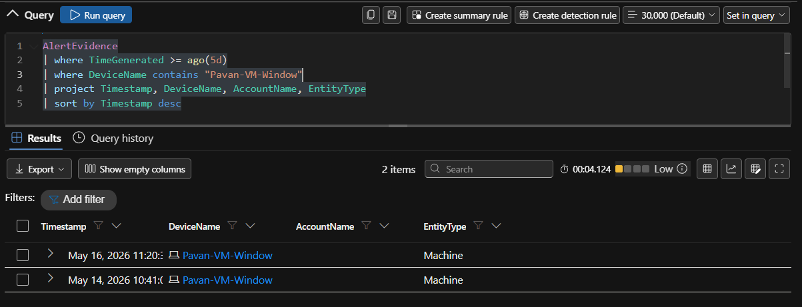
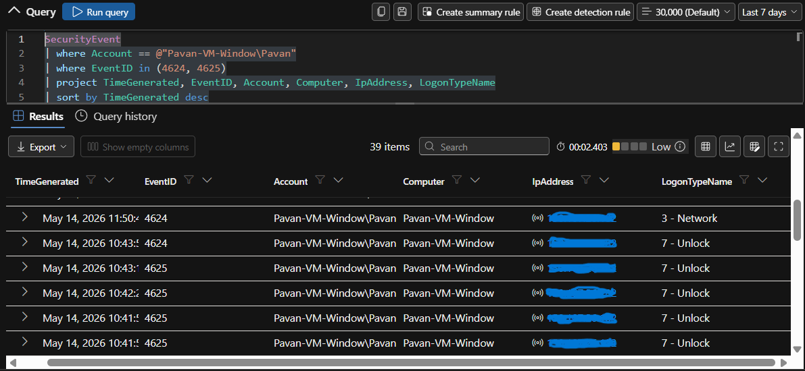
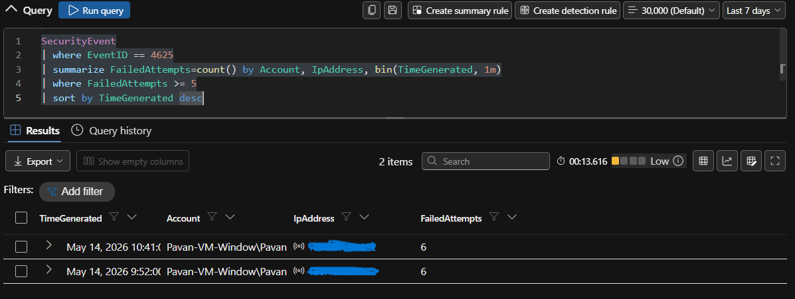
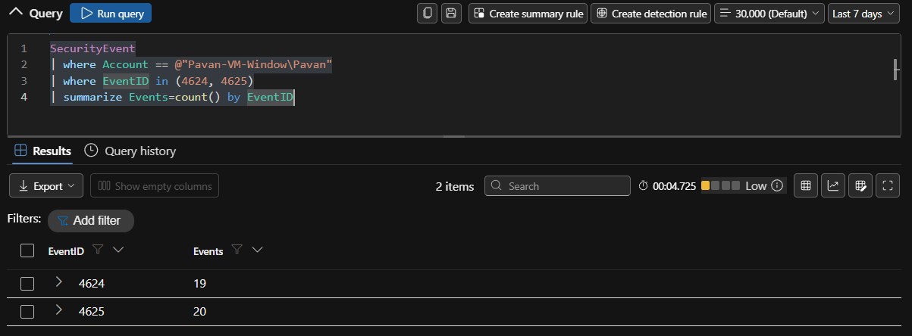
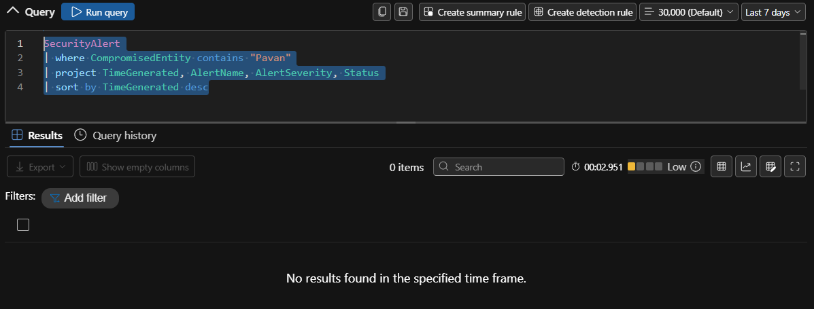
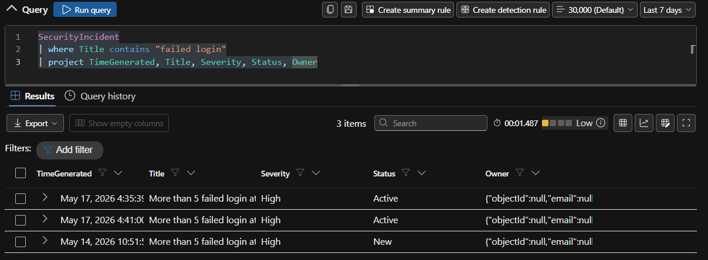

# 🔎 Advanced Hunting — Failed Login Investigation | Windows

## 📌 Objective

The objective of this phase was to perform advanced hunting using Kusto Query Language (KQL) within Microsoft Sentinel and Microsoft Defender to determine whether additional suspicious activity existed beyond the initially triggered incident.

The hunting process focused on:

- affected user investigation
- affected device investigation
- authentication activity analysis
- brute-force validation
- related alert correlation
- timeline-based threat hunting

---

# 🏗️ Advanced Hunting Workflow

```text
Incident Triggered
        ↓
Identify User & Device
        ↓
Pivot on Entities
        ↓
Validate Authentication Activity
        ↓
Search for Additional Threats
        ↓
Correlate Alerts & Events
        ↓
Threat Hunting Conclusion
```

---

# 🎯 Hunting Scope

The following entities identified during investigation were used as pivot points for advanced hunting.

| Entity Type | Value |
|---|---|
| User | Pavan-VM-Window\Pavan |
| Device | Pavan-VM-Window |

---

# 📌 0. Validating Alerts Using Defender XDR Hunting Tables

Before proceeding with advanced hunting, the generated incident alerts were validated using Microsoft Defender XDR hunting tables.

The following tables were used:

| Table | Purpose |
|---|---|
| AlertInfo | Stores alert metadata and detection details |
| AlertEvidence | Stores associated entities and evidence |

These tables help analysts validate alerts, investigate impacted entities, and correlate related evidence during incident analysis.

---

## 📌 Query 1 — Validate Alert from AlertInfo Table

### 📌 KQL Query

```kql
AlertInfo
| where TimeGenerated >= ago(5d)
| where Title contains "failed login"
| project Timestamp, Title, Severity, ServiceSource, DetectionSource
| sort by Timestamp desc
```

---

### 📌 Purpose

This query validates:

- alert generation
- alert severity
- detection source
- alert timestamp
- Microsoft Defender alert telemetry

---

## 📸 AlertInfo Validation


---

## 📌 Query 2 — Validate Alert Evidence

### 📌 KQL Query

```kql
AlertEvidence
| where TimeGenerated >= ago(5d)
| where DeviceName contains "Pavan-VM-Window"
| project Timestamp, DeviceName, AccountName, EntityType
| sort by Timestamp desc
```

---

### 📌 Purpose

This query helps identify:

- affected devices
- impacted accounts
- correlated entities
- alert evidence associated with the incident

---

## 📸 AlertEvidence Validation



---

## 📌 Query 3 — Correlating AlertInfo and AlertEvidence

### 📌 KQL Query

```kql
AlertInfo
| where TimeGenerated >= ago(5d)
| join kind=inner AlertEvidence on AlertId
| where DeviceName contains "Pavan-VM-Window"
| project Timestamp, Title, Severity, DeviceName, AccountName
| sort by Timestamp desc
```

---

### 📌 Purpose

This query correlates:

- alert metadata
- impacted entities
- related evidence
- device activity
- account involvement

This provides a more complete investigation context during advanced hunting workflows.

---

## 📸 Alert Correlation Validation


---

# 📌 1. Hunting Authentication Activity for User

The first hunting step involved reviewing all authentication activity associated with the affected user account.

## 📌 KQL Query

```kql
SecurityEvent
| where Account == @"Pavan-VM-Window\Pavan"
| where EventID in (4624, 4625)
| project TimeGenerated, EventID, Account, Computer, IpAddress, LogonTypeName
| sort by TimeGenerated desc
```

---

## 📌 Purpose

This query helps identify:

- successful logins
- failed logins
- authentication patterns
- suspicious login activity
- source IP information

---

## 📸 Authentication Activity Hunt



---

# 📌 2. Hunting Failed Login Attempts

Authentication failures were analyzed to determine whether brute-force behavior was observed.

## 📌 KQL Query

```kql
SecurityEvent
| where EventID == 4625
| summarize FailedAttempts=count() by Account, IpAddress, bin(TimeGenerated, 1m)
| where FailedAttempts >= 5
| sort by TimeGenerated desc
```

---

## 📌 Purpose

This query validates:

- repeated failed authentication attempts
- brute-force patterns
- suspicious login frequency
- attack timing

---

## 📸 Failed Login Hunt



---

# 📌 3. Checking If Failed Logins Led to Successful Authentication

Further hunting was performed to determine whether repeated failed attempts eventually resulted in a successful login.

## 📌 KQL Query

```kql
SecurityEvent
| where Account == @"Pavan-VM-Window\Pavan"
| where EventID in (4624, 4625)
| summarize Events=count() by EventID
```

---

## 📌 Purpose

This query helps determine:

- whether compromise may have occurred
- authentication success following repeated failures
- potential brute-force success indicators

---

## 📸 Successful Login Validation



---

# 📌 4. Hunting Device Activity

The affected Windows virtual machine was investigated for additional suspicious activity.

## 📌 KQL Query

```kql
SecurityEvent
| where Computer == "Pavan-VM-Window"
| project TimeGenerated, EventID, Account, Activity
| sort by TimeGenerated desc
```

---

## 📌 Purpose

This query helps analysts:

- review device activity
- identify suspicious events
- validate attack scope
- investigate related authentication activity

---

## 📸 Device Activity Hunt


---


# 📌 5. Hunting Related Alerts

Additional hunting was performed against alert tables to identify whether the affected user or device was associated with other security alerts.

## 📌 KQL Query

```kql
SecurityAlert
| where CompromisedEntity contains "Pavan"
| project TimeGenerated, AlertName, AlertSeverity, Status
| sort by TimeGenerated desc
```

---

## 📌 Purpose

This query helps identify:

- related detections
- recurring suspicious activity
- additional correlated alerts
- broader attack patterns

---

## 📸 Related Alerts Hunt



---

# 📌 6. Investigating Incidents Through SecurityIncident Table

Incident telemetry was also validated directly through Sentinel incident tables.

## 📌 KQL Query

```kql
SecurityIncident
| where Title contains "failed login"
| project TimeGenerated, Title, Severity, Status, Owner
```

---

## 📌 Purpose

This query validates:

- incident creation
- incident ownership
- incident status
- alert-to-incident correlation

---

## 📸 SecurityIncident Hunt



---

# 🧠 Hunting Summary

Advanced hunting activities confirmed that the generated incident was associated with repeated failed authentication activity targeting the Windows virtual machine.

The investigation did not reveal evidence of:

- successful compromise
- malware execution
- persistence activity
- privilege escalation
- lateral movement

The observed activity remained consistent with controlled lab-generated authentication failure simulations.

---

# 🎯 Skills Demonstrated

- Advanced Hunting using KQL
- Microsoft Sentinel Investigation
- Microsoft Defender XDR Hunting
- Authentication Threat Hunting
- Brute-force Detection Analysis
- Alert Correlation
- Timeline Investigation
- Entity-based Investigation
- Security Telemetry Analysis
- Incident Validation

---

# 🧠 Key Learnings

- Learned how to pivot investigations using users and devices
- Performed authentication-focused threat hunting
- Investigated Sentinel incidents using KQL
- Correlated alerts and evidence across Defender tables
- Validated detection logic using raw telemetry
- Performed timeline-based security investigation
- Applied SOC-style hunting methodology using KQL

---

# 🔗 Next Step

Proceeding to document final investigation findings, incident verdict, and overall security conclusions from the simulated attack scenario.
