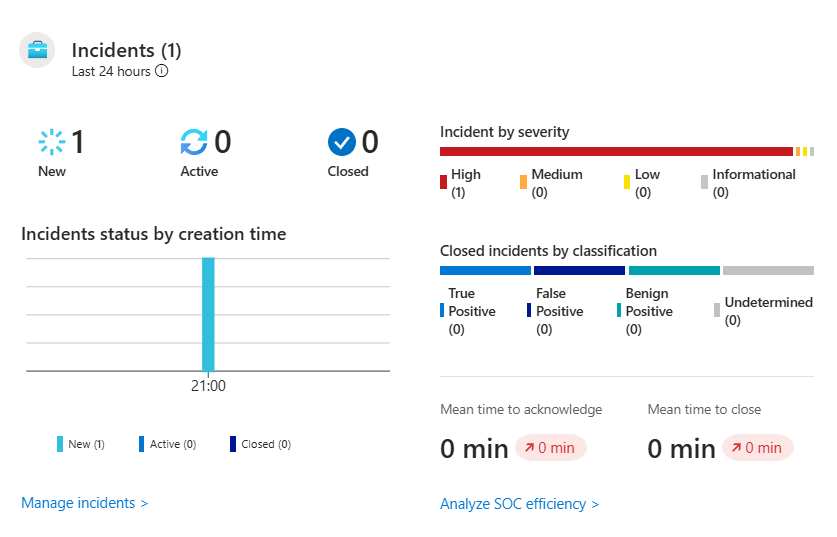
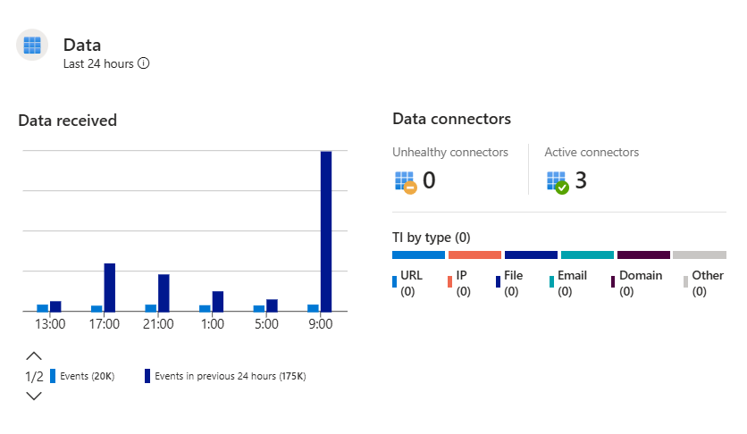
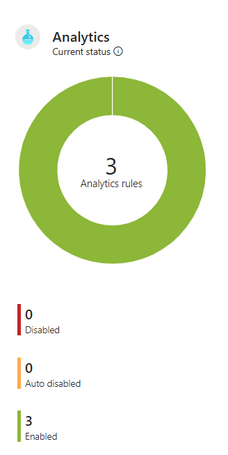
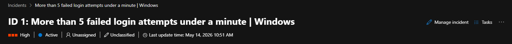
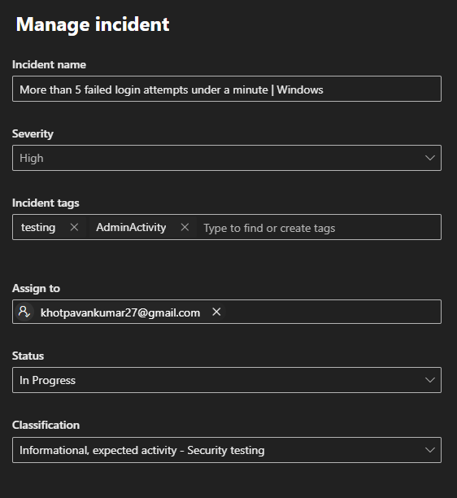
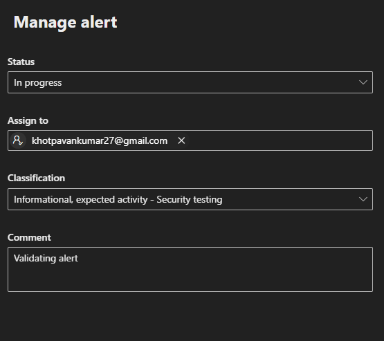
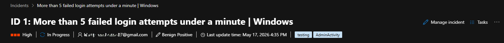
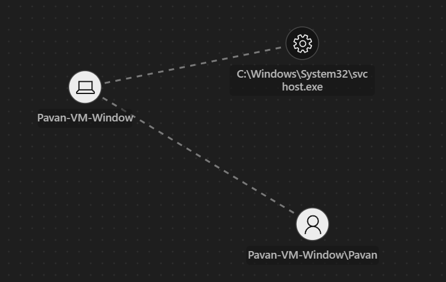

# 🚨 Incident Investigation — Failed Login Attempts | Windows

## 📌 Objective

The objective of this investigation was to analyze a Microsoft Sentinel incident generated from repeated failed authentication attempts against a Windows virtual machine.

The investigation workflow was performed through the Microsoft Defender portal, which now provides the unified investigation experience for Microsoft Sentinel incidents and alerts.

---

# 🏗️ Investigation Workflow

```text
Analytics Rule Triggered
        ↓
Incident Created
        ↓
Incident Assignment
        ↓
Attack Story Analysis
        ↓
Entity Investigation
        ↓
Evidence Validation
        ↓
Rule Logic Validation
```

---

# 📊 Microsoft Sentinel Overview

The Microsoft Sentinel overview dashboard was reviewed to analyze:

- Total incidents generated
- Data ingestion statistics
- Active analytics rules
- Alert trends
- Incident severity distribution
- Workspace activity

This provides analysts with an overall security posture and monitoring visibility across the environment.

---

## 📸 Sentinel Overview Dashboard

<table>
<tr>
<td width="65%">

<br><br>


</td>

<td width="35%">



</td>
</tr>
</table>

---

# 🚨 Incident Under Investigation

| Property | Value |
|---|---|
| Incident Name | More than 5 failed login attempts under a minute \| Windows |
| Severity | High |
| Detection Type | Scheduled Query Rule |
| MITRE Tactic | Credential Access |
| MITRE Technique | T1110 — Brute Force |

---

# 📌 1. Incident Overview

The incident was opened from the Microsoft Defender portal incident queue for initial triage and investigation.

The following details were reviewed:

- Incident severity
- Incident status
- Detection source
- Alert count
- Affected entities
- Incident creation timestamp

The incident indicated repeated failed authentication attempts occurring within a short timeframe on the monitored Windows Server virtual machine.

---

## 📸 Incident Overview



---

# 📌 2. Assigning Incident and Alert to Myself

To initiate investigation ownership, the incident and associated alert were assigned to the analyst account.

### Actions Performed

- Incident owner assigned
- Alert owner assigned
- Incident status changed to `In Progress`

This process helps establish accountability and ensures proper tracking of investigation activities within the SOC workflow.

---

## 📸 Incident Assignment

<table>
<tr>
<td width="50%">



</td>

<td width="50%">



</td>
</tr>

<tr>
<td colspan="2" align="center">

<br>



</td>
</tr>
</table>

---

# 📌 3. Checking Attack Story and Investigation Graph

The investigation graph and attack story were reviewed to understand relationships between:

- impacted assets
- associated accounts
- triggered alerts
- related entities

The investigation graph provides a visual representation of the incident context and helps analysts quickly identify suspicious relationships and attack patterns.

---

## 📸 Attack Story & Investigation Graph

<table>
<tr>
<td width="50%">


</td>

<td width="50%">



</td>
</tr>
</table>

---

# 📌 4. Checking Affected Assets

The affected assets associated with the incident were analyzed.

### Assets Identified

| Asset Type | Asset |
|---|---|
| Device | Pavan-VM-Window |
| User | Pavan-VM-Window\Pavan |

The entity mapping provided valuable contextual information for understanding which systems and accounts were involved in the authentication failure activity.

---

## 📸 Affected Assets


---

# 📌 5. Checking Evidence

The evidence section was reviewed to validate the telemetry and detection context associated with the incident.

### Evidence Reviewed

- Failed authentication attempts
- Associated host information
- User account involved
- Alert telemetry
- Detection source

This step helps analysts validate whether the alert activity appears legitimate, suspicious, or expected within the environment.

---

## 📸 Evidence Review


---

# 📌 6. Analytics Rule Triggered — Re-running Rule Logic Query

The detection logic responsible for triggering the alert was manually re-executed to validate telemetry and confirm the incident conditions.

## 📌 KQL Query

```kql
SecurityEvent
| where EventID == 4625
| project TimeGenerated, Account, EventID, TargetDomainName, ProcessName, WorkstationName
| summarize count() by Account, WorkstationName, ProcessName, EventID, bin(TimeGenerated, 1m)
| where count_ >=3
| project TimeGenerated, Computer, RenderedDescription, EventID, EventLevel
```

The query successfully returned matching events associated with Windows log-clearing activity from the monitored virtual machine.

Re-running detection queries is a common SOC practice used to validate detections, confirm telemetry consistency, and investigate ongoing suspicious activity.

---

## 📸 Re-running Rule Logic Query


---

# 🧠 Investigation Summary

The investigation confirmed that the incident was successfully generated from repeated authentication failure activity against the Windows Server virtual machine.

The Microsoft Defender investigation experience provided:

- centralized incident management
- entity correlation
- attack visualization
- evidence review
- analytics rule validation
- investigation workflow tracking

No evidence of successful compromise or malicious persistence was identified during this phase of the investigation.

---

# 🎯 Skills Demonstrated

- Microsoft Sentinel Incident Investigation
- Microsoft Defender Portal Navigation
- SOC Investigation Workflow
- Alert Triage
- Entity Investigation
- Investigation Graph Analysis
- Evidence Validation
- KQL Validation
- Detection Engineering
- Incident Ownership & Tracking

---

# 🔗 Next Step

Proceeding to perform advanced hunting using KQL queries to identify additional suspicious activity associated with the affected user and device.
