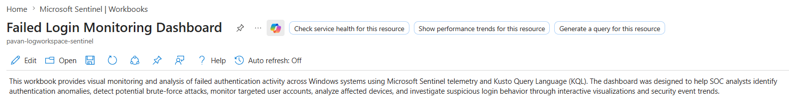
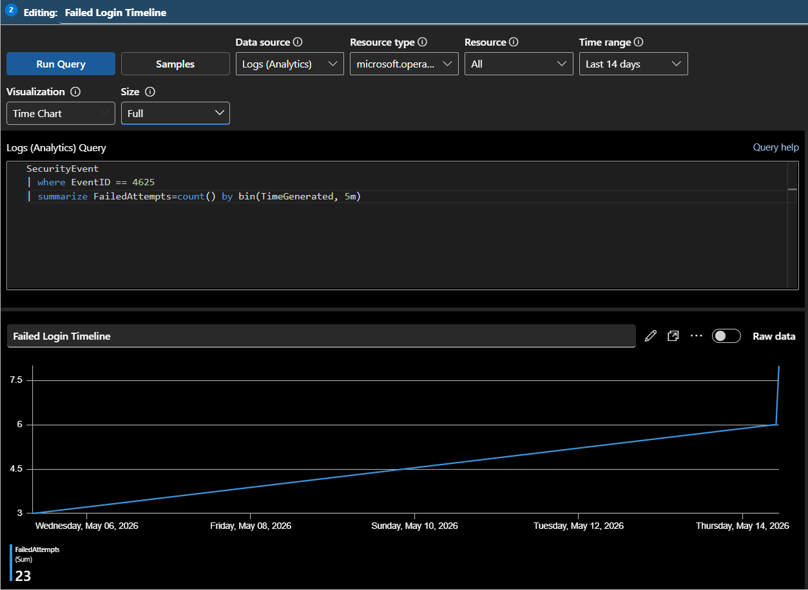
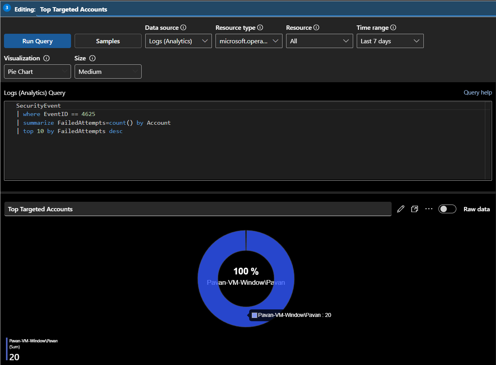

# 🔐 Failed Login Monitoring Dashboard

This workbook was created to monitor failed authentication activity across Windows systems using Microsoft Sentinel Workbooks and Kusto Query Language (KQL).

The dashboard focuses on Windows failed login events (`EventID 4625`) to help visualize:

- authentication spikes
- brute-force activity
- targeted accounts
- affected systems
- authentication trends

---

# 📌 Workbook Information

| Property | Value |
|---|---|
| Workbook Name | Failed Login Monitoring Dashboard |
| Data Source | SecurityEvent Table |
| Primary Event ID | 4625 |
| Monitoring Focus | Failed Authentication Activity |

---

# 📸 Workbook Overview



---

# 📊 Failed Login Timeline

This visualization monitors failed login attempts over time.

## 📌 KQL Query

```kql
SecurityEvent
| where EventID == 4625
| summarize FailedAttempts=count() by bin(TimeGenerated, 5m)
```

---

## 📊 Visualization Type

```text
Time Chart
```

---

## 📌 Purpose

This visualization helps identify:

- spikes in failed authentication attempts
- brute-force attack behavior
- authentication anomalies
- suspicious login timelines

---

## 📸 Failed Login Timeline



---

# 🎯 Top Targeted Accounts

This visualization identifies the accounts receiving the highest number of failed login attempts.

## 📌 KQL Query

```kql
SecurityEvent
| where EventID == 4625
| summarize FailedAttempts=count() by Account
| top 10 by FailedAttempts desc
```

---

## 📊 Visualization Type

```text
Pie Chart
```

---

## 📌 Purpose

This visualization helps analysts:

- identify frequently targeted accounts
- monitor brute-force targeting patterns
- detect authentication abuse

---

## 📸 Top Targeted Accounts



---

# 📋 Latest Failed Login Events

This table displays the latest failed authentication events collected from Windows systems.

## 📌 KQL Query

```kql
SecurityEvent
| where EventID == 4625
| project TimeGenerated, Account, Computer, IpAddress
| sort by TimeGenerated desc
```

---

## 📊 Visualization Type

```text
Grid / Table
```

---

## 📌 Purpose

This visualization helps analysts:

- review recent failed logins
- validate authentication activity
- investigate suspicious login attempts
- identify affected accounts and systems

---

## 📸 Latest Failed Login Events


---

# 🖥️ Failed Attempts by Device

This visualization displays failed login attempts grouped by Windows device.

## 📌 KQL Query

```kql
SecurityEvent
| where EventID == 4625
| summarize FailedAttempts=count() by Computer
```

---

## 📊 Visualization Type

```text
Bar Chart
```

---

## 📌 Purpose

This visualization helps analysts:

- identify targeted systems
- monitor authentication failures per device
- analyze suspicious device activity

---

## 📸 Failed Attempts by Device


---
