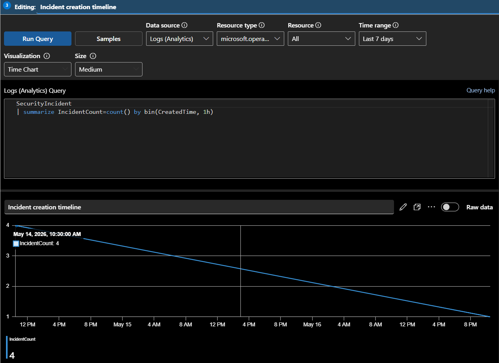
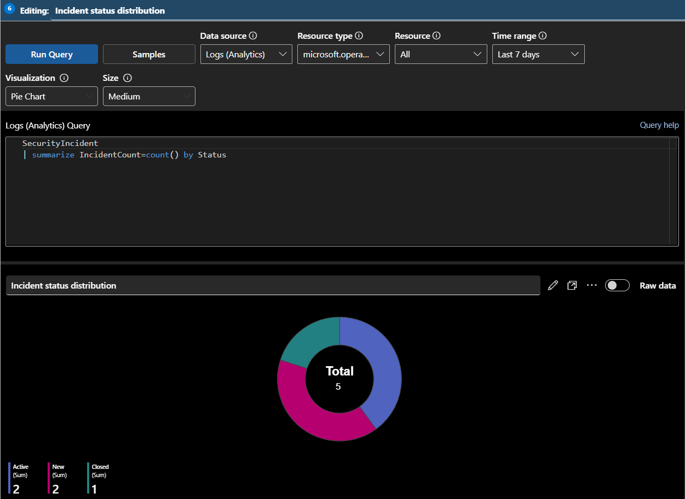
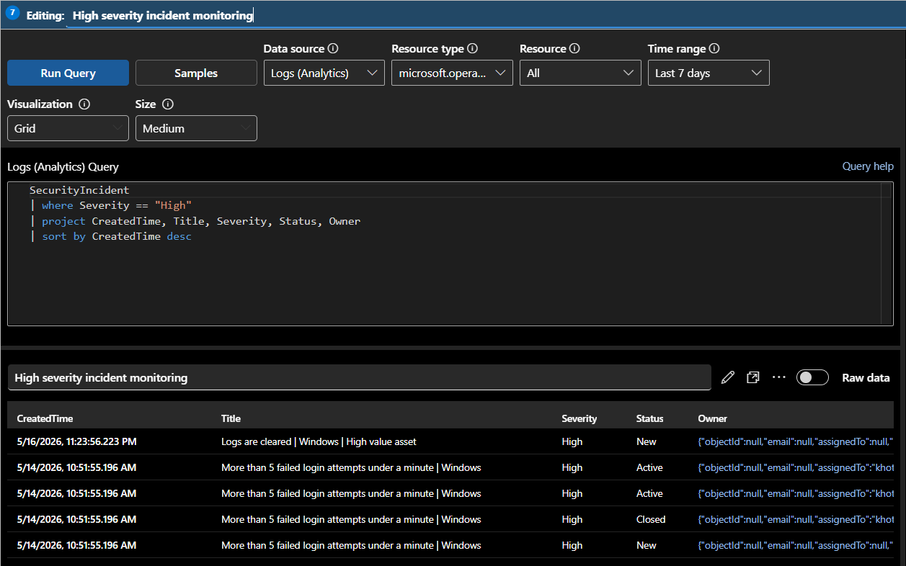

# 🚨 Incident Management Dashboard

This workbook was created to provide centralized visibility into security incidents generated within Microsoft Sentinel. The dashboard helps SOC analysts monitor incident activity, track investigation progress, review incident severity distribution, and analyze operational workload through interactive visualizations powered by Kusto Query Language (KQL).

The workbook focuses on incident telemetry collected from the `SecurityIncident` table and provides insights into active incidents, high severity alerts, incident trends, analyst ownership, and incident lifecycle monitoring. These visualizations help security teams prioritize investigations, improve response efficiency, and maintain operational awareness across the SOC environment.

---

# 📌 Workbook Information

| Property | Value |
|---|---|
| Workbook Name | Incident Management Dashboard |
| Data Source | SecurityIncident Table |
| Monitoring Focus | Security Incident Monitoring |
| Visualization Platform | Microsoft Sentinel Workbooks |

---

# 📸 Workbook Overview


---

# 📊 Incident Severity Distribution

This visualization displays incidents grouped by severity levels such as High, Medium, and Low.

## 📌 KQL Query

```kql
SecurityIncident
| summarize IncidentCount=count() by Severity
```

---

## 📊 Visualization Type

```text
Pie Chart
```

---

## 📌 Purpose

This visualization helps analysts:
- identify critical incidents quickly
- understand incident distribution
- prioritize investigation activities
- monitor overall SOC alert posture

---

## 📸 Incident Severity Distribution


---

# 📈 Incident Creation Timeline

This visualization monitors incident generation trends over time.

## 📌 KQL Query

```kql
SecurityIncident
| summarize IncidentCount=count() by bin(CreatedTime, 1h)
```

---

## 📊 Visualization Type

```text
Time Chart
```

---

## 📌 Purpose

This visualization helps analysts:
- identify spikes in incident generation
- monitor security event trends
- analyze detection frequency
- visualize operational activity within Sentinel

---

## 📸 Incident Timeline



---

# 📋 Active Incident Monitoring

This table displays active incidents generated within Microsoft Sentinel.

## 📌 KQL Query

```kql
SecurityIncident
| project CreatedTime, Title, Severity, Status, Owner
| sort by CreatedTime desc
```

---

## 📊 Visualization Type

```text
Grid / Table
```

---

## 📌 Purpose

This visualization helps analysts:
- monitor active incidents
- track incident ownership
- review investigation status
- identify high priority alerts

---

## 📸 Active Incidents


---

# 👤 Incident Ownership Monitoring

This visualization displays incidents grouped by assigned analyst ownership.

## 📌 KQL Query

```kql
SecurityIncident
| summarize IncidentCount=count() by Owner
```

---

## 📊 Visualization Type

```text
Bar Chart
```

---

## 📌 Purpose

This visualization helps SOC teams:
- monitor analyst workload
- track incident assignment
- balance operational responsibilities
- review investigation distribution

---

## 📸 Incident Ownership Monitoring


---

# 📌 Incident Status Distribution

This visualization groups incidents by their current lifecycle status.

## 📌 KQL Query

```kql
SecurityIncident
| summarize IncidentCount=count() by Status
```

---

## 📊 Visualization Type

```text
Pie Chart
```

---

## 📌 Purpose

This visualization helps analysts:
- monitor open incidents
- track closed investigations
- review incident lifecycle progress
- identify unresolved alerts

---

## 📸 Incident Status Distribution



---

# 🚨 High Severity Incident Monitoring

This table displays all high severity incidents generated within Sentinel.

## 📌 KQL Query

```kql
SecurityIncident
| where Severity == "High"
| project CreatedTime, Title, Severity, Status, Owner
| sort by CreatedTime desc
```

---

## 📊 Visualization Type

```text
Grid / Table
```

---

## 📌 Purpose

This visualization helps analysts:
- focus on critical incidents
- prioritize high-risk investigations
- monitor urgent threats
- improve incident response efficiency

---

## 📸 High Severity Incidents



---
