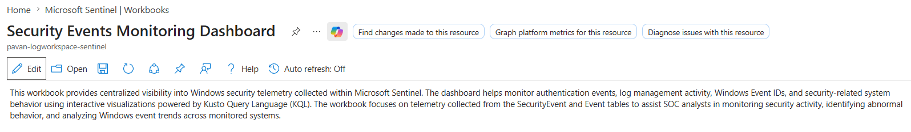
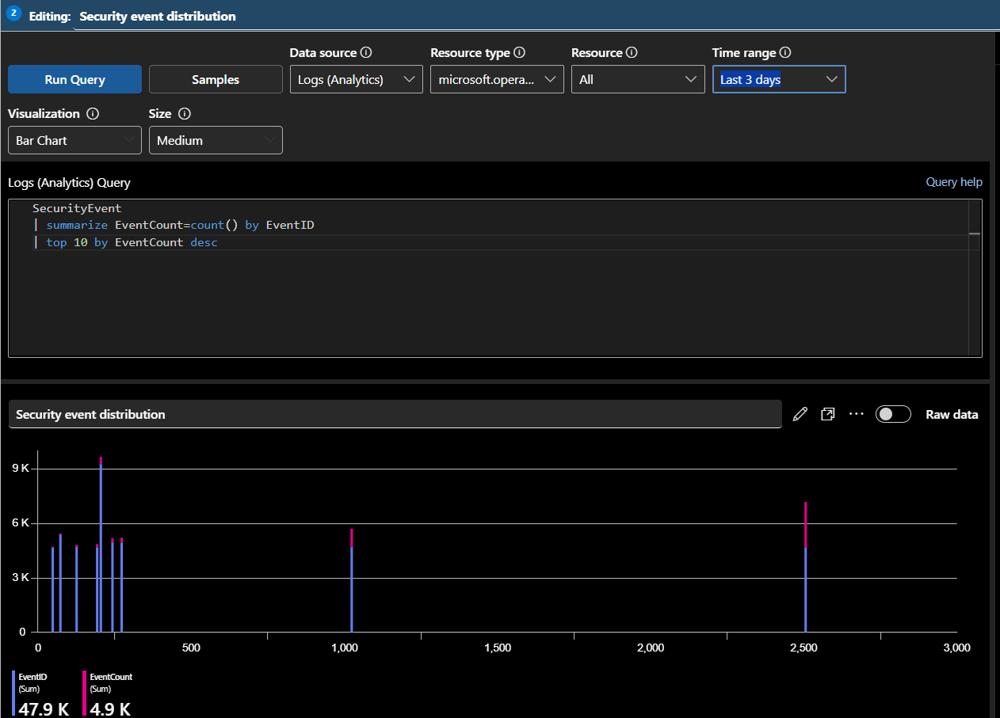
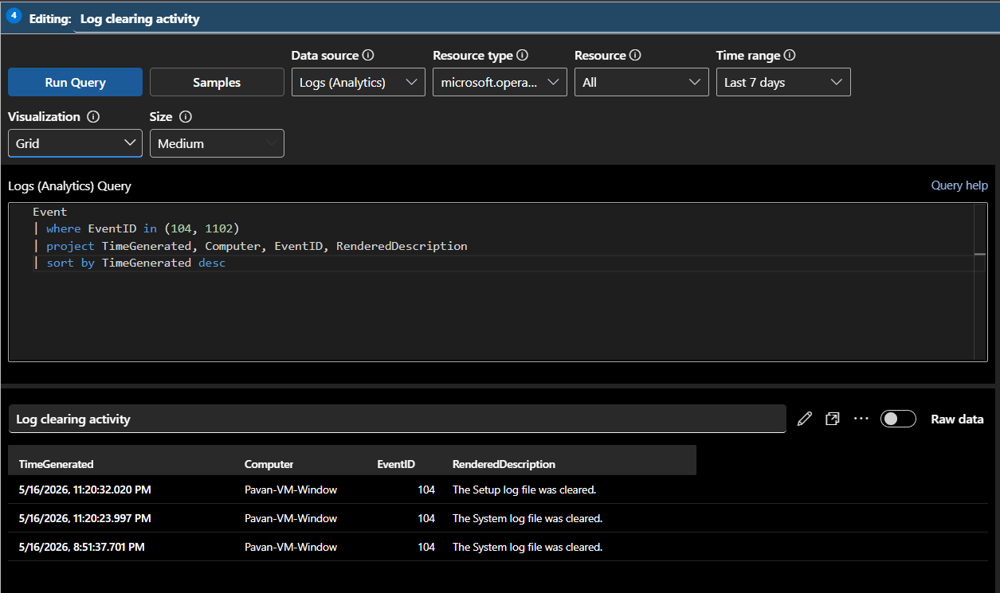
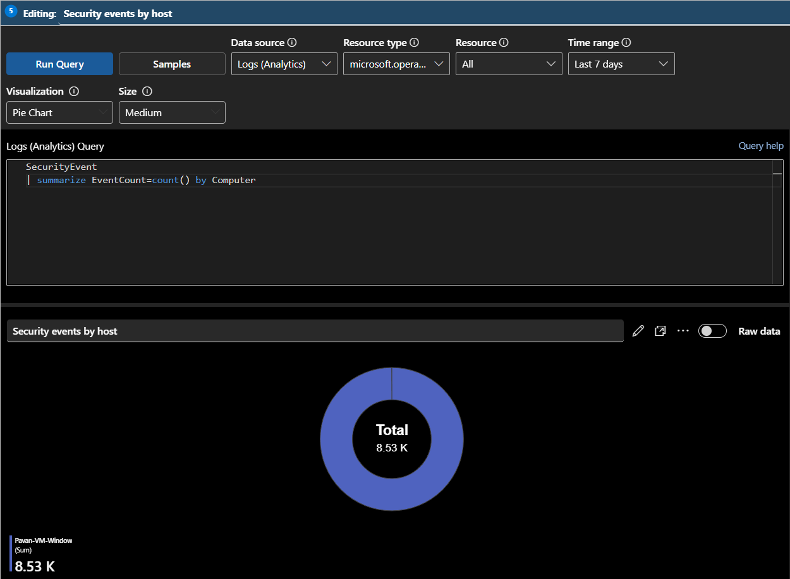
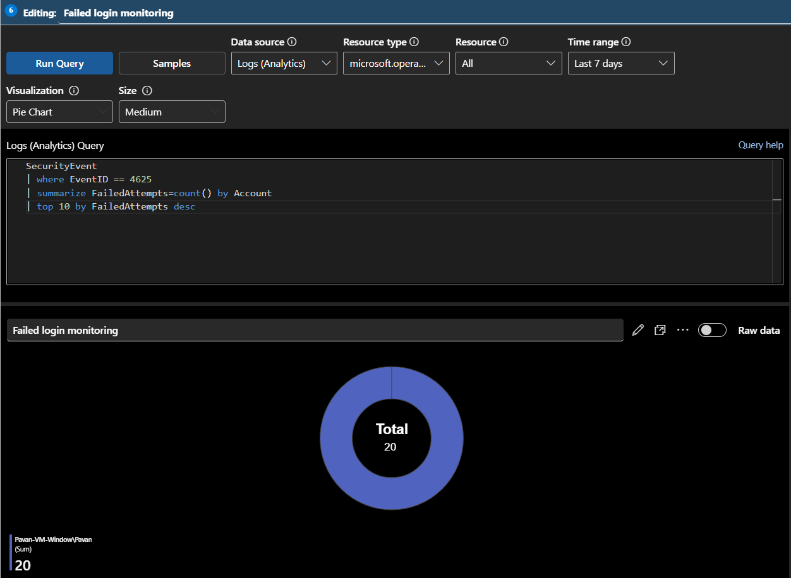

# 🛡️ Security Events Monitoring Dashboard

This workbook provides centralized visibility into Windows security telemetry collected within Microsoft Sentinel. The dashboard helps monitor authentication events, log management activity, Windows Event IDs, and security-related system behavior using interactive visualizations powered by Kusto Query Language (KQL).

The workbook focuses on telemetry collected from the `SecurityEvent` and `Event` tables to assist SOC analysts in monitoring security activity, identifying abnormal behavior, and analyzing Windows event trends across monitored systems.

---

# 📌 Workbook Information

| Property | Value |
|---|---|
| Workbook Name | Security Events Monitoring Dashboard |
| Data Sources | SecurityEvent, Event |
| Monitoring Focus | Windows Security Telemetry |
| Visualization Platform | Microsoft Sentinel Workbooks |

---

# 📸 Workbook Overview



---

# 📊 Security Event Distribution

This visualization displays the most frequently generated Windows security event IDs.

## 📌 KQL Query

```kql
SecurityEvent
| summarize EventCount=count() by EventID
| top 10 by EventCount desc
```

---

## 📊 Visualization Type

```text
Bar Chart
```

---

## 📌 Purpose

This visualization helps analysts:
- identify dominant Windows security events
- understand telemetry distribution
- monitor authentication and system activity
- review security event frequency

---

## 📸 Security Event Distribution



---

# 📈 Authentication Event Timeline

This visualization monitors successful and failed authentication activity over time.

## 📌 KQL Query

```kql
SecurityEvent
| where EventID in (4624, 4625)
| summarize EventCount=count() by EventID, bin(TimeGenerated, 10m)
```

---

## 📊 Visualization Type

```text
Time Chart
```

---

## 📌 Purpose

This visualization helps analysts:
- compare successful and failed login activity
- identify authentication spikes
- detect brute-force behavior
- monitor authentication trends

---

## 📸 Authentication Event Timeline


---

# 🧹 Log Clearing Activity Monitoring

This visualization monitors Windows log clearing events associated with defense evasion activity.

## 📌 KQL Query

```kql
Event
| where EventID in (104, 1102)
| project TimeGenerated, Computer, EventID, RenderedDescription
| sort by TimeGenerated desc
```

---

## 📊 Visualization Type

```text
Grid / Table
```

---

## 📌 Purpose

This visualization helps analysts:
- detect log tampering activity
- monitor defense evasion behavior
- investigate suspicious system actions
- review event log clearing operations

---

## 📸 Log Clearing Activity



---

# 🖥️ Security Events by Host

This visualization displays security event volume grouped by monitored systems.

## 📌 KQL Query

```kql
SecurityEvent
| summarize EventCount=count() by Computer
```

---

## 📊 Visualization Type

```text
Pie Chart
```

---

## 📌 Purpose

This visualization helps analysts:
- identify highly active systems
- monitor host telemetry distribution
- review device-level event activity
- analyze monitored endpoints

---

## 📸 Security Events by Host



---

# 🔐 Failed Login Monitoring

This visualization displays the accounts receiving the highest number of failed login attempts.

## 📌 KQL Query

```kql
SecurityEvent
| where EventID == 4625
| summarize FailedAttempts=count() by Account
| top 10 by FailedAttempts desc
```

---

## 📊 Visualization Type

```text
Pie Chart
```

---

## 📌 Purpose

This visualization helps analysts:
- identify targeted user accounts
- detect brute-force targets
- monitor authentication abuse
- analyze failed login distribution

---

## 📸 Failed Login Monitoring



---

# 📋 Recent Security Events

This table displays the latest Windows security events collected within Sentinel.

## 📌 KQL Query

```kql
SecurityEvent
| project TimeGenerated, EventID, Account, Computer, Activity
| sort by TimeGenerated desc
```

---

## 📊 Visualization Type

```text
Bar Chart
```

---

## 📌 Purpose

This visualization helps analysts:
- review raw security telemetry
- validate Windows events
- investigate suspicious activity
- monitor recent authentication behavior

---

## 📸 Recent Security Events


---
