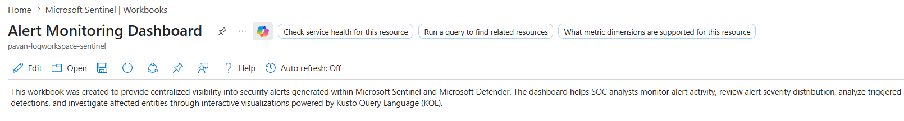
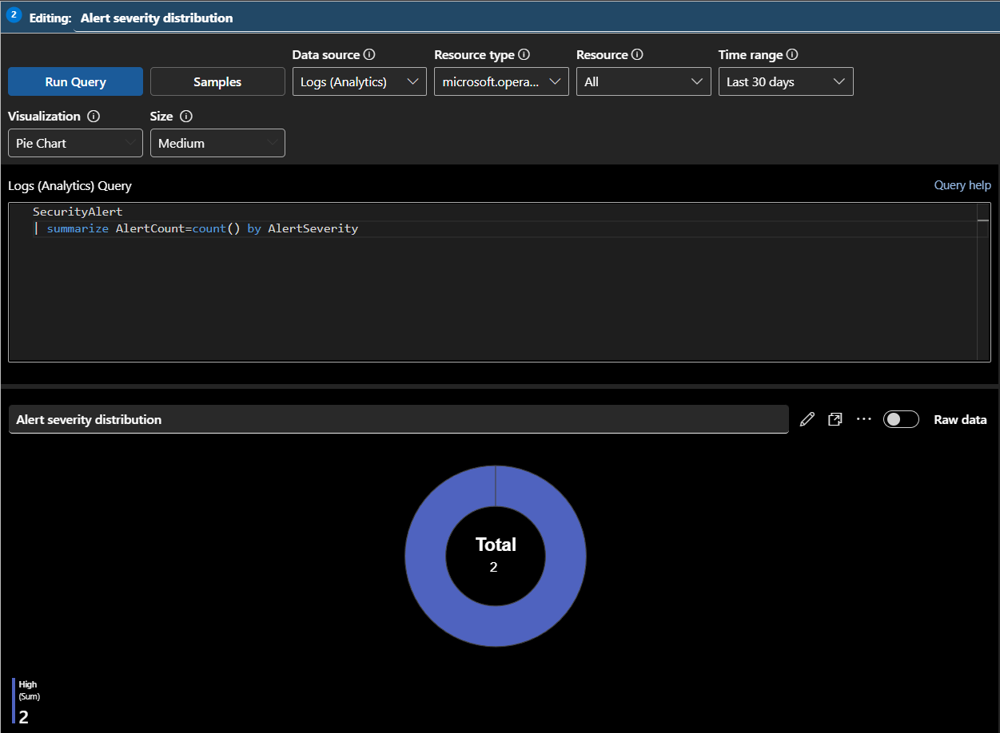
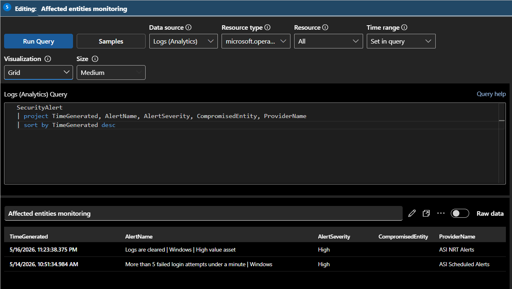
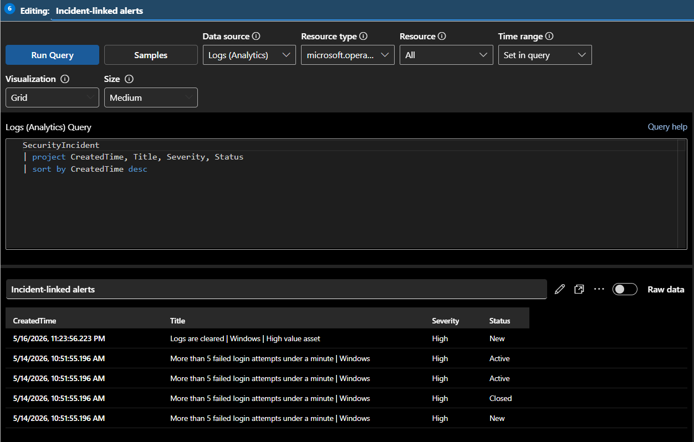

# 🚨 Alert Monitoring Dashboard

This workbook was created to provide visibility into security alerts and detections generated within Microsoft Sentinel. The dashboard helps SOC analysts monitor alert activity, analyze triggered detections, review affected entities, and investigate alert severity trends through interactive visualizations powered by Kusto Query Language (KQL).

The workbook focuses on telemetry collected from the `SecurityAlert` and `SecurityIncident` tables to help analysts validate detections, monitor alert generation trends, identify affected assets, and improve security monitoring visibility across the SOC environment.

---

# 📌 Workbook Information

| Property | Value |
|---|---|
| Workbook Name | Alert Monitoring Dashboard |
| Data Sources | SecurityAlert, SecurityIncident |
| Monitoring Focus | Alert & Detection Monitoring |
| Visualization Platform | Microsoft Sentinel Workbooks |

---

# 📸 Workbook Overview



---

# 📊 Alert Severity Distribution

This visualization displays alerts grouped by severity levels.

## 📌 KQL Query

```kql
SecurityAlert
| summarize AlertCount=count() by AlertSeverity
```

---

## 📊 Visualization Type

```text
Pie Chart
```

---

## 📌 Purpose

This visualization helps analysts:
- identify critical alerts quickly
- monitor alert severity distribution
- prioritize investigations
- review detection posture

---

## 📸 Alert Severity Distribution



---

# 📈 Alert Generation Timeline

This visualization monitors alert creation trends over time.

## 📌 KQL Query

```kql
SecurityAlert
| summarize AlertCount=count() by bin(TimeGenerated, 1h)
```

---

## 📊 Visualization Type

```text
Time Chart
```

---

## 📌 Purpose

This visualization helps analysts:
- identify alert spikes
- monitor detection activity
- analyze alert trends
- review SOC operational activity

---

## 📸 Alert Generation Timeline


---

# ⚙️ Triggered Analytics Rules

This visualization displays the analytics rules generating alerts within Sentinel.

## 📌 KQL Query

```kql
SecurityAlert
| summarize AlertCount=count() by AlertName
| top 10 by AlertCount desc
```

---

## 📊 Visualization Type

```text
Bar Chart
```

---

## 📌 Purpose

This visualization helps analysts:
- identify frequently triggered detections
- monitor analytics rule activity
- review noisy alerts
- analyze detection effectiveness

---

## 📸 Triggered Analytics Rules


---

# 🖥️ Affected Entities Monitoring

This table displays affected systems and entities associated with generated alerts.

## 📌 KQL Query

```kql
SecurityAlert
| project TimeGenerated, AlertName, AlertSeverity, CompromisedEntity, ProviderName
| sort by TimeGenerated desc
```

---

## 📊 Visualization Type

```text
Grid / Table
```

---

## 📌 Purpose

This visualization helps analysts:
- identify affected systems
- review impacted entities
- validate generated detections
- monitor alert telemetry
- analyze alert sources

---

## 📸 Affected Entities Monitoring



---

# 🔗 Incident-Linked Alerts

This visualization displays incidents associated with generated alerts.

## 📌 KQL Query

```kql
SecurityIncident
| project CreatedTime, Title, Severity, Status
| sort by CreatedTime desc
```

---

## 📊 Visualization Type

```text
Grid / Table
```

---

## 📌 Purpose

This visualization helps analysts:
- correlate alerts with incidents
- review triggered incidents
- monitor investigation status
- track alert-to-incident flow

---

## 📸 Incident-Linked Alerts



---

# 📋 Recent Alerts Monitoring

This table displays the latest alerts generated within Sentinel.

## 📌 KQL Query

```kql
SecurityAlert
| project TimeGenerated, AlertName, AlertSeverity, CompromisedEntity
| sort by TimeGenerated desc
```

---

## 📊 Visualization Type

```text
Grid / Table
```

---

## 📌 Purpose

This visualization helps analysts:
- review recent detections
- validate alert activity
- investigate suspicious events
- monitor detection telemetry

---

## 📸 Recent Alerts Monitoring


---
