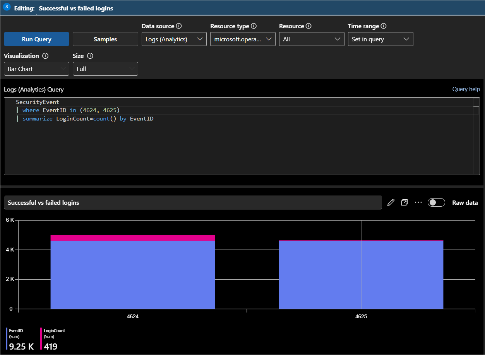
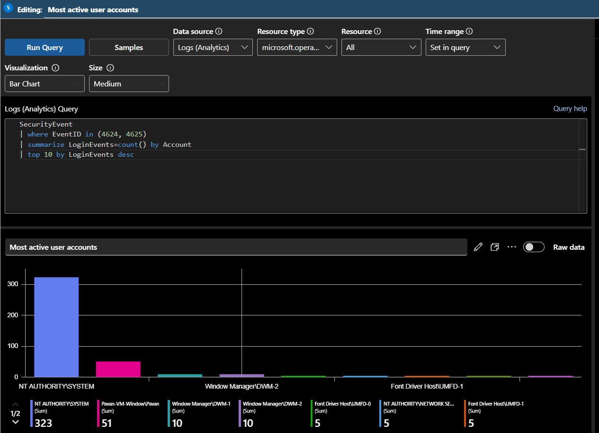

# 🖥️ VM Activity & Authentication Dashboard

This workbook was created to monitor Windows virtual machine activity and authentication telemetry collected within Microsoft Sentinel. The dashboard helps SOC analysts analyze authentication behavior, monitor user activity, identify targeted systems, and review host-level security events using interactive Kusto Query Language (KQL) visualizations.

The workbook focuses on telemetry collected from the `SecurityEvent` and `Event` tables to provide visibility into user logins, failed authentication attempts, host activity, and Windows security event generation across monitored virtual machines.

---

# 📌 Workbook Information

| Property | Value |
|---|---|
| Workbook Name | VM Activity & Authentication Dashboard |
| Data Sources | SecurityEvent, Event |
| Monitoring Focus | VM Activity & Authentication Monitoring |
| Visualization Platform | Microsoft Sentinel Workbooks |

---

# 📸 Workbook Overview


---

# 🔐 Successful vs Failed Logins

This visualization compares successful and failed authentication activity generated within monitored Windows virtual machines.

## 📌 KQL Query

```kql
SecurityEvent
| where EventID in (4624, 4625)
| summarize LoginCount=count() by EventID
```

---

## 📊 Visualization Type

```text
Bar Chart
```

---

## 📌 Purpose

This visualization helps analysts:
- compare successful and failed login activity
- monitor authentication behavior
- identify brute-force attempts
- analyze login anomalies

---

## 📸 Successful vs Failed Logins



---

# 📈 Authentication Timeline

This visualization monitors authentication activity over time.

## 📌 KQL Query

```kql
SecurityEvent
| where EventID in (4624, 4625)
| summarize LoginCount=count() by EventID, bin(TimeGenerated, 10m)
```

---

## 📊 Visualization Type

```text
Time Chart
```

---

## 📌 Purpose

This visualization helps analysts:
- identify authentication spikes
- monitor login trends
- review suspicious login activity
- analyze authentication patterns

---

## 📸 Authentication Timeline


---

# 👤 Most Active User Accounts

This visualization displays the accounts generating the highest authentication activity.

## 📌 KQL Query

```kql
SecurityEvent
| where EventID in (4624, 4625)
| summarize LoginEvents=count() by Account
| top 10 by LoginEvents desc
```

---

## 📊 Visualization Type

```text
Bar Chart
```

---

## 📌 Purpose

This visualization helps analysts:
- identify highly active accounts
- review authentication behavior
- detect unusual account activity
- monitor account usage patterns

---

## 📸 Most Active User Accounts



---

# 🖥️ VM Activity Monitoring

This visualization displays authentication and security event activity grouped by monitored hosts.

## 📌 KQL Query

```kql
SecurityEvent
| summarize EventCount=count() by Computer
```

---

## 📊 Visualization Type

```text
Pie Chart
```

---

## 📌 Purpose

This visualization helps analysts:
- monitor endpoint activity
- identify highly active systems
- analyze host telemetry
- review VM event distribution

---

## 📸 VM Activity Monitoring


---

# 🚨 Failed Login Monitoring

This visualization displays accounts receiving the highest failed authentication attempts.

## 📌 KQL Query

```kql
SecurityEvent
| where EventID == 4625
| summarize FailedAttempts=count() by Account
| top 10 by FailedAttempts desc
```

---

## 📊 Visualization Type

```text
Bar Chart
```

---

## 📌 Purpose

This visualization helps analysts:
- identify targeted accounts
- monitor brute-force behavior
- analyze authentication abuse
- investigate suspicious login attempts

---

## 📸 Failed Login Monitoring


---

# 📋 Recent VM Security Events

This table displays recent Windows security events generated across monitored systems.

## 📌 KQL Query

```kql
SecurityEvent
| project TimeGenerated, EventID, Account, Computer, Activity
| sort by TimeGenerated desc
```

---

## 📊 Visualization Type

```text
Grid / Table
```

---

## 📌 Purpose

This visualization helps analysts:
- review recent telemetry
- validate authentication activity
- investigate suspicious events
- monitor Windows security behavior

---

## 📸 Recent VM Security Events


---
