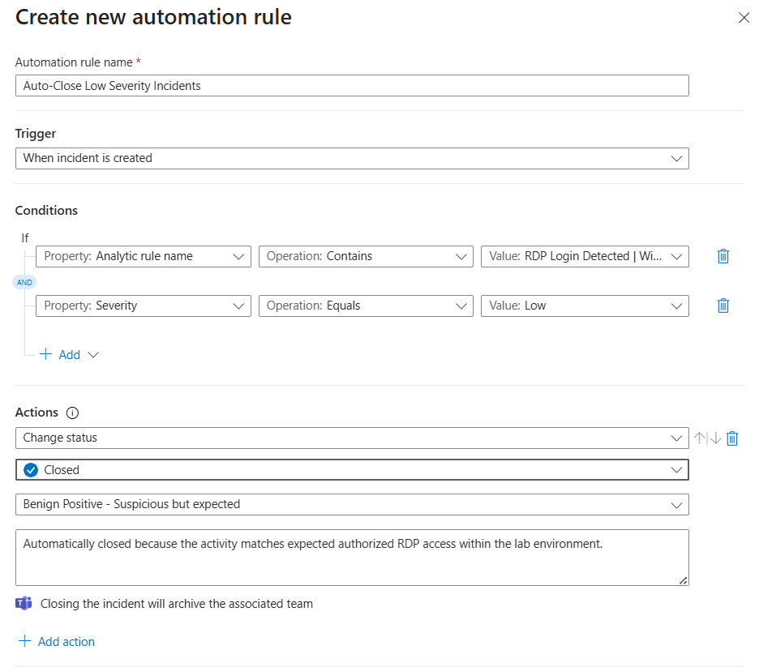
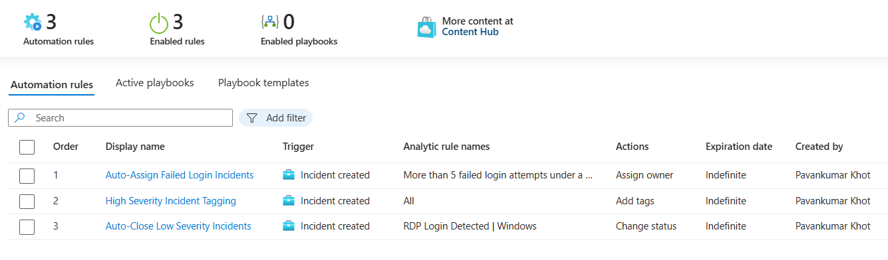

# 🔕 Auto-Close Low Severity Incidents

This automation rule was created to automatically close low severity informational incidents generated within Microsoft Sentinel from expected RDP login activity inside the lab environment.

The automation helps reduce SOC alert fatigue, minimize unnecessary analyst effort, and streamline incident lifecycle management by automatically classifying and closing low-risk incidents.

---

# 📌 Automation Rule Information

| Property | Value |
|---|---|
| Automation Rule Name | Auto-Close Low Severity Incidents |
| Trigger Type | When incident is created |
| Action Type | Update Incident |
| Status | Enabled |

---

# 🚀 Automation Configuration

The automation rule was configured with the following settings:

## Basic Information

| Field | Value |
|---|---|
| Name | Auto-Close Low Severity Incidents |
| Order | 3 |
| Status | Enabled |

---

## Trigger Configuration

| Setting | Value |
|---|---|
| Trigger | When incident is created |

---

## Condition Configuration

| Property | Operator | Value |
|---|---|---|
| Severity | Equals | Low |
| Analytics Rule Name | Contains | RDP Login Detected |

---

## Actions Configured

| Action | Purpose |
|---|---|
| Update Incident | Automatically closes low severity incidents |

Configured Incident Update:

| Field | Value |
|---|---|
| Status | Closed |
| Classification | Benign Positive - Suspicious but expected |

Classification Comment:

```text
Automatically closed because the activity matches expected authorized RDP access within the lab environment.
```

---

# 📸 Automation Rule Configuration




---

# 🚀 Automation Validation

To validate the automation workflow:
- a fresh RDP login was generated against the Windows VM
- the analytics rule generated a low severity incident
- the automation rule triggered automatically
- the incident status was updated to Closed
- incident classification was applied successfully

---

# 📸 Automation Result


---

# 🧠 Security Benefits

This automation workflow helps:
- reduce SOC alert fatigue
- minimize low-risk incident noise
- improve operational efficiency
- automate incident lifecycle management
- standardize informational incident handling

---

# 🛠️ Features Demonstrated

| Feature | Demonstrated |
|---|---|
| Sentinel Automation Rules | ✅ |
| Automated Incident Closure | ✅ |
| Incident Lifecycle Management | ✅ |
| Conditional Automation Logic | ✅ |
| SOC Workflow Automation | ✅ |

---

# 🧠 Key Learnings

- Created Microsoft Sentinel automation rules
- Implemented automatic incident closure workflows
- Configured severity-based automation logic
- Applied automated incident classification
- Reduced low-priority SOC noise using Sentinel automation capabilities

---
