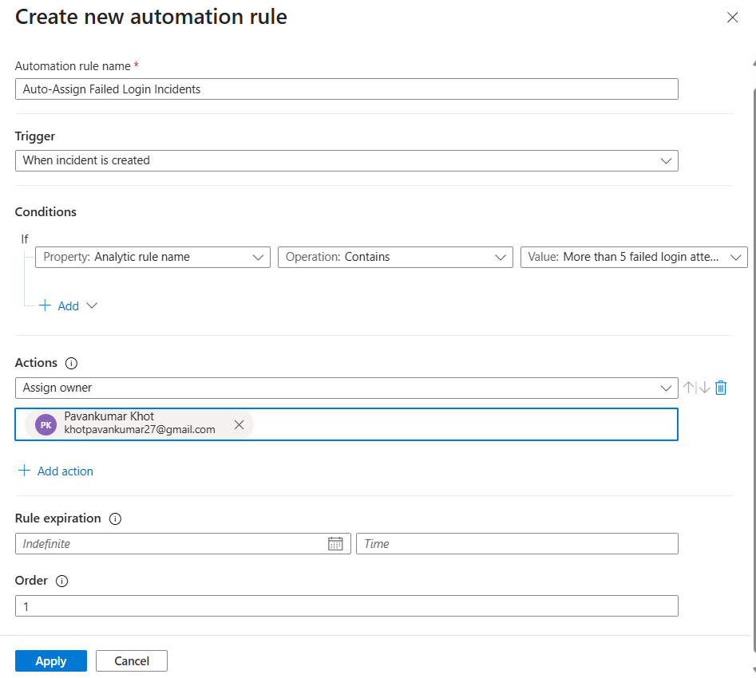
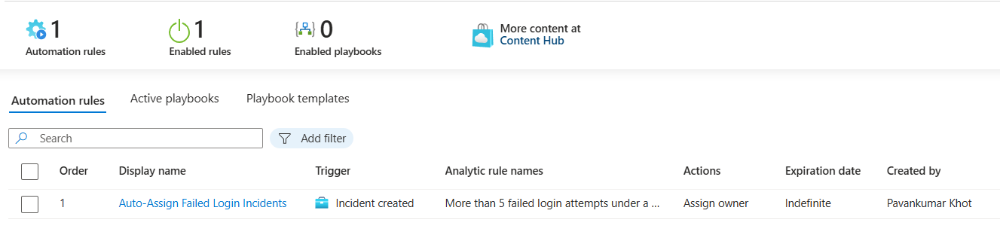

# 🤖 Auto-Assign Failed Login Incidents

This automation rule was created to automatically assign brute-force related incidents to a SOC analyst whenever the failed login analytics rule generates a new incident within Microsoft Sentinel.

The automation helps reduce manual triage effort and improves SOC incident handling efficiency by automatically assigning ownership and investigation tags during incident creation.

---

# 📌 Automation Rule Information

| Property | Value |
|---|---|
| Automation Rule Name | Auto-Assign Failed Login Incidents |
| Trigger Type | When incident is created |
| Action Type | Assign Owner |
| Status | Enabled |

---

# 🚀 Automation Configuration

The automation rule was configured with the following settings:

## Basic Information

| Field | Value |
|---|---|
| Name | Auto-Assign Failed Login Incidents |
| Order | 1 |
| Status | Enabled |

---

## Trigger Configuration

| Setting | Value |
|---|---|
| Trigger | When incident is created |

---

## Condition Configuration

| Property | Operator | Value |
|---|---|---|
| Analytics Rule Name | Contains | More than 5 failed login attempts under a minute |

---

## Actions Configured

| Action | Purpose |
|---|---|
| Assign Owner | Automatically assigns incident to SOC analyst |

---

# 📸 Automation Rule Configuration

---

# 🚀 Automation Validation

To validate the automation workflow:
- multiple failed login attempts were generated against the Windows VM
- the analytics rule generated a new incident
- the automation rule triggered automatically
- the incident owner was assigned automatically
- investigation tags were applied successfully

---

# 📸 Automation Result

---

# 🧠 Security Benefits

This automation workflow helps:
- reduce manual SOC effort
- improve incident ownership visibility
- accelerate incident triage
- standardize incident handling workflows

---

# 🛠️ Features Demonstrated

| Feature | Demonstrated |
|---|---|
| Sentinel Automation Rules | ✅ |
| Automated Incident Assignment | ✅ |
| Conditional Automation Logic | ✅ |
| Incident Tagging | ✅ |
| SOC Workflow Automation | ✅ |

---

# 🧠 Key Learnings

- Created Microsoft Sentinel automation rules
- Configured incident-based trigger conditions
- Automated incident ownership assignment
- Implemented SOC workflow automation
- Improved operational efficiency using Sentinel automation capabilities

---
