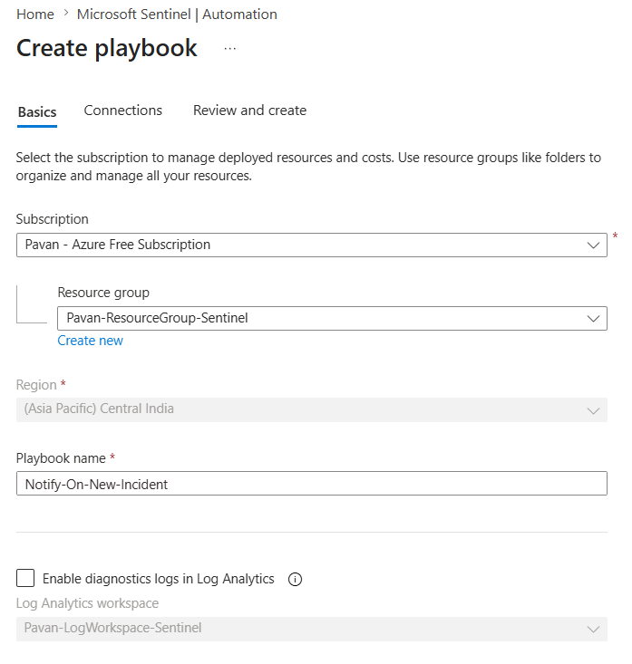
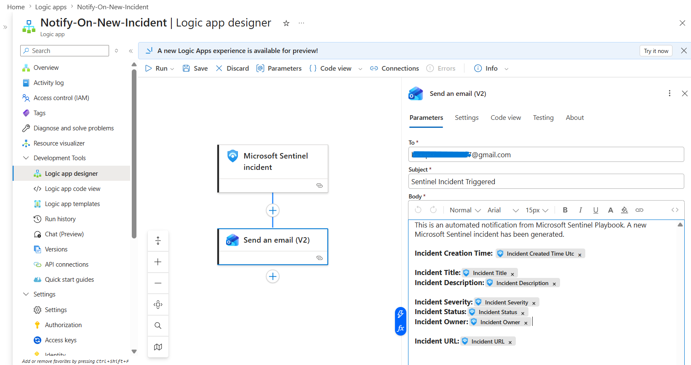
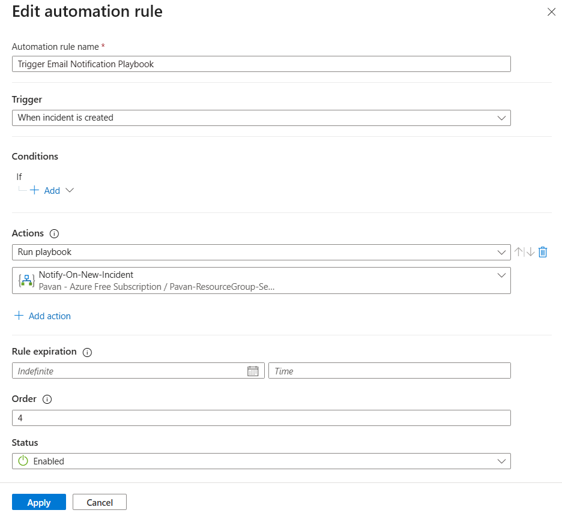

# 📧 Email Notification Playbook

This playbook was created using Azure Logic Apps and integrated with Microsoft Sentinel to automate incident notification workflows.

The playbook automatically sends an email notification whenever a new Microsoft Sentinel incident is created. Dynamic incident information such as incident title, severity, status, and creation time is included within the notification email.

This implementation demonstrates a basic SOAR (Security Orchestration, Automation, and Response) workflow using Microsoft Sentinel Automation Rules and Logic Apps.

---

# 📌 Playbook Information

| Property | Value |
|---|---|
| Playbook Name | Notify-On-New-Incident |
| Trigger Type | Microsoft Sentinel Incident Trigger |
| Workflow Type | Logic App (Consumption) |
| Action Performed | Send Email Notification |
| Status | Operational |

---

# 🚀 Playbook Workflow

```text
Microsoft Sentinel Incident
        ↓
Automation Rule Triggered
        ↓
Logic App Playbook Executed
        ↓
Email Notification Sent
```

---

# 🛠️ Playbook Creation Steps

## Step 1 — Create Playbook

Navigate to:

```text
Microsoft Sentinel
→ Automation
→ Create
→ Playbook with incident trigger
```

Configure:
- playbook name
- resource group
- region
- consumption plan

---

## Step 2 — Configure Logic App Designer

Inside Logic App Designer:
- Microsoft Sentinel incident trigger was automatically added
- a new action was created using `Send an email (V2)`

---

## Step 3 — Configure Email Connector

The Office 365 Outlook connector was authenticated and configured to send automated notification emails.

Dynamic incident fields were added inside the email body using Logic App dynamic content.

---

## Step 4 — Save Playbook

The playbook configuration was saved successfully after validating the Logic App workflow.

---

# 📸 Playbook Configuration





---

# 🚀 Automation Rule Integration

An automation rule was created to automatically trigger the playbook whenever a new Microsoft Sentinel incident is generated.

Automation Workflow:
- trigger type configured as `When incident is created`
- action configured as `Run playbook`
- linked with `Notify-On-New-Incident`

---

# 📸 Automation Rule Configuration



---

# 🚀 Email Notification Validation

To validate the playbook workflow:
- a new Sentinel incident was generated
- the automation rule triggered automatically
- the Logic App executed successfully
- an automated email notification was received successfully

The email included:
- incident title
- severity
- status
- creation time

---

# 📸 Successful Playbook Execution


---

# 📸 Email Notification Result


---

# 🧠 Features Demonstrated

| Feature | Demonstrated |
|---|---|
| Microsoft Sentinel Playbooks | ✅ |
| Azure Logic Apps | ✅ |
| SOAR Workflow Automation | ✅ |
| Dynamic Incident Content | ✅ |
| Automation Rules Integration | ✅ |
| Email Notification Workflow | ✅ |

---

# 🧠 Key Learnings

- Created Logic App playbooks integrated with Microsoft Sentinel
- Configured Microsoft Sentinel incident triggers
- Implemented automated incident notification workflows
- Integrated Office 365 Outlook connector
- Used dynamic incident content inside Logic App workflows
- Connected automation rules with Sentinel playbooks
- Validated end-to-end SOAR workflow execution

---
