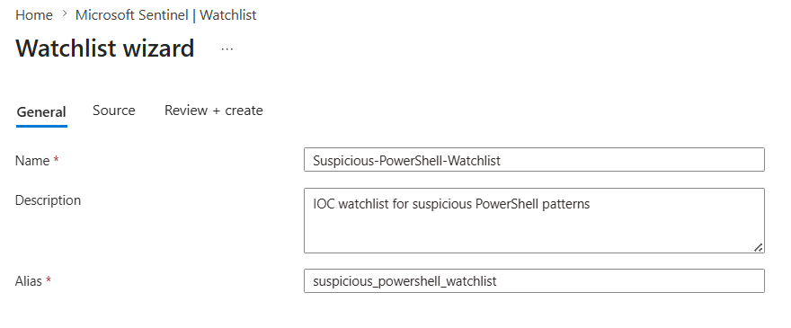
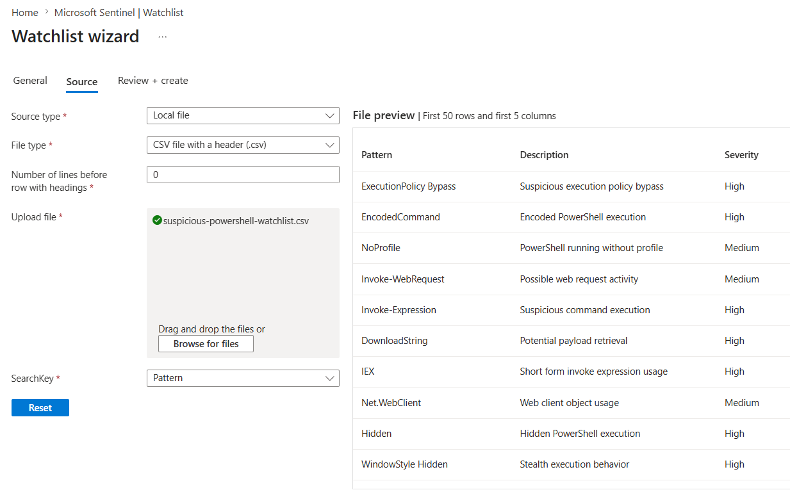
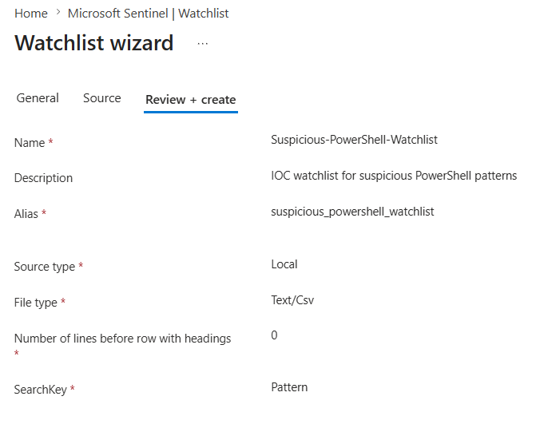
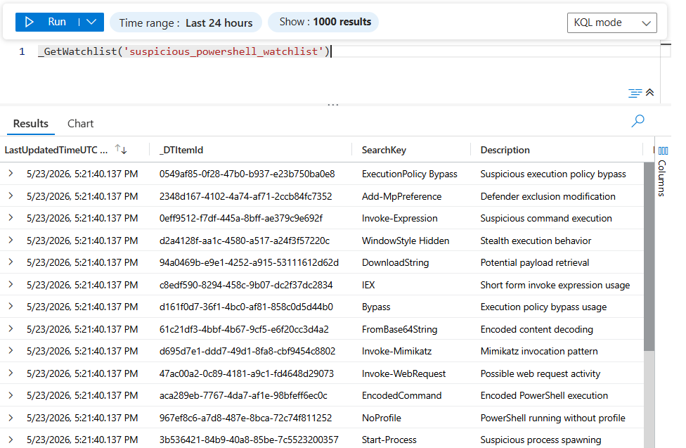
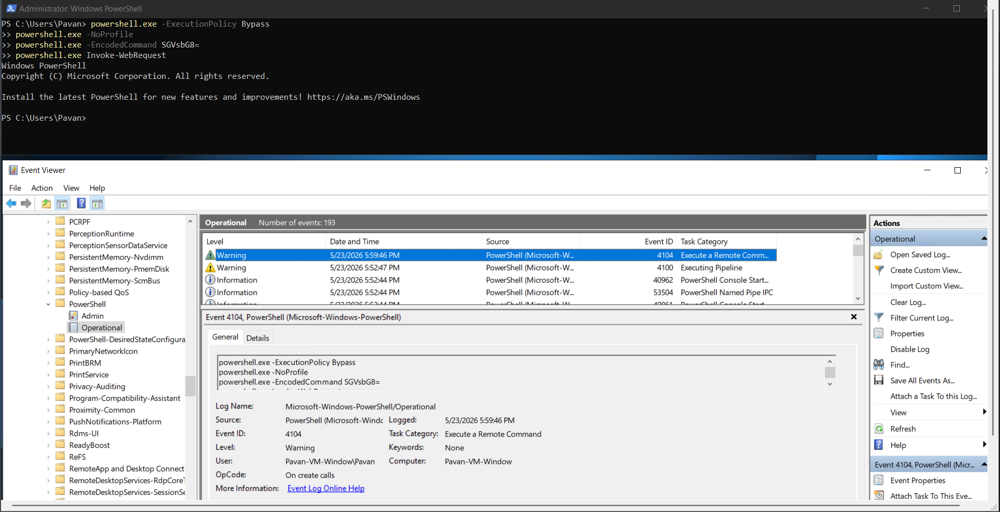
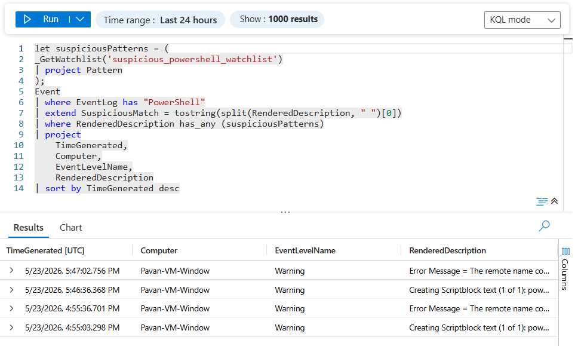
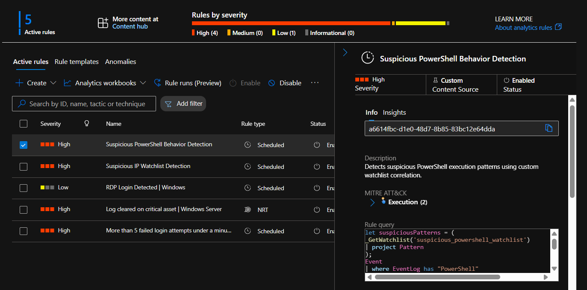
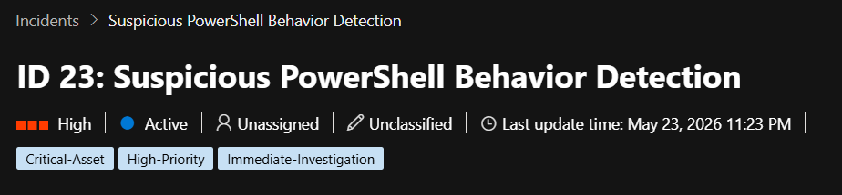
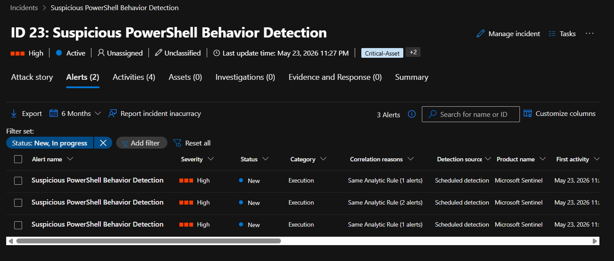

# 🚨 Suspicious PowerShell Behavior Detection Using Watchlists

This section demonstrates advanced behavior-based threat detection using Microsoft Sentinel Watchlists, PowerShell Operational Logs, KQL correlation, and Analytics Rules.

A custom watchlist containing suspicious PowerShell execution patterns was created and correlated against PowerShell Operational telemetry collected from the Windows victim VM.

This implementation demonstrates:
- PowerShell telemetry monitoring
- behavior-based detection engineering
- custom IOC correlation
- KQL-based analytics
- incident generation using suspicious PowerShell activity
- safe attack simulation techniques

---

# 🧠 Objective

The goal of this implementation was to:
- monitor suspicious PowerShell activity
- ingest PowerShell Operational logs into Sentinel
- create custom PowerShell IOC watchlists
- correlate suspicious execution patterns against telemetry
- generate Sentinel incidents automatically

---

# ⚡ Why PowerShell Monitoring Matters

PowerShell is one of the most abused tools in modern attacks because it allows:
- remote execution
- payload downloads
- in-memory execution
- execution policy bypass
- stealthy scripting

Attackers frequently use suspicious PowerShell arguments such as:
- EncodedCommand
- ExecutionPolicy Bypass
- NoProfile
- Invoke-WebRequest

This implementation demonstrates how Microsoft Sentinel can detect such suspicious behavior safely in a lab environment.

---

# 🖥️ PowerShell Operational Logging

PowerShell Operational logging was enabled on the Windows victim VM to collect detailed PowerShell execution telemetry.

Path used:

```text
Event Viewer
→ Applications and Services Logs
→ Microsoft
→ Windows
→ PowerShell
→ Operational
```

This generated:
- informational events
- warning events
- PowerShell execution traces
- suspicious command telemetry

---


# 🚀 Data Collection Rule (DCR) Configuration

The Azure Monitor Data Collection Rule (DCR) was updated to ingest PowerShell Operational logs into Microsoft Sentinel.

Custom XPath entries configured:

```text
Application!*
Security!*
System!*
Microsoft-Windows-PowerShell/Operational!*
```

This ensured:
- existing SecurityEvent collection remained intact
- PowerShell Operational telemetry was additionally collected

---

# 🚀 Suspicious PowerShell Watchlist Creation

A custom watchlist containing suspicious PowerShell execution patterns was created inside Microsoft Sentinel.

Watchlist Name:

```text
Suspicious-PowerShell-Watchlist
```

Alias:

```text
suspicious_powershell_watchlist
```

SearchKey:

```text
Pattern
```

---

# 📄 Watchlist CSV Structure

```csv
Pattern,Description,Severity
ExecutionPolicy Bypass,Suspicious execution policy bypass,High
EncodedCommand,Encoded PowerShell execution,High
NoProfile,PowerShell running without profile,Medium
Invoke-WebRequest,Possible web request activity,Medium
Invoke-Expression,Suspicious command execution,High
DownloadString,Potential payload retrieval,High
IEX,Short form invoke expression usage,High
Net.WebClient,Web client object usage,Medium
Hidden,Hidden PowerShell execution,High
WindowStyle Hidden,Stealth execution behavior,High
Bypass,Execution policy bypass usage,High
Unrestricted,Unrestricted execution policy usage,Medium
Start-Process,Suspicious process spawning,Medium
FromBase64String,Encoded content decoding,High
Reflection.Assembly,Potential in-memory execution,High
WebRequest,Outbound web communication,Medium
iex(new-object net.webclient),Classic download cradle pattern,High
Invoke-Mimikatz,Mimikatz invocation pattern,Critical
Set-MpPreference,Defender modification attempt,High
Add-MpPreference,Defender exclusion modification,High
```

---

# 📸 Screenshot Section





# 🔍 Watchlist Validation

The following KQL query was used to validate successful watchlist ingestion:

```kusto
_GetWatchlist('suspicious_powershell_watchlist')
```

This confirmed:
- successful IOC ingestion
- accessible watchlist entries
- proper alias configuration

---

# 📸 Screenshot Section



---

# 🚀 Suspicious PowerShell Activity Simulation

Safe but suspicious-looking PowerShell commands were executed on the Windows victim VM to generate telemetry.

The commands were intentionally harmless and used only for:
- telemetry generation
- detection validation
- SOC simulation purposes

---

# ⚠️ Simulated Suspicious Commands

```powershell
powershell.exe -ExecutionPolicy Bypass
powershell.exe -NoProfile
powershell.exe -EncodedCommand SGVsbG8=
powershell.exe Invoke-WebRequest
```

These commands generated:
- suspicious PowerShell Operational logs
- behavior-based telemetry
- detection-worthy events

without harming the VM.

---

# 📸 Screenshot Section



---

# 🔍 Sentinel Log Validation

The following KQL query was used to validate successful PowerShell telemetry ingestion:

```kusto
Event
| where EventLog has "PowerShell"
| sort by TimeGenerated desc
```

This confirmed:
- successful PowerShell log ingestion
- telemetry visibility inside Sentinel
- operational logging functionality

---

# 📸 Screenshot Section



---

# 🚀 Analytics Rule Creation

A scheduled analytics rule was created to correlate PowerShell Operational logs against suspicious patterns stored in the watchlist.

Rule Name:

```text
Suspicious PowerShell Behavior Detection
```

MITRE ATT&CK Mapping:
- Execution
- T1059.001 - PowerShell

---

# 🔍 Detection Query

```kusto
let suspiciousPatterns = (
_GetWatchlist('suspicious_powershell_watchlist')
| project Pattern
);

Event
| where EventLog has "PowerShell"
| extend SuspiciousMatch = tostring(split(RenderedDescription, " ")[0])
| where RenderedDescription has_any (suspiciousPatterns)
| project
    TimeGenerated,
    Computer,
    EventLevelName,
    RenderedDescription
| sort by TimeGenerated desc
```

---

# ⚙️ Rule Configuration

| Setting | Value |
|---|---|
| Rule Type | Scheduled Query Rule |
| Severity | High |
| Query Frequency | 5 Minutes |
| Lookup Data | Last 5 Minutes |
| Incident Creation | Enabled |
| Alert Threshold | Greater than 0 results |

---

# 📸 Screenshot Section



---

# 🚨 Incident Generation

After PowerShell telemetry ingestion and rule execution:
- Microsoft Sentinel correlated suspicious PowerShell patterns
- analytics rule triggered automatically
- incident was generated successfully

This demonstrated:
- behavior-based detection engineering
- watchlist-driven PowerShell monitoring
- custom IOC correlation
- automated threat detection workflow

---

# 📸 Screenshot Section




---

# 🎯 Key Learning Outcomes

This implementation demonstrated:
- PowerShell Operational logging
- Azure Monitor DCR customization
- custom IOC watchlists
- KQL-based behavior correlation
- suspicious PowerShell detection
- Sentinel analytics rule engineering
- incident generation workflows
- behavior-based threat detection
- SOC telemetry analysis

---

# 🧠 Final Detection Workflow

```text
Suspicious PowerShell Execution
↓
PowerShell Operational Logs
↓
Azure Monitor DCR Ingestion
↓
Microsoft Sentinel Event Table
↓
Watchlist Correlation
↓
Analytics Rule Trigger
↓
Incident Generation
```

This implementation transformed the SOC lab from simple authentication monitoring into advanced behavior-based detection engineering using Microsoft Sentinel.
