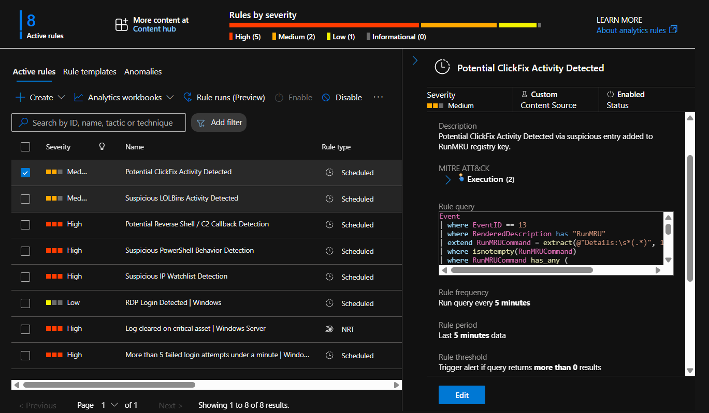

# 🎭 ClickFix Initial Access Simulation & RunMRU Detection

> Simulating a modern ClickFix-style social engineering attack and detecting user execution activity through RunMRU registry artifacts using Sysmon, Azure Monitor Agent (AMA), and Microsoft Sentinel.

---

# 🎯 Objective

This project demonstrates a ClickFix-inspired attack simulation where a user is socially engineered into executing a command via the Windows Run dialog.

The goal was to:

- Simulate a realistic ClickFix attack chain
- Generate RunMRU registry artifacts
- Capture Sysmon Registry Events
- Ingest telemetry into Microsoft Sentinel
- Create a custom analytics rule
- Generate alerts and incidents for detection validation

---

# 🏗️ Lab Architecture

```text
Linux Attacker VM
        │
        ▼
Python HTTP Server
        │
        ▼
Fake Teams Voicemail Page
        │
        ▼
Cloudflare Verification Page
        │
        ▼
User Executes Command via Win + R
        │
        ▼
RunMRU Registry Updated
        │
        ▼
Sysmon Event ID 13
        │
        ▼
Azure Monitor Agent
        │
        ▼
Microsoft Sentinel
        │
        ▼
Analytics Rule
        │
        ▼
Incident Created
```

---

# ⚔️ Attack Scenario

A user receives a fake Microsoft Teams voicemail notification.

The voicemail page redirects the user to a fake Cloudflare verification page.

The verification process instructs the user to execute a command via the Windows Run dialog.

Executing the command creates a RunMRU registry artifact, which is collected by Sysmon and forwarded to Microsoft Sentinel for detection.

---

# 🛠️ Environment

## Attacker Infrastructure

- Ubuntu Linux VM
- Python HTTP Server

## Victim Infrastructure

- Windows VM
- Sysmon

## Detection Stack

- Azure Monitor Agent (AMA)
- Log Analytics Workspace
- Microsoft Sentinel

---

# 🏗️ Infrastructure Preparation

## Step 1 — Create Project Directory

```bash
mkdir ClickFix-RunMRU-Detection-Simulation
cd ClickFix-RunMRU-Detection-Simulation
```

---

## Step 2 — Create Fake Microsoft Teams Voicemail Page

Created:

```text
index.html
```

Purpose:

- Simulate Teams voicemail notification
- Convince the user to click a voicemail message
- Redirect user to verification page

### Screenshot


---

## Step 3 — Create Fake Cloudflare Verification Page

Created:

```text
captcha.html
```

Purpose:

- Simulate Cloudflare verification
- Create legitimacy
- Instruct user to execute a command

Features:

- Cloudflare branding
- Verification animation
- Human verification prompt
- User instructions

### Screenshot


---

## Step 4 — Host Pages on Linux VM

Started a Python web server:

```bash
python3 -m http.server 8080
```

Hosted URL:

```text
http://<ATTACKER-IP>:8080
```

Victim machine accessed the phishing infrastructure directly from the Linux VM.

### Screenshot


---

## Step 5 — User Interaction Simulation

User opens:

```text
http://<ATTACKER-IP>:8080
```

Attack flow:

```text
Open Fake Teams Voicemail
            ↓
Click "Listen To Voicemail"
            ↓
Redirect to Cloudflare Verification
            ↓
Click "Verify You Are Human"
            ↓
Follow Instructions
            ↓
Open Win + R
            ↓
Execute Command
```
## Attack Demonstration


Full recording: [clickfix-user-execution.mp4](videos/clickfix-user-execution.mp4)

---

# 🧪 Simulated User Execution

Command used during simulation:

```powershell
powershell.exe -ExecutionPolicy Bypass -NoProfile -WindowStyle Hidden -Command "Invoke-WebRequest https://secure-verification.example/check"
```

User Context:

```text
Pavan-VM-Window\Pavan
```

---

# 🔍 Artifact Generation

Execution through the Run dialog generated a RunMRU registry artifact.

Registry Path:

```text
HKCU\Software\Microsoft\Windows\CurrentVersion\Explorer\RunMRU
```

Generated Event:

```text
Sysmon Event ID 13
Registry Value Set
```

---

# 📡 Log Collection Pipeline

```text
Windows Endpoint
        ↓
Sysmon
        ↓
Azure Monitor Agent
        ↓
Log Analytics Workspace
        ↓
Microsoft Sentinel
```

---

# 📊 RunMRU Validation Query

The following KQL query was used to validate RunMRU activity and extract the executed command from Sysmon telemetry.

```kusto
Event
| where EventID == 13
| where RenderedDescription has "RunMRU"
| extend RunMRUCommand = extract(@"Details:\s*(.*)", 1, RenderedDescription)
| project TimeGenerated, Computer, RunMRUCommand
```

### Screenshot


---

# 🧠 Detection Engineering

## Analytics Rule Name

```text
Potential ClickFix Activity Detected
```

## Analytics Rule Logic

```kusto
Event
| where EventID == 13
| where RenderedDescription has "RunMRU"
| extend RunMRUCommand = extract(@"Details:\s*(.*)", 1, RenderedDescription)
| where isnotempty(RunMRUCommand)
| where RunMRUCommand has_any (
    "powershell",
    "pwsh",
    "cmd.exe",
    "mshta",
    "rundll32",
    "regsvr32",
    "wscript",
    "cscript",
    "certutil",
    "bitsadmin",
    "curl",
    "wget"
)
| project
    TimeGenerated,
    Computer,
    RunMRUCommand,
    UserName,
    RenderedDescription
```

---

# 🎯 MITRE ATT&CK Mapping

| Technique | Description |
|------------|-------------|
| T1204 | User Execution |
| T1059 | Command and Scripting Interpreter |

### Screenshot



---

# 🚔 Incident Creation

Microsoft Sentinel successfully generated an incident based on the analytics rule.

Incident Name:

```text
Potential ClickFix Activity Detected
```

### Screenshot


---

# 📈 Detection Workflow

```text
User Visits Fake Teams Page
            ↓
Cloudflare Verification Page
            ↓
User Executes Command
            ↓
RunMRU Registry Updated
            ↓
Sysmon Event ID 13
            ↓
AMA Collection
            ↓
Sentinel Ingestion
            ↓
Analytics Rule Triggered
            ↓
Alert Created
            ↓
Incident Created
```

---

# 📚 Key Learnings

- ClickFix attacks rely heavily on user interaction.
- RunMRU provides valuable forensic evidence of command execution via Win + R.
- Sysmon Event ID 13 can be leveraged to monitor registry modifications.
- Microsoft Sentinel can detect ClickFix-style activity through custom KQL analytics rules.
- Detection engineering can combine registry artifacts and behavioral indicators to identify social engineering attacks.

---

# ✅ Outcome

Successfully simulated a ClickFix-style initial access attack and built an end-to-end detection workflow using:

- Sysmon
- Azure Monitor Agent (AMA)
- Microsoft Sentinel
- KQL
- Analytics Rules
- Incident Generation

This project demonstrates how defenders can identify and investigate user-executed commands originating from ClickFix-style social engineering campaigns.
