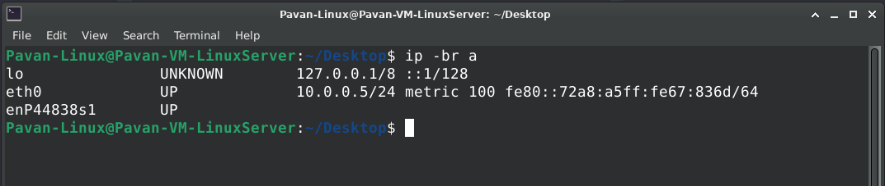
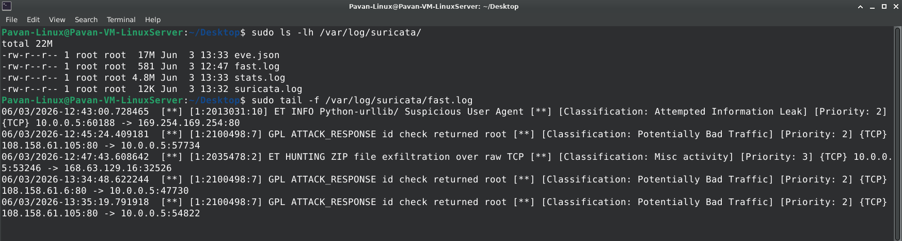

# 🛡️ 01-Suricata-Deployment

---

# 🎯 Objective

The objective of this project is to deploy and validate **Suricata IDS (Intrusion Detection System)** on an Ubuntu Linux VM and introduce network-level visibility into the SOC Lab.

Until this point, the lab primarily relied on endpoint telemetry generated by Windows Sysmon. By deploying Suricata, the lab gains the ability to inspect network traffic and detect suspicious activities such as:

- Port Scanning
- Brute Force Attempts
- Command & Control (C2) Traffic
- Malware Communication
- Policy Violations
- Reconnaissance Activity

This project serves as the foundation for future network security monitoring, detection engineering, and threat hunting exercises.

---

# 🧠 What is Suricata?

Suricata is an open-source Intrusion Detection System (IDS), Intrusion Prevention System (IPS), and Network Security Monitoring (NSM) platform.

Unlike endpoint-based tools such as Sysmon, Suricata analyzes network packets and identifies suspicious traffic patterns using predefined detection signatures.

In enterprise environments, Suricata is commonly used to:

- Monitor network traffic
- Detect malicious activity
- Generate security alerts
- Support incident response investigations
- Feed alerts into SIEM platforms

---

# 🏗️ Lab Architecture

```text
Internet
    │
    ▼
Ubuntu Linux VM
(10.0.0.5)
    │
    ├── Suricata IDS
    └── Network Traffic Monitoring

Windows VM
(10.0.0.4)
    │
    ├── Sysmon
    └── Endpoint Telemetry
```

---

# 📋 Prerequisites

Before deploying Suricata, the following components were already available:

- Azure Virtual Network
- Ubuntu 24.04.4 LTS Linux VM
- Windows VM
- Internet Connectivity
- Administrative Access to Linux VM

---

# 🔍 Verify Operating System

## Why are we doing this?

Different Linux distributions and versions may require different installation procedures. Verifying the operating system ensures compatibility with Suricata packages and documentation.

## Command

```bash
cat /etc/os-release
```

## Expected Result

Ubuntu version information is displayed.

### 📸 Screenshot


---

# ⚙️ Update Linux Packages

## Why are we doing this?

Updating the operating system ensures that all packages, dependencies, and security updates are current before installing Suricata.

## Command

```bash
sudo apt update && sudo apt upgrade -y
```

## Expected Result

The system downloads and installs available package updates successfully.

---

# ⚙️ Install Suricata

## What is happening?

The Suricata package and supporting components are installed on the Linux VM.

## Why are we doing this?

Suricata will provide network intrusion detection capabilities and generate alerts when suspicious network activity is observed.

## Command

```bash
sudo apt install suricata -y
```

## Expected Result

Suricata installation completes successfully.

### 📸 Screenshot


---

# 🔍 Verify Suricata Installation

## Why are we doing this?

This step confirms that Suricata binaries are installed correctly and available to the operating system.

## Command

```bash
suricata --build-info
```

## Expected Result

Version and build information are displayed.

Example:

```text
This is Suricata version 7.x
```

### 📸 Screenshot


---

# 🔧 Verify Suricata Service

## Why are we doing this?

Installing Suricata does not guarantee that the service is running. This step confirms that the IDS engine is active and capable of inspecting network traffic.

## Command

```bash
sudo systemctl status suricata
```

## Expected Result

The service should show:

```text
Active: active (running)
```

### 📸 Screenshot


---

# 🌐 Identify Monitoring Interface

## Why are we doing this?

Suricata must monitor the correct network interface in order to inspect packets.

Monitoring an incorrect interface would prevent alerts from being generated.

## Command

```bash
ip -br a
```

## Expected Result

The active network interface is identified.

Example:

```text
eth0
```

### 📸 Screenshot



---

# 🔧 Validate Interface Configuration

## Why are we doing this?

This step confirms that Suricata is actively configured to monitor the correct interface.

Suricata uses capture methods such as:

- AF_PACKET
- PCAP
- DPDK

In this deployment, AF_PACKET is used to inspect network traffic flowing through the Linux VM.

## Command

```bash
grep -n "af-packet:" -A 20 /etc/suricata/suricata.yaml
```

## Expected Result

The configuration should indicate:

```yaml
af-packet:
  - interface: eth0
```

### 📸 Screenshot


---

# 📡 Download Detection Rules

## Why are we doing this?

An IDS without detection signatures cannot identify malicious activity.

Suricata uses rule sets that contain thousands of attack patterns and indicators maintained by the cybersecurity community.

The most commonly used free rule source is:

- Emerging Threats Open (ET Open)

These rules help detect:

- Malware Traffic
- Command & Control Communication
- Scanning Activity
- Exploit Attempts
- Suspicious Network Behavior

## Command

```bash
sudo suricata-update
```

## Expected Result

Emerging Threats Open rules are downloaded successfully.

### 📸 Screenshot


---

# ✅ Validate Configuration

## Why are we doing this?

Before running Suricata in production mode, the configuration should be validated.

This step verifies:

- YAML Syntax
- Interface Configuration
- Rule Files
- Logging Configuration
- Detection Engine Settings

## Command

```bash
sudo suricata -T -c /etc/suricata/suricata.yaml
```

## Expected Result

Configuration validation succeeds.

Example:

```text
Configuration provided was successfully loaded
```

### 📸 Screenshot


---

# 📁 Verify Log Files

## Why are we doing this?

Suricata stores events and alerts in dedicated log files.

These files provide visibility into:

- Detected Threats
- Network Events
- Flow Information
- Protocol Metadata

## Command

```bash
sudo ls -lh /var/log/suricata/
```

## Expected Result

The following files should exist:

```text
eve.json
fast.log
stats.log
suricata.log
```

### 📸 Screenshot


---

# 🧪 Generate Test Traffic

## Why are we doing this?

After installation and configuration validation, the IDS must be tested using known traffic that is expected to trigger an alert.

This confirms that:

```text
Traffic
    ↓
Packet Inspection
    ↓
Rule Match
    ↓
Alert Generation
```

is functioning correctly.

For testing purposes, a dedicated IDS testing website is used.

## Command

```bash
curl http://testmynids.org/uid/index.html
```

## Expected Result

The website responds successfully and generates traffic that matches an IDS signature.

### 📸 Screenshot


---

# 🚨 Monitor Alerts Using fast.log

## What is fast.log?

fast.log is Suricata's human-readable alert log.

Whenever a rule matches network traffic, a corresponding alert is written to this file.

This file is commonly used by analysts for quick validation and troubleshooting.

## Why are we doing this?

We want to confirm that the generated traffic triggered a Suricata detection.

## Command

```bash
sudo tail -f /var/log/suricata/fast.log
```

## Expected Result

A Suricata alert appears.

Example:

```text
ET INFO TestmyIDS Alert
```

### 📸 Screenshot



---

# 📄 Validate Structured Alert Logging

## What is eve.json?

eve.json is Suricata's primary structured logging format.

Unlike fast.log, which is intended for humans, eve.json is designed for:

- SIEM Platforms
- Log Analytics
- Security Monitoring
- Automated Parsing

Most enterprise deployments forward eve.json events into platforms such as:

- Microsoft Sentinel
- Splunk
- QRadar
- Elastic

## Why are we doing this?

We want to verify that Suricata is producing machine-readable alert data suitable for future integrations.

## Command

```bash
sudo tail -n 5 /var/log/suricata/eve.json
```

## Expected Result

JSON-formatted events are displayed.

Example:

```json
{
  "event_type":"alert"
}
```

---

# 🔍 Validate Alert Records

## Why are we doing this?

A successful IDS deployment should produce detailed alert metadata.

This metadata helps analysts understand:

- What happened
- Who initiated the traffic
- Which rule matched
- How severe the alert is

## Command

```bash
grep '"event_type":"alert"' /var/log/suricata/eve.json | tail -1
```

## Expected Result

The alert record contains information such as:

- Source IP
- Destination IP
- Signature Name
- Category
- Severity

### 📸 Screenshot


---

# 🎓 Key Learnings

During this project, the following concepts were learned and validated:

## Network Security Monitoring (NSM)

Understanding how security teams monitor network traffic to identify suspicious activity.

---

## Intrusion Detection Systems (IDS)

Learning the purpose of an IDS and how signature-based detection works.

---

## Suricata Architecture

Understanding how Suricata processes:

```text
Network Traffic
        ↓
Packet Capture
        ↓
Rule Matching
        ↓
Alert Generation
        ↓
Log Storage
```

---

## Detection Signatures

Understanding how Suricata uses rule sets to identify:

- Malware Activity
- Reconnaissance Activity
- Command & Control Communication
- Exploit Attempts
- Policy Violations

---

## Packet Inspection

Learning how Suricata monitors packets flowing through a network interface and compares them against detection rules.

---

## Rule Management

Understanding the importance of keeping IDS signatures updated through:

```bash
sudo suricata-update
```

---

## Alert Generation Workflow

Understanding the complete lifecycle:

```text
Traffic Generated
        ↓
Suricata Inspection
        ↓
Rule Match
        ↓
Alert Creation
        ↓
Log Storage
```

---

## Security Logging

Learning the difference between:

### fast.log

Human-readable alert log used for quick validation.

### eve.json

Structured JSON-based logging used for SIEM integrations and advanced analytics.

---

## Validation Methodology

Learning how to safely validate IDS functionality using known test traffic without generating real malicious activity.

---

# 🎉 Outcome

Successfully deployed and validated Suricata IDS on an Ubuntu Linux VM.

## Achievements

- ✅ Suricata Installed Successfully
- ✅ Service Running Successfully
- ✅ Detection Rules Downloaded
- ✅ Interface Monitoring Configured
- ✅ Configuration Validated
- ✅ Log Generation Verified
- ✅ Test Traffic Generated
- ✅ First IDS Alert Triggered
- ✅ fast.log Validated
- ✅ eve.json Validated
- ✅ Alert Metadata Verified

---

## Project Result

The SOC Lab now includes its first network security monitoring capability.

This deployment provides a foundation for future projects involving:

- Custom Rule Development
- Network Detection Engineering
- Alert Tuning
- Threat Hunting
- Brute Force Detection
- Port Scan Detection
- SIEM Integration
- Advanced Network Security Monitoring

---

## Next Step

➡️ **02-Suricata-Rule-Management**

The next phase focuses on:

- Understanding Rule Structure
- Rule Sources
- Rule Tuning
- Enabling and Disabling Rules
- Creating Custom Detection Rules
- Testing Custom Signatures

---
