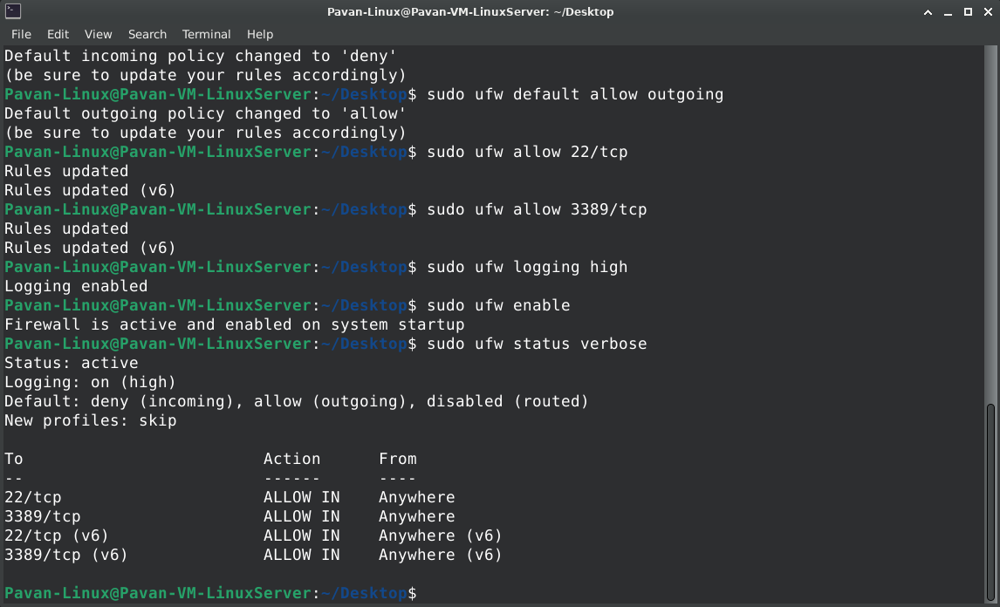

# UFW Firewall Deployment

## Overview

This module focuses on deploying and configuring the Uncomplicated Firewall (UFW) on Ubuntu Linux to establish baseline network security controls.

UFW provides a simplified interface for managing Linux firewall rules and serves as the primary network protection mechanism used throughout this lab.

---

## Objectives

- Install UFW Firewall
- Configure inbound and outbound policies
- Allow administrative access
- Enable firewall logging
- Validate firewall functionality

---

## Configuration Performed

### Install UFW

```bash
sudo apt update
sudo apt install ufw -y
```

### Configure Default Policies

```bash
sudo ufw default deny incoming
sudo ufw default allow outgoing
```

### Allow Administrative Access

```bash
sudo ufw allow 22/tcp
sudo ufw allow 3389/tcp
```

### Enable Logging

```bash
sudo ufw logging high
```

### Enable Firewall

```bash
sudo ufw enable
```

### Verify Configuration

```bash
sudo ufw status verbose
```

---

## Validation

The firewall was successfully enabled and configured with:

- Default deny inbound policy
- Default allow outbound policy
- SSH access permitted
- RDP access permitted
- Logging enabled

---



---

## Skills Demonstrated

- Linux Firewall Administration
- UFW Configuration
- Network Security Hardening
- Access Control Management
