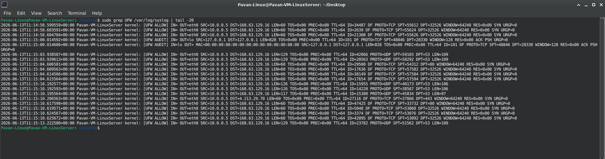
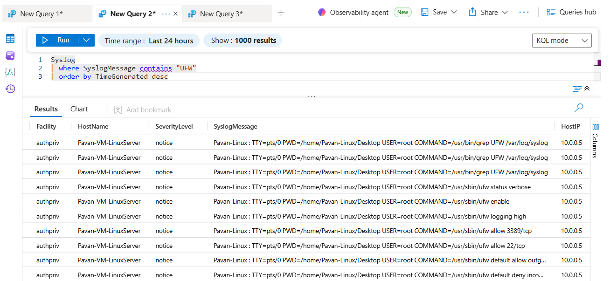

# UFW Log Collection

## Overview

This module focuses on collecting Linux firewall telemetry generated by UFW and validating its ingestion into Microsoft Sentinel through Syslog and Azure Monitor Agent (AMA).

The objective is to establish an end-to-end telemetry pipeline that enables security monitoring and threat hunting using Linux firewall events.

---

## Objectives

- Validate UFW log generation
- Verify Syslog event creation
- Configure Azure Monitor Agent collection
- Validate log ingestion into Microsoft Sentinel
- Confirm visibility of Linux network telemetry

---

## Log Verification

### View UFW Events in Syslog

```bash
sudo grep UFW /var/log/syslog | tail -20
```

### Monitor Logs in Real Time

```bash
sudo tail -f /var/log/syslog
```

---

## Sentinel Validation

### Verify UFW Events

```kusto
Syslog
| where SyslogMessage contains "UFW"
| order by TimeGenerated desc
```

---

## Telemetry Flow

```text
UFW Firewall
      │
      ▼
Linux Syslog
      │
      ▼
Azure Monitor Agent
      │
      ▼
Data Collection Rule
      │
      ▼
Microsoft Sentinel
```

---

## Screenshots

### UFW Events Generated in Syslog



---

### UFW Telemetry Ingested into Sentinel



---

## Validation Results

Successfully verified:

- UFW log generation
- Syslog event creation
- Azure Monitor Agent collection
- Microsoft Sentinel ingestion
- End-to-end telemetry visibility

---

## Skills Demonstrated

- Syslog Analysis
- Linux Logging
- Azure Monitor Agent
- Data Collection Rules
- Microsoft Sentinel
- Log Validation
