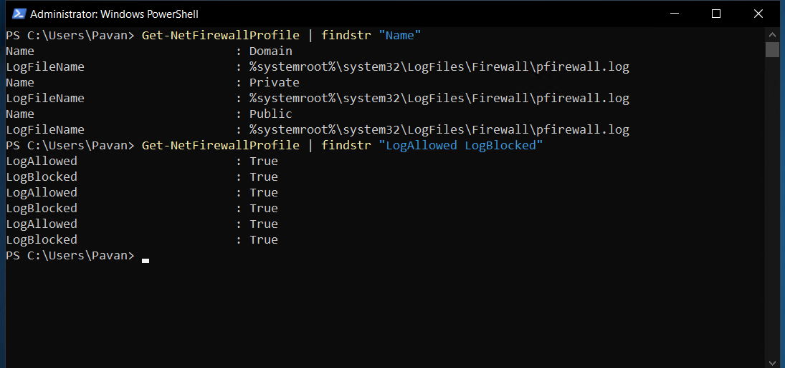

# Windows Firewall Configuration

## Overview

This module focuses on configuring Windows Defender Firewall and enabling firewall logging across Domain, Private, and Public profiles.

Windows Defender Firewall serves as the primary host-based network protection mechanism for Windows systems and provides the foundation for security monitoring and network telemetry collection.

---

## Objectives

- Verify Windows Defender Firewall status
- Enable firewall logging
- Configure logging for allowed and blocked connections
- Validate firewall configuration
- Prepare the system for network telemetry collection

---

## Configuration Performed

### Verify Firewall Status

```powershell
Get-NetFirewallProfile
```

### Enable Firewall Logging

```powershell
Set-NetFirewallProfile -Profile Domain,Private,Public -LogAllowed True

Set-NetFirewallProfile -Profile Domain,Private,Public -LogBlocked True
```

### Validate Configuration

```powershell
Get-NetFirewallProfile
```

Expected Result:

```text
LogAllowed : True
LogBlocked : True
```

for all profiles.

---

## Validation

Successfully verified:

- Windows Defender Firewall enabled
- Domain profile active
- Private profile active
- Public profile active
- Allowed connection logging enabled
- Blocked connection logging enabled

---

## Screenshots

### Windows Firewall Logging Enabled



---

## Skills Demonstrated

- Windows Firewall Administration
- Endpoint Security Configuration
- Windows Network Security
- Security Hardening
