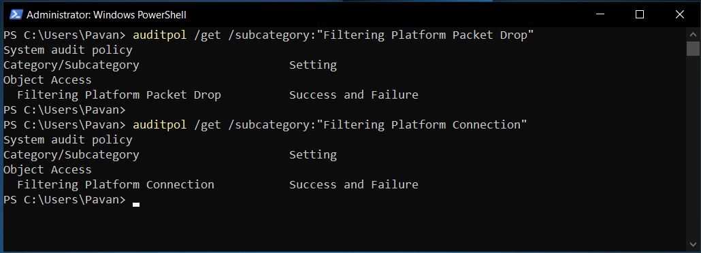
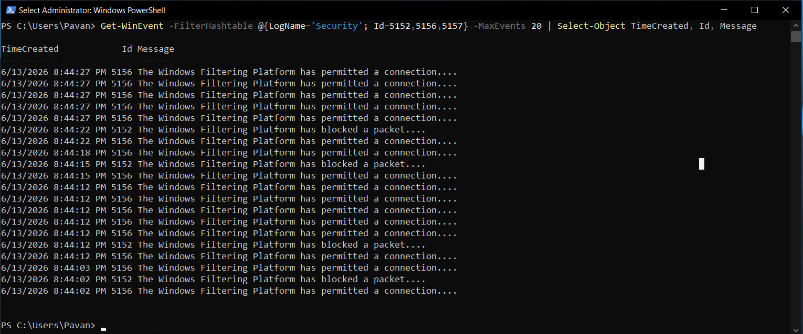
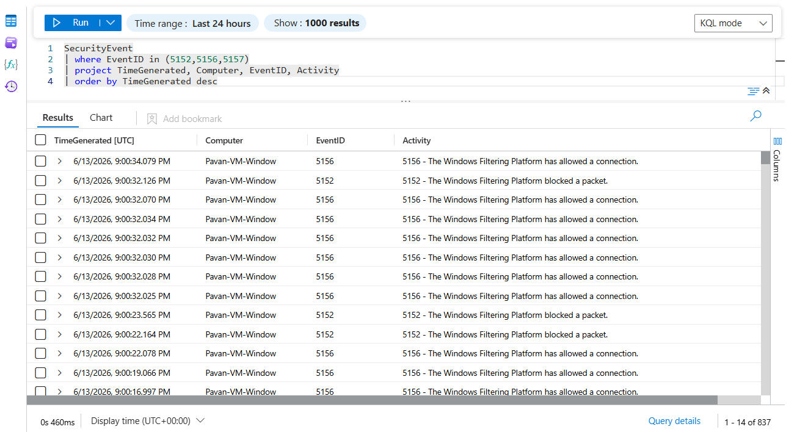

# Windows Network Event Analysis

## Overview

This module focuses on generating, collecting, and analyzing Windows network security events using Windows Defender Firewall, Windows Security Logs, and Microsoft Sentinel.

The objective is to investigate network activity, validate firewall enforcement, and perform threat hunting using native Windows security telemetry.

---

## Objectives

- Enable Windows network security auditing
- Generate firewall network events
- Analyze Filtering Platform telemetry
- Validate Sentinel ingestion
- Perform KQL-based investigations
- Hunt for allowed and blocked network activity

---

## Audit Configuration

Windows Filtering Platform auditing was enabled to generate network security events.

### Enable Packet Drop Auditing

```powershell
auditpol /set /subcategory:"Filtering Platform Packet Drop" /success:enable /failure:enable
```

### Enable Connection Auditing

```powershell
auditpol /set /subcategory:"Filtering Platform Connection" /success:enable /failure:enable
```

### Verify Audit Policy

```powershell
auditpol /get /subcategory:"Filtering Platform Packet Drop"

auditpol /get /subcategory:"Filtering Platform Connection"
```

Expected Result:

```text
Filtering Platform Packet Drop      Success and Failure

Filtering Platform Connection       Success and Failure
```

---

## Event Generation

### Generate Network Traffic

```powershell
Test-NetConnection google.com -Port 443
```

This generates Windows Filtering Platform events within the Security Log.

---

## Security Event IDs

| Event ID | Description |
|-----------|------------|
| 5152 | Packet Dropped |
| 5156 | Connection Allowed |
| 5157 | Connection Blocked |

---

## Local Validation

### Verify Firewall Events

```powershell
Get-WinEvent -FilterHashtable @{LogName='Security'; Id=5152,5156,5157} -MaxEvents 20
```

Successfully validated:

```text
5152
5156
```

events within the Security Log.

---

## Sentinel Validation

### View Network Security Events

```kusto
SecurityEvent
| where EventID in (5152,5156,5157)
| order by TimeGenerated desc
| take 20
```

---

## Threat Hunting Query

```kusto
SecurityEvent
| where EventID in (5152,5156,5157)
| project TimeGenerated, Computer, EventID, Activity
| order by TimeGenerated desc
```

---

## Investigation Findings

### Issue

Windows Firewall logging was enabled but no network security events were being generated within the Security Log.

### Investigation

Validation confirmed:

- Firewall enabled
- Firewall logging enabled
- Local firewall logs generated
- Sentinel ingestion functioning

However, Event IDs 5152, 5156, and 5157 were absent.

### Root Cause

Windows Filtering Platform auditing was disabled.

Audit Policy Status:

```text
Filtering Platform Packet Drop      No Auditing

Filtering Platform Connection       No Auditing
```

### Resolution

Enabled:

```text
Filtering Platform Packet Drop

Filtering Platform Connection
```

with:

```text
Success and Failure
```

auditing.

### Result

Windows Security Logs successfully generated:

```text
5152 - Packet Dropped

5156 - Connection Allowed
```

events which were subsequently ingested into Microsoft Sentinel.

---

## Screenshots

### Filtering Platform Auditing Enabled



---

### Filtering Platform Events Generated



---

### KQL Threat Hunting



---

## Skills Demonstrated

- Windows Security Auditing
- Windows Filtering Platform
- Firewall Event Analysis
- Security Event Investigation
- Microsoft Sentinel
- KQL Threat Hunting
- Endpoint Monitoring
- Root Cause Analysis
- Security Troubleshooting
