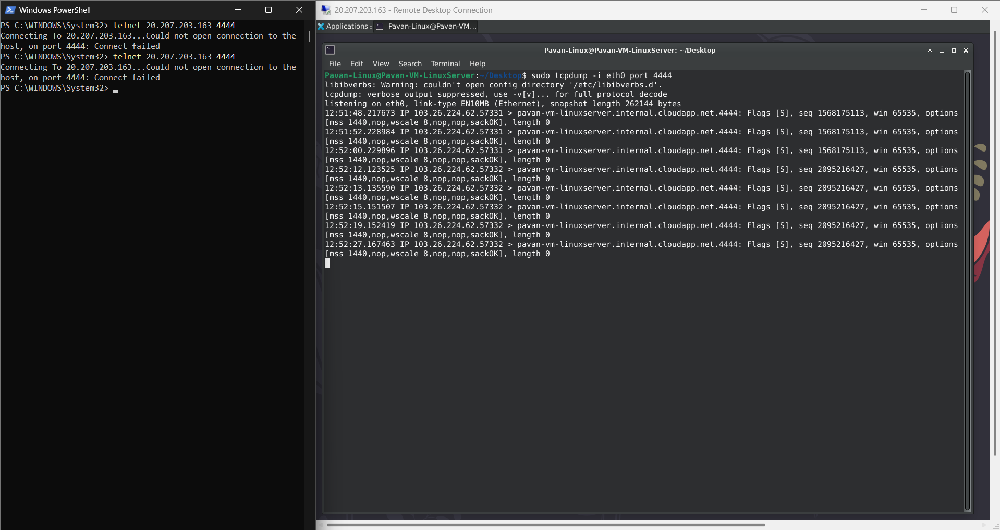
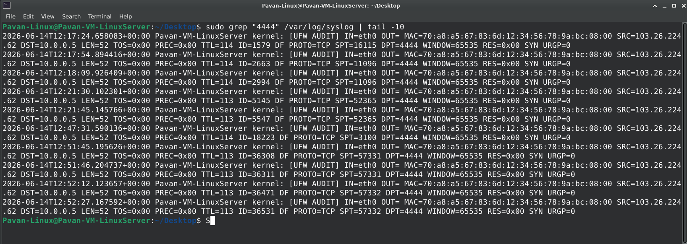
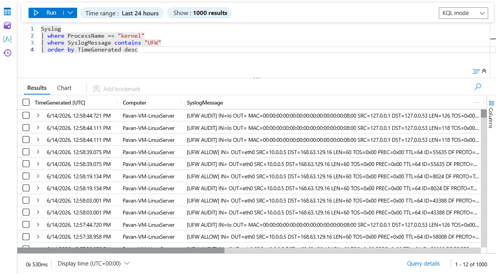
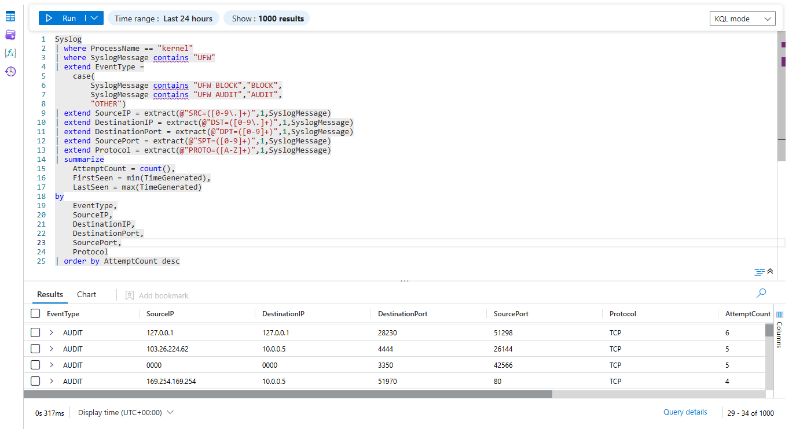

# Linux Port Scanning Detection

## Overview

This threat hunting scenario demonstrates how unauthorized connection attempts against a Linux server can be detected using host firewall telemetry, Syslog collection, Microsoft Sentinel ingestion, and KQL-based threat hunting.

The objective was to simulate network reconnaissance activity against a Linux virtual machine and validate the complete detection pipeline from the host firewall to Microsoft Sentinel.

---

## Attack Simulation

A connection attempt was generated from an external system against TCP port **4444**, a port explicitly monitored by the Linux firewall.

### Attack Method

```powershell
telnet <Linux-Public-IP> 4444
```

The connection attempt generated inbound TCP SYN packets directed at the Linux server.

---

## Detection Workflow

```text
External Connection Attempt
            ↓
Linux Host Receives Traffic
            ↓
UFW Firewall Inspection
            ↓
Syslog Generation
            ↓
Azure Monitor Agent
            ↓
Microsoft Sentinel
            ↓
KQL Threat Hunting
```

---

## Evidence

### Attack Generation



The screenshot shows:

- Telnet connection attempt from an external host
- Packet arrival validation using tcpdump
- Traffic directed toward TCP port 4444

---

### Local Log Validation



The Linux firewall generated UFW telemetry indicating inspection of inbound traffic targeting the monitored service.

Example event:

```text
[UFW AUDIT]
SRC=<Source IP>
DPT=4444
PROTO=TCP
```

---

### Sentinel Event Validation



The firewall telemetry was successfully ingested into Microsoft Sentinel through Syslog collection.

Collected fields included:

- TimeGenerated
- Computer
- ProcessName
- SyslogMessage

---

### Threat Hunting Results



KQL was used to identify source IPs, destination ports, protocols, and connection attempt frequency.

---

## Hunting Query

```kusto
Syslog
| where ProcessName == "kernel"
| where SyslogMessage contains "UFW"
| extend EventType =
    case(
        SyslogMessage contains "UFW BLOCK","BLOCK",
        SyslogMessage contains "UFW AUDIT","AUDIT",
        "OTHER")
| extend SourceIP = extract(@"SRC=([0-9\.]+)",1,SyslogMessage)
| extend DestinationIP = extract(@"DST=([0-9\.]+)",1,SyslogMessage)
| extend DestinationPort = extract(@"DPT=([0-9]+)",1,SyslogMessage)
| extend SourcePort = extract(@"SPT=([0-9]+)",1,SyslogMessage)
| extend Protocol = extract(@"PROTO=([A-Z]+)",1,SyslogMessage)
| summarize
    AttemptCount = count(),
    FirstSeen = min(TimeGenerated),
    LastSeen = max(TimeGenerated)
by
    EventType,
    SourceIP,
    DestinationIP,
    DestinationPort,
    SourcePort,
    Protocol
| order by AttemptCount desc
```

---

## Key Findings

- Unauthorized connection attempts were successfully detected.
- Traffic targeting TCP port 4444 reached the Linux host.
- UFW firewall telemetry was generated and collected.
- Events were successfully ingested into Microsoft Sentinel.
- KQL hunting queries enabled identification of source IPs, targeted ports, and connection frequencies.

---

## MITRE ATT&CK Mapping

| Technique | Description |
|------------|------------|
| T1046 | Network Service Discovery |
| T1595 | Active Scanning |

---

## Skills Demonstrated

- Linux Firewall Monitoring
- UFW Log Analysis
- Syslog Collection
- Microsoft Sentinel Integration
- Network Threat Hunting
- KQL Investigation
- Threat Detection Engineering
- SOC Analyst Workflow
