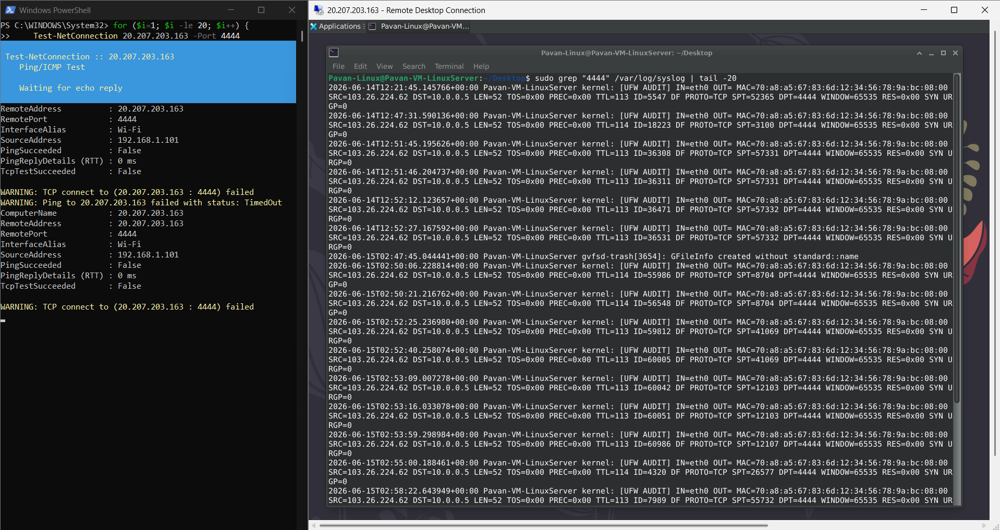
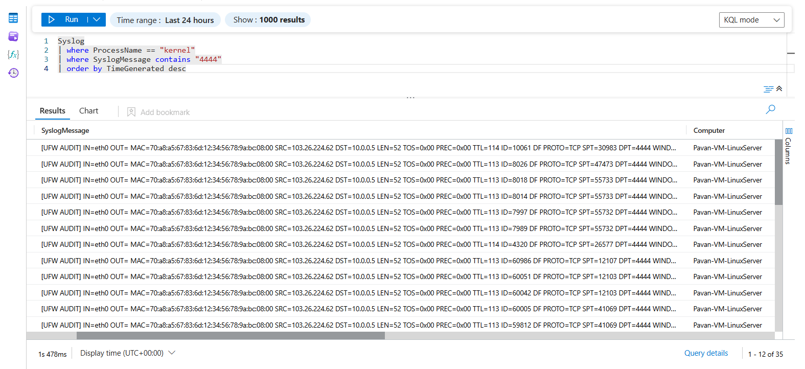
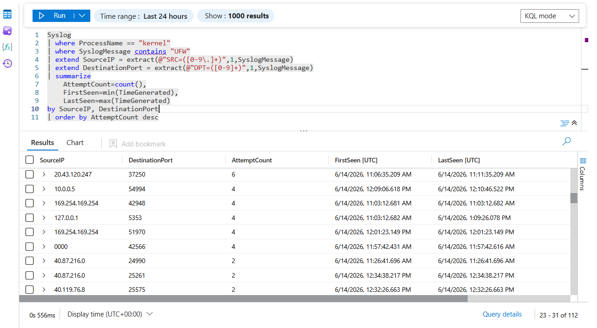
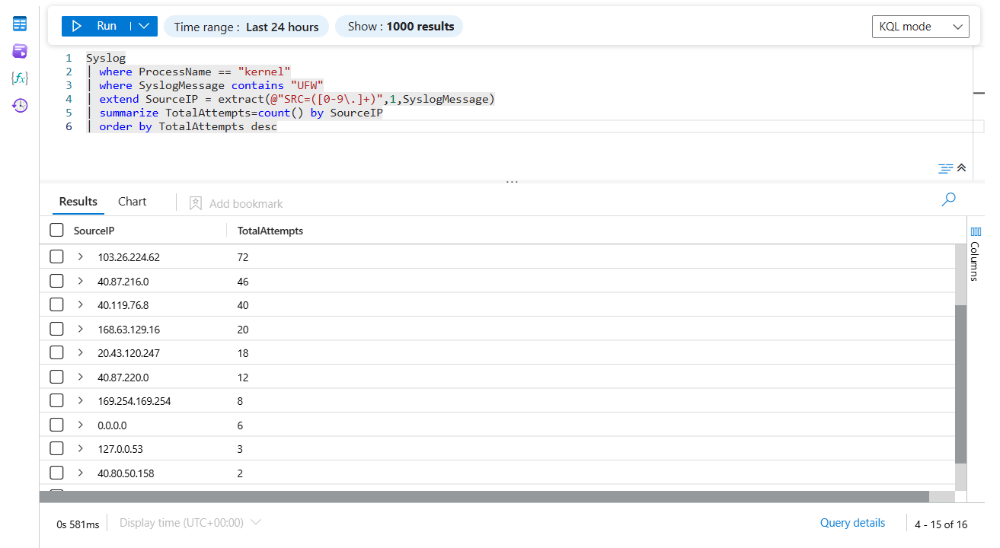

# Linux Unauthorized Connection Investigation

## Overview

This threat hunting scenario demonstrates how repeated unauthorized connection attempts against a Linux server can be detected and investigated using UFW firewall telemetry, Syslog collection, Microsoft Sentinel ingestion, and KQL-based threat hunting.

The objective was to simulate repeated connection attempts against a monitored service and identify suspicious activity through centralized log analysis.

---

## Attack Simulation

Multiple connection attempts were generated from an external host targeting TCP port **4444** on the Linux virtual machine.

### Attack Method

```powershell
for ($i=1; $i -le 20; $i++) {
    Test-NetConnection <Linux-Public-IP> -Port 4444
}
```

The repeated connections generated firewall telemetry that was collected through Syslog and forwarded to Microsoft Sentinel.

---

## Detection Workflow

```text
Repeated Connection Attempts
              ↓
Linux Host Receives Traffic
              ↓
UFW Firewall Inspection
              ↓
Syslog Generation
              ↓
Azure Monitor Agent
              ↓
Microsoft Sentinel
              ↓
KQL Threat Hunting
```

---

## Evidence

### Repeated Connection Attempts



The screenshot demonstrates multiple inbound connection attempts targeting TCP port 4444.

---

### Sentinel Event Validation



Firewall telemetry was successfully collected and ingested into Microsoft Sentinel.

Collected fields included:

- TimeGenerated
- Computer
- ProcessName
- SyslogMessage

---

### Hunting Results



KQL was used to identify source IPs, destination ports, connection frequencies, and activity timelines.

---

### Source IP Analysis



Source IP analysis was performed to identify the most active systems generating connection attempts against the Linux host.

---

## Investigation Notes

During testing, connection attempts targeting TCP port **4444** consistently generated **UFW AUDIT** events rather than **UFW BLOCK** events.

Example telemetry:

```text
[UFW AUDIT]
SRC=<Source IP>
DPT=4444
PROTO=TCP
```

Although a corresponding UFW BLOCK event was not generated for the test traffic, the following evidence confirms that the connection attempts were inspected by the Linux firewall:

1. TCP SYN packets were observed reaching the Linux host using tcpdump.
2. TCP port 4444 was configured with a UFW DENY rule.
3. UFW AUDIT telemetry was generated for the same destination port.
4. The events were successfully collected through Syslog and ingested into Microsoft Sentinel.

Based on the firewall configuration and observed telemetry, the AUDIT events were used as indicators of unauthorized connection attempts against a protected service.

This scenario focuses on detection and investigation of suspicious connection activity rather than validation of firewall enforcement behavior.

---

## Hunting Query

```kusto
Syslog
| where ProcessName == "kernel"
| where SyslogMessage contains "UFW"
| extend SourceIP = extract(@"SRC=([0-9\.]+)",1,SyslogMessage)
| extend DestinationPort = extract(@"DPT=([0-9]+)",1,SyslogMessage)
| summarize
    AttemptCount=count(),
    FirstSeen=min(TimeGenerated),
    LastSeen=max(TimeGenerated)
by SourceIP, DestinationPort
| order by AttemptCount desc
```

---

## Advanced Investigation Query

```kusto
Syslog
| where ProcessName == "kernel"
| where SyslogMessage contains "UFW"
| extend EventType =
    case(
        SyslogMessage contains "UFW BLOCK","BLOCK",
        SyslogMessage contains "UFW AUDIT","AUDIT",
        "OTHER")
| extend SourceIP = extract(@"SRC=([0-9\.]+)",1,SyslogMessage)
| extend DestinationIP = extract(@"DST=([0-9\.]+)",1,SyslogMessage)
| extend DestinationPort = extract(@"DPT=([0-9]+)",1,SyslogMessage)
| extend SourcePort = extract(@"SPT=([0-9]+)",1,SyslogMessage)
| extend Protocol = extract(@"PROTO=([A-Z]+)",1,SyslogMessage)
| summarize
    AttemptCount = count(),
    FirstSeen = min(TimeGenerated),
    LastSeen = max(TimeGenerated)
by
    EventType,
    SourceIP,
    DestinationIP,
    DestinationPort,
    SourcePort,
    Protocol
| order by AttemptCount desc
```

---

## Key Findings

- Repeated unauthorized connection attempts were successfully detected.
- Connection attempts reached the Linux host and generated firewall telemetry.
- UFW AUDIT events provided visibility into attempted access against a monitored service.
- Firewall telemetry was successfully ingested into Microsoft Sentinel.
- KQL hunting queries enabled identification of source IPs, targeted ports, and activity frequency.
- Suspicious source systems were identified through aggregation and trend analysis.

---

## MITRE ATT&CK Mapping

| Technique | Description |
|------------|------------|
| T1046 | Network Service Discovery |
| T1595 | Active Scanning |

---

## Skills Demonstrated

- Linux Firewall Monitoring
- UFW Log Analysis
- Syslog Collection
- Microsoft Sentinel Integration
- Threat Hunting
- KQL Investigation
- Network Security Monitoring
- SOC Analyst Workflow
