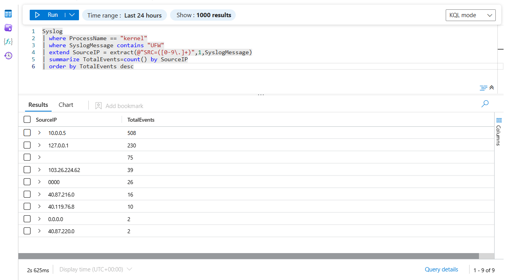
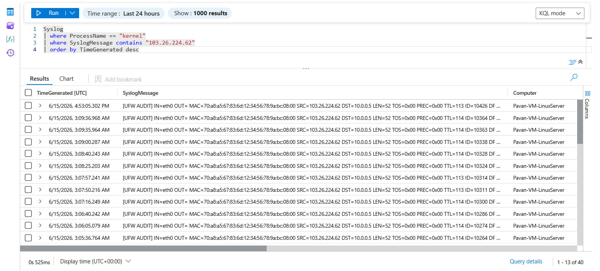
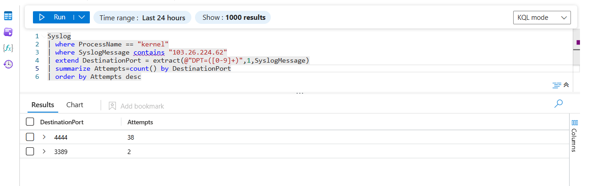
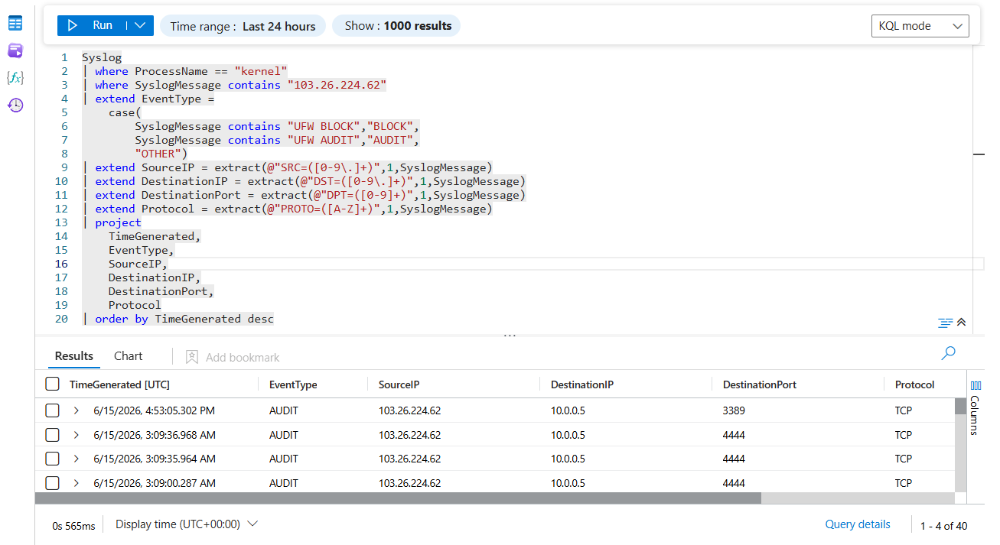

# Linux Suspicious External IP Analysis

## Overview

This threat hunting scenario demonstrates how Microsoft Sentinel can be used to identify, investigate, and profile suspicious external IP addresses interacting with a Linux server.

The objective was to analyze firewall telemetry collected from the Linux host, identify the most active external source, and investigate its behavior using KQL-based threat hunting techniques.

The analysis identified **103.26.224.62** as one of the most active external IP addresses generating firewall telemetry against the Linux server.

---

## Investigation Workflow

```text
Linux Firewall Telemetry
            ↓
Syslog Collection
            ↓
Microsoft Sentinel
            ↓
Top Source IP Identification
            ↓
Timeline Analysis
            ↓
Port Analysis
            ↓
Suspicious Activity Investigation
```

---

## Evidence

### Top Source IP Identification



A frequency analysis was performed against firewall telemetry to identify the most active source systems interacting with the Linux server.

The investigation identified:

```text
103.26.224.62
```

as one of the most active external IP addresses.

---

### Activity Timeline Investigation



A timeline analysis was performed to understand when the source IP interacted with the Linux server.

The timeline helped establish:

- Frequency of activity
- Duration of activity
- Recurring connection attempts
- Behavioral patterns

---

### Targeted Port Analysis



Port analysis was performed to identify which services were targeted by the source IP.

The analysis provided visibility into:

- Targeted destination ports
- Attack surface focus
- Potential reconnaissance activity

---

### Full Investigation Results



A detailed investigation was performed to correlate:

- Source IP
- Destination IP
- Destination Port
- Protocol
- Event Type
- Timestamp

This provided a complete activity profile for the suspicious source.

---

## Hunting Query – Top Source IPs

```kusto
Syslog
| where ProcessName == "kernel"
| where SyslogMessage contains "UFW"
| extend SourceIP = extract(@"SRC=([0-9\.]+)",1,SyslogMessage)
| summarize TotalEvents=count() by SourceIP
| order by TotalEvents desc
```

---

## Hunting Query – Activity Timeline

```kusto
Syslog
| where ProcessName == "kernel"
| where SyslogMessage contains "103.26.224.62"
| order by TimeGenerated desc
```

---

## Hunting Query – Targeted Ports

```kusto
Syslog
| where ProcessName == "kernel"
| where SyslogMessage contains "103.26.224.62"
| extend DestinationPort = extract(@"DPT=([0-9]+)",1,SyslogMessage)
| summarize Attempts=count() by DestinationPort
| order by Attempts desc
```

---

## Advanced Investigation Query

```kusto
Syslog
| where ProcessName == "kernel"
| where SyslogMessage contains "103.26.224.62"
| extend EventType =
    case(
        SyslogMessage contains "UFW BLOCK","BLOCK",
        SyslogMessage contains "UFW AUDIT","AUDIT",
        "OTHER")
| extend SourceIP = extract(@"SRC=([0-9\.]+)",1,SyslogMessage)
| extend DestinationIP = extract(@"DST=([0-9\.]+)",1,SyslogMessage)
| extend DestinationPort = extract(@"DPT=([0-9]+)",1,SyslogMessage)
| extend Protocol = extract(@"PROTO=([A-Z]+)",1,SyslogMessage)
| project
    TimeGenerated,
    EventType,
    SourceIP,
    DestinationIP,
    DestinationPort,
    Protocol
| order by TimeGenerated desc
```

---

## Investigation Findings

The investigation revealed:

- Repeated activity originating from external IP **103.26.224.62**
- Multiple firewall events associated with the source
- Consistent interaction patterns over time
- Targeted access attempts against services exposed on the Linux server
- Successful visibility through Syslog collection and Sentinel hunting

The activity was classified as suspicious due to its frequency and recurring interaction with monitored services.

---

## MITRE ATT&CK Mapping

| Technique | Description |
|------------|------------|
| T1595 | Active Scanning |
| T1046 | Network Service Discovery |
| T1590 | Gather Victim Network Information |

---

## Skills Demonstrated

- Threat Hunting
- Firewall Log Analysis
- Source IP Profiling
- KQL Investigation
- Microsoft Sentinel
- Linux Security Monitoring
- Network Traffic Analysis
- SOC Investigation Workflow
