# Linux Lateral Movement Hunting

## Overview

This threat hunting scenario demonstrates how Microsoft Sentinel can be used to identify indicators of lateral movement on a Linux system using SSH authentication logs, privilege escalation activity, account management events, and staging behavior.

The objective was to simulate a realistic attacker workflow consisting of:

1. Failed SSH login attempts
2. Successful SSH authentication
3. Privilege escalation using sudo
4. Host reconnaissance
5. Local account creation
6. Privilege assignment
7. Staging directory creation

The generated telemetry was collected through Syslog and investigated using KQL within Microsoft Sentinel.

---

## Attack Scenario

The following attack chain was simulated:

```text
Failed SSH Login Attempts
            ↓
Successful SSH Authentication
            ↓
Privilege Escalation
            ↓
Host Reconnaissance
            ↓
Account Creation
            ↓
Privilege Assignment
            ↓
Staging Directory Creation
```

This sequence closely resembles behavior observed during post-compromise lateral movement activity.

---

## Detection Workflow

```text
Windows System
        ↓
SSH Authentication Attempts
        ↓
Linux SSH Service (sshd)
        ↓
Authentication Logs
        ↓
Syslog Collection
        ↓
Azure Monitor Agent
        ↓
Microsoft Sentinel
        ↓
Threat Hunting Investigation
```

---

## Evidence

### Failed SSH Authentication Attempts

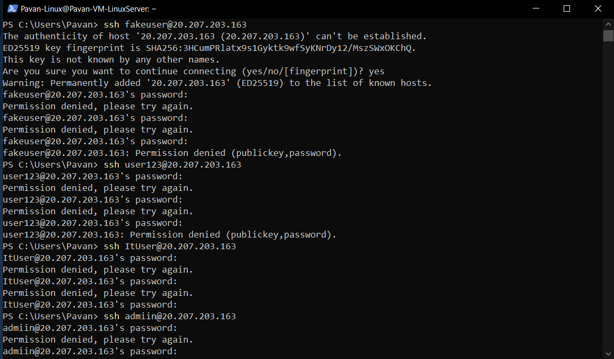

An invalid user account was used to generate failed SSH authentication attempts.

---

### Linux Authentication Evidence

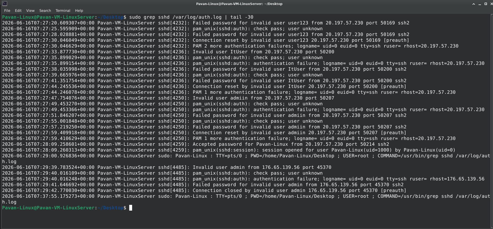

The Linux authentication logs recorded:

- Invalid user attempts
- Failed password events
- Authentication failures

These events are commonly associated with credential guessing and lateral movement activity.

---

### Successful SSH Authentication

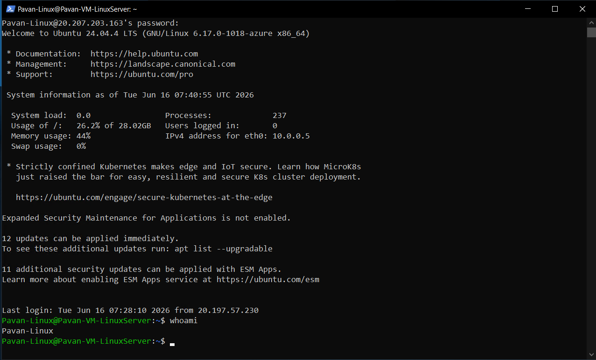

A successful SSH login was performed using valid credentials.

---

### Authentication Success Validation

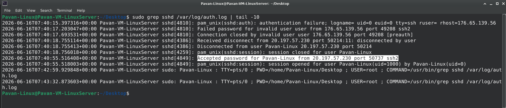

The Linux authentication logs recorded:

```text
Accepted password
Session opened
```

These events confirm successful remote access.

---

### Privilege Escalation and Host Reconnaissance

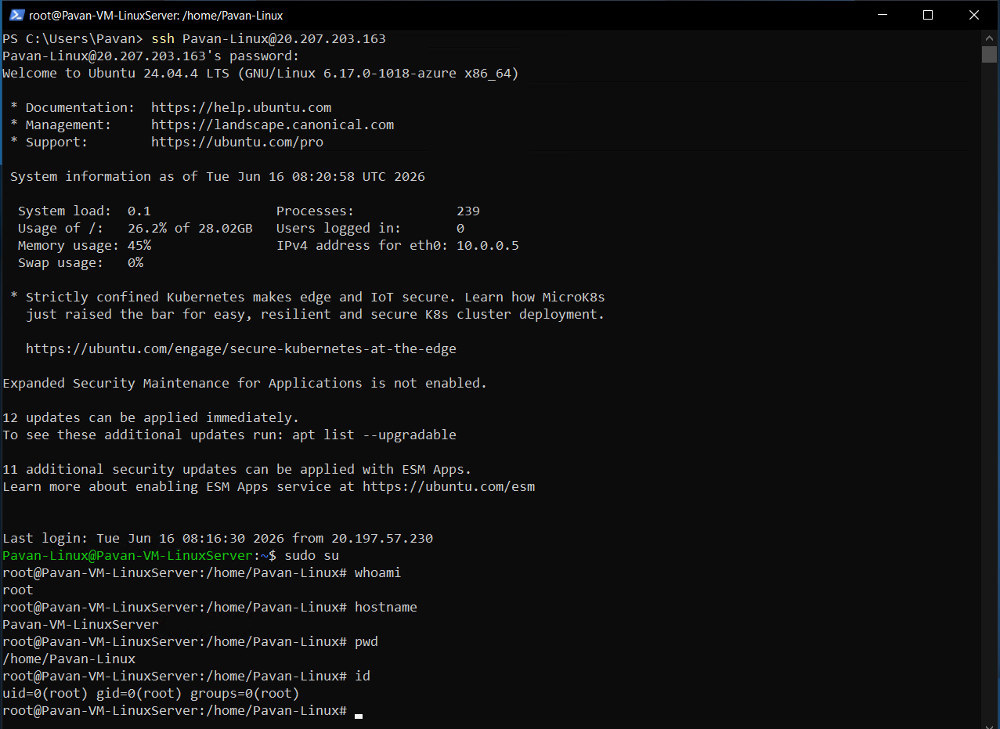

Following authentication, elevated access was obtained using sudo.

Reconnaissance activities included:

```bash
hostname
ip a
ss -tulnp
id
```

These commands simulate common attacker enumeration activities after initial access.

---

### Account Creation and Privilege Assignment

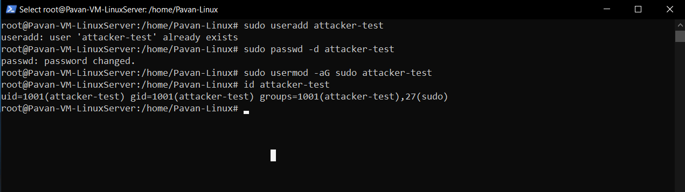

A new local account was created and assigned elevated privileges.

Commands executed:

```bash
sudo useradd attacker-test
sudo passwd -d attacker-test
sudo usermod -aG sudo attacker-test
id attacker-test
```

This activity simulates persistence and privilege establishment techniques frequently observed after lateral movement.

---

### Staging Directory Creation

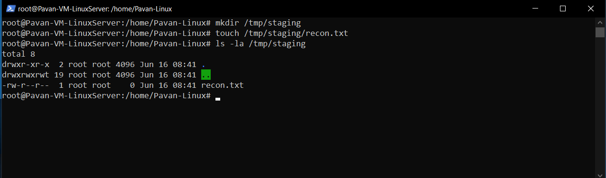

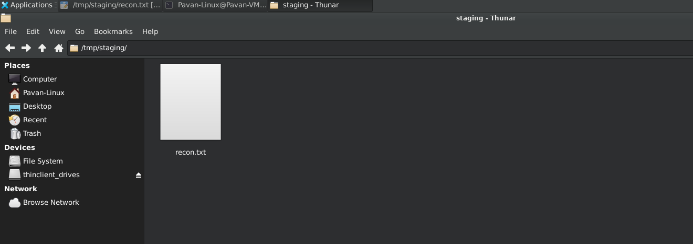

A temporary staging directory was created to simulate attacker preparation activities following successful compromise.

Commands executed:

```bash
mkdir /tmp/staging
touch /tmp/staging/recon.txt
ls -la /tmp/staging
```

Staging directories are commonly used by attackers to:

- Store reconnaissance results
- Prepare tools for execution
- Stage payloads prior to deployment
- Organize collected data before exfiltration

Although no malicious payloads were used in this lab, the activity demonstrates how filesystem artifacts can provide evidence of post-compromise operations.

---

## Hunting Query – Failed SSH Logins

```kusto
Syslog
| where ProcessName == "sshd"
| where SyslogMessage contains "Failed password"
| project
    TimeGenerated,
    Computer,
    SyslogMessage
| order by TimeGenerated desc
```
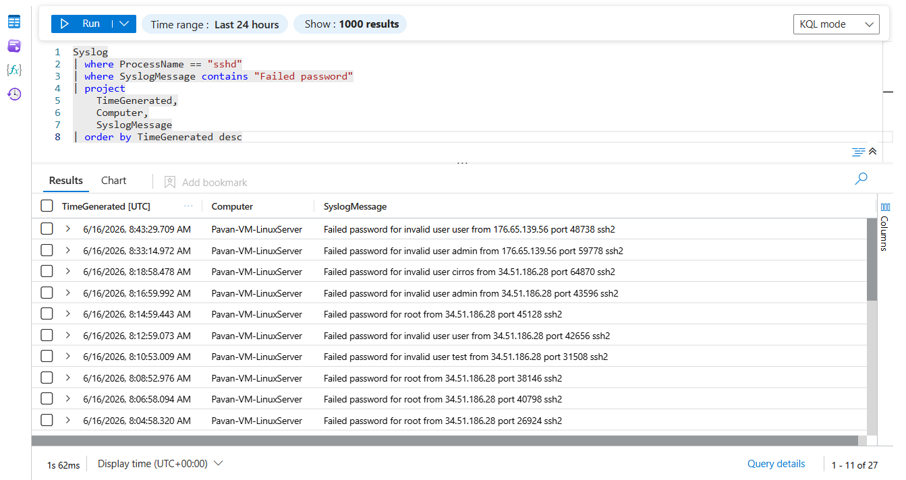

---

## Hunting Query – Successful SSH Logins

```kusto
Syslog
| where ProcessName == "sshd"
| where SyslogMessage contains "Accepted password"
| project
    TimeGenerated,
    Computer,
    SyslogMessage
| order by TimeGenerated desc
```
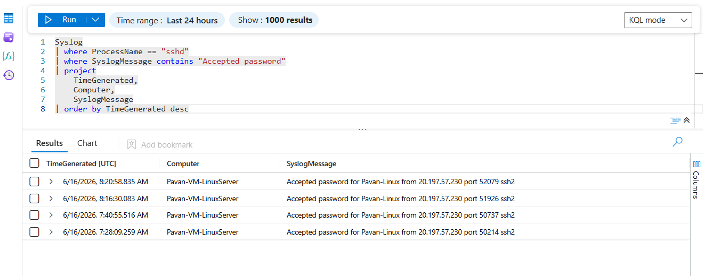

---

## Hunting Query – SSH Activity Timeline

```kusto
Syslog
| where ProcessName == "sshd"
| summarize EventCount=count() by bin(TimeGenerated, 15m)
| render timechart
```
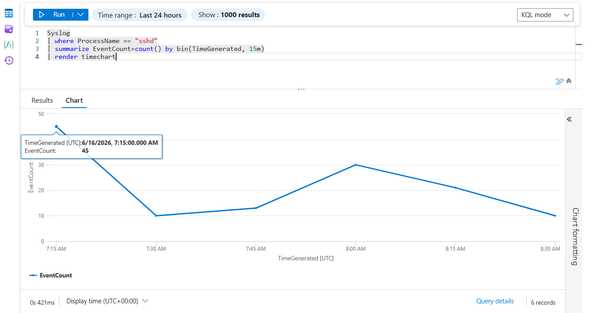

---

## Hunting Query – Privilege Escalation Activity

```kusto
Syslog
| where ProcessName == "sudo"
| project
    TimeGenerated,
    Computer,
    SyslogMessage
| order by TimeGenerated desc
```
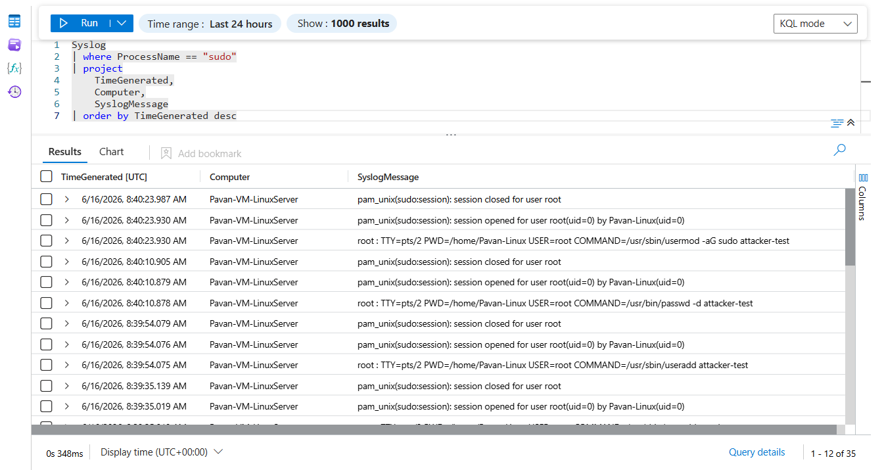

---

## Hunting Query – Account Creation Activity

```kusto
Syslog
| where ProcessName in ("useradd","usermod","userdel")
| project
    TimeGenerated,
    Computer,
    ProcessName,
    SyslogMessage
| order by TimeGenerated desc
```
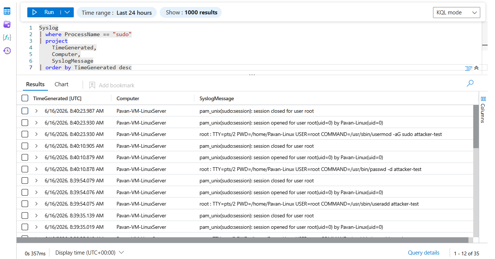

---

## Advanced Investigation Query

```kusto
Syslog
| where ProcessName in ("sshd","sudo","useradd","usermod","userdel")
| project
    TimeGenerated,
    Computer,
    ProcessName,
    SyslogMessage
| order by TimeGenerated desc
```
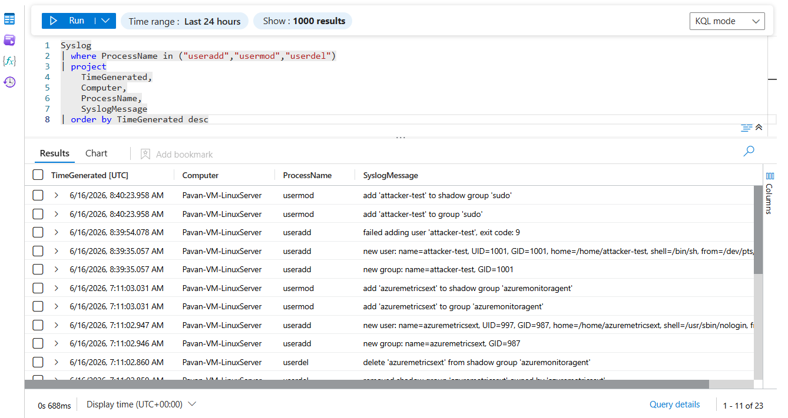

---

## Investigation Findings

The investigation identified a sequence of events commonly associated with lateral movement activity:

- Multiple failed SSH authentication attempts
- Successful remote login
- Privilege escalation using sudo
- Host reconnaissance activity
- Creation of a new local account
- Assignment of elevated privileges
- Creation of a staging directory for post-compromise activity

The combined sequence provides strong visibility into attacker behavior following successful authentication.

---

## MITRE ATT&CK Mapping

| Technique | Description |
|------------|------------|
| T1021.004 | Remote Services: SSH |
| T1078 | Valid Accounts |
| T1068 | Privilege Escalation |
| T1087 | Account Discovery |
| T1136 | Create Account |
| T1057 | Process Discovery |
| T1074 | Data Staged |

---

## Skills Demonstrated

- Linux Security Monitoring
- Authentication Log Analysis
- SSH Threat Hunting
- Privilege Escalation Detection
- Account Creation Monitoring
- Persistence Detection
- Staging Activity Investigation
- Syslog Collection
- Microsoft Sentinel
- KQL Investigation
- SOC Analyst Workflow
- MITRE ATT&CK Mapping
