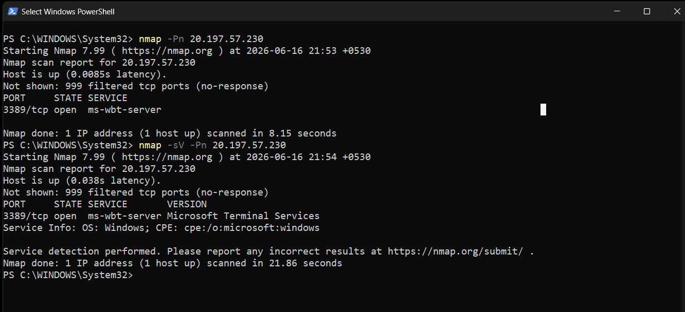
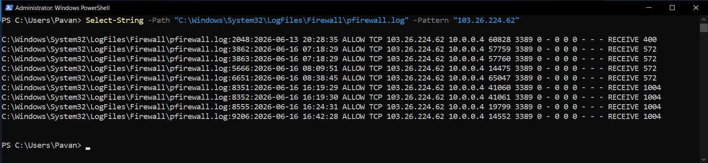
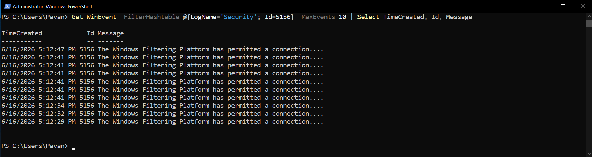
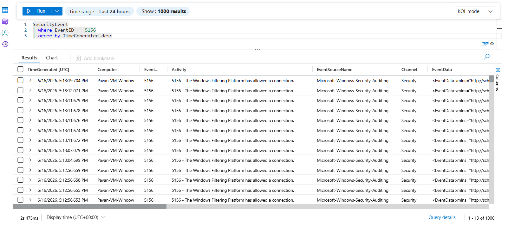
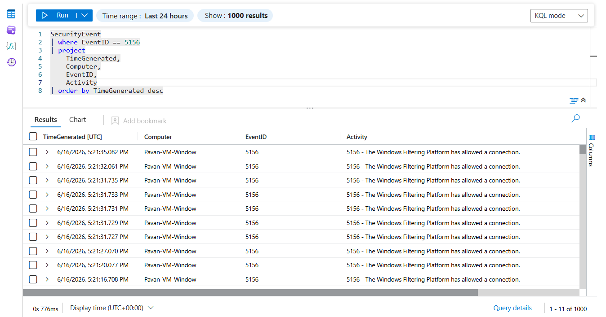

# Windows Port Scanning Detection

## Overview

This threat hunting scenario demonstrates how Microsoft Sentinel can be used to detect and investigate network reconnaissance activity targeting a Windows server.

An Nmap scan was launched from an external system against the Windows VM. The activity was validated through:

- Nmap scan results
- Windows Firewall logs
- Windows Security Event ID 5156
- Microsoft Sentinel telemetry

The objective was to identify evidence of network reconnaissance and correlate multiple telemetry sources to validate the activity.

---

## Attack Scenario

The following attack chain was simulated:

```text
External Host (103.26.224.62)
                ↓
Nmap Port Scan
                ↓
Windows Server
                ↓
Windows Firewall Logs
                ↓
Security Event ID 5156
                ↓
Microsoft Sentinel
```

---

## Detection Workflow

```text
Attacker System
        ↓
Nmap Scan
        ↓
Windows Firewall
        ↓
Windows Security Logs
        ↓
Azure Monitor Agent
        ↓
Microsoft Sentinel
        ↓
Threat Hunting Investigation
```

---

## Evidence

### Port Scan Generation



An Nmap scan was executed against the Windows VM public IP address.

Command executed:

```bash
nmap -Pn <Windows-VM-Public-IP>
```

The scan identified exposed services and generated inbound network activity against the target system.

---

### Firewall Log Source Attribution



Windows Firewall logs recorded the originating source IP address:

```text
103.26.224.62
```

This IP corresponds to the attacking system used to generate the Nmap scan.

This evidence confirms that the reconnaissance traffic successfully reached the Windows server.

---

### Security Event Validation



Windows Security Event ID 5156 was generated during the scanning activity.

Event ID:

```text
5156
```

Description:

```text
The Windows Filtering Platform has permitted a connection.
```

This confirms that Windows observed and allowed network communication associated with the scan.

---

### Sentinel Validation



The generated telemetry was successfully ingested into Microsoft Sentinel and became available for hunting and investigation.

---

## Hunting Query – Allowed Network Connections

```kusto
SecurityEvent
| where EventID == 5156
| project
    TimeGenerated,
    Computer,
    EventID,
    Activity
| order by TimeGenerated desc
```


---

## Hunting Query – Port Scan Activity Timeline

```kusto
SecurityEvent
| where EventID == 5156
| summarize EventCount=count() by bin(TimeGenerated, 15m)
| render timechart
```


---

## Investigation Findings

The investigation identified evidence of reconnaissance activity against the Windows server.

Key findings:

- Nmap scan successfully reached the target system
- Source IP address 103.26.224.62 was recorded in Windows Firewall logs
- Windows generated Security Event ID 5156 during the activity
- Sentinel successfully ingested the associated telemetry
- Multiple data sources were correlated to validate the reconnaissance attempt

The combination of firewall logs and Windows Security Events provided strong evidence of network scanning activity.

---

## MITRE ATT&CK Mapping

| Technique | Description |
|------------|------------|
| T1595 | Active Scanning |
| T1046 | Network Service Discovery |

---

## Skills Demonstrated

- Windows Security Monitoring
- Windows Firewall Analysis
- Network Reconnaissance Detection
- Security Event Investigation
- Microsoft Sentinel
- KQL Threat Hunting
- Event Correlation
- SOC Investigation Workflow
- MITRE ATT&CK Mapping
