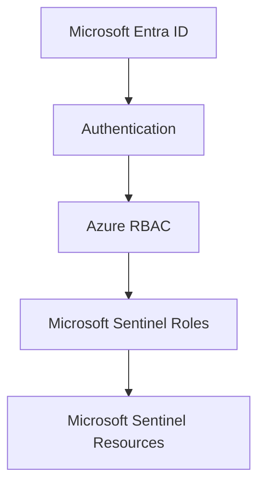

# Microsoft Sentinel Roles

## Overview

Microsoft Sentinel provides a set of built-in Azure RBAC roles designed specifically for Security Operations Center (SOC) activities. Unlike generic Azure roles such as **Owner**, **Contributor**, or **Reader**, Sentinel roles follow the principle of least privilege by granting only the permissions required for specific security operations.

These roles enable organizations to separate responsibilities among SOC analysts, incident responders, content engineers, and automation administrators without granting unnecessary access to Azure resources.

In this lab, we explored the four primary Microsoft Sentinel roles, assigned them to a secondary user, and validated their permissions by performing real-world SOC tasks.

---

## Learning Objectives

After completing this lab, you will be able to:

- Understand Microsoft Sentinel RBAC architecture.
- Differentiate Azure RBAC from Microsoft Sentinel roles.
- Explain the purpose of each built-in Sentinel role.
- Assign Sentinel roles using Azure RBAC.
- Validate permissions using a secondary user account.
- Identify which roles are appropriate for different SOC responsibilities.
- Apply the Principle of Least Privilege when assigning Sentinel permissions.

---

## Prerequisites

- Azure Subscription
- Microsoft Sentinel enabled
- Log Analytics Workspace
- Owner permissions on the Azure Subscription
- Secondary Microsoft Entra ID user for permission validation

---

# Azure RBAC vs Microsoft Sentinel Roles

Microsoft Sentinel does not implement its own authorization system. Instead, it relies on **Azure Role-Based Access Control (Azure RBAC)**.

Azure RBAC provides the authorization framework, while Microsoft Sentinel defines specialized roles that can be assigned through Azure RBAC.

This integration allows organizations to manage Sentinel permissions using the same RBAC model that governs all Azure resources.

---

# Microsoft Sentinel Built-in Roles

Microsoft Sentinel includes four primary built-in roles.

| Role | Primary Responsibility |
|------|------------------------|
| Microsoft Sentinel Reader | View security data |
| Microsoft Sentinel Responder | Manage incidents |
| Microsoft Sentinel Contributor | Manage Sentinel content |
| Microsoft Sentinel Automation Contributor | Manage automation resources |

Each role builds upon the previous one by providing additional permissions aligned with specific SOC responsibilities.

---

# Microsoft Sentinel Reader

The **Microsoft Sentinel Reader** role provides read-only access to Microsoft Sentinel resources.

Typical responsibilities include:

- View incidents
- View analytics rules
- View hunting queries
- View workbooks
- View bookmarks
- View watchlists

Limitations:

- Cannot modify incidents
- Cannot create analytics rules
- Cannot edit Sentinel content
- Cannot manage automation

### Typical Users

- Tier-1 SOC Analyst
- Security Auditor
- Compliance Team
- Management requiring visibility

---

# Microsoft Sentinel Responder

The **Microsoft Sentinel Responder** role is designed for analysts responsible for investigating and responding to security incidents.

Capabilities include:

- View incidents
- Assign incidents
- Change incident status
- Add comments
- Perform incident investigations

Limitations:

- Cannot create analytics rules
- Cannot modify detection content
- Cannot manage automation rules

### Typical Users

- Tier-2 SOC Analyst
- Incident Responder
- Threat Hunter

---

# Microsoft Sentinel Contributor

The **Microsoft Sentinel Contributor** role provides full management capabilities for Microsoft Sentinel.

Capabilities include:

- Create analytics rules
- Edit analytics rules
- Delete analytics rules
- Create hunting queries
- Manage workbooks
- Manage watchlists
- Manage incidents
- Configure Microsoft Sentinel content

This role is commonly assigned to security engineers responsible for maintaining and improving the Sentinel environment.

### Typical Users

- SOC Engineer
- Detection Engineer
- Security Administrator
- Microsoft Sentinel Administrator

---

# Microsoft Sentinel Automation Contributor

The **Microsoft Sentinel Automation Contributor** role is focused on automation rather than incident management.

Capabilities include:

- Create automation rules
- Modify automation rules
- Manage playbook integrations
- Configure automated workflows

Limitations:

- Cannot create analytics rules
- Cannot modify detection rules
- Does not provide full Sentinel administration

### Typical Users

- SOAR Engineer
- Automation Engineer
- Security Operations Engineer

---

# Enterprise Role Mapping

The following table shows how Microsoft Sentinel roles are commonly assigned in enterprise SOC environments.

| SOC Role | Recommended Sentinel Role |
|----------|--------------------------|
| Tier-1 Analyst | Microsoft Sentinel Reader |
| Tier-2 Analyst | Microsoft Sentinel Responder |
| Detection Engineer | Microsoft Sentinel Contributor |
| SOAR Engineer | Microsoft Sentinel Automation Contributor |
| SOC Manager | Microsoft Sentinel Reader or Contributor |
| Security Administrator | Microsoft Sentinel Contributor |

This separation of duties improves security while ensuring each team member has only the permissions required for their responsibilities.

---

# Lab Environment

The following environment was used throughout this lab.

| Component | Value |
|-----------|-------|
| Azure Subscription | Existing SOC Lab Subscription |
| Microsoft Sentinel | Enabled |
| Log Analytics Workspace | Existing Workspace |
| Primary User | Subscription Owner |
| Secondary User | Microsoft Entra ID User |
| Role Assignment Method | Resource Group → Access Control (IAM) |

> **Note**
>
> Microsoft Sentinel roles were assigned through **Azure RBAC** using the **Access Control (IAM)** blade at the Resource Group scope.

# Hands-on Implementation

This lab validates the permissions of the four primary Microsoft Sentinel built-in roles by assigning each role to a secondary Microsoft Entra ID user and performing common SOC tasks.

The testing methodology followed these steps for each role:

1. Assign the Sentinel role through **Resource Group → Access Control (IAM)**.
2. Sign in using the secondary user account.
3. Access Microsoft Sentinel.
4. Perform role-specific actions.
5. Record the observed behavior.
6. Capture validation screenshots.

---

# Lab 1 – Microsoft Sentinel Reader

## Assigned Role

**Microsoft Sentinel Reader**

## Validation Performed

| Action | Result |
|--------|:------:|
| Open Microsoft Sentinel | ✅ |
| View Incidents | ✅ |
| View Analytics Rules | ✅ |
| View Hunting Queries | ✅ |
| View Workbooks | ✅ |
| Create Analytics Rule | ❌ |
| Edit Analytics Rule | ❌ |
| Create Automation Rule | ❌ |

## Lab Observation

The Reader role provided full visibility into Microsoft Sentinel resources while preventing any configuration changes. Attempts to create or modify Analytics Rules resulted in an authorization failure, confirming that the role is intended for read-only access.

### Validation Evidence

**Screenshot 1 – Reader Role**

*The secondary user could successfully access Microsoft Sentinel but was denied permission to create an Analytics Rule.*

---

# Lab 2 – Microsoft Sentinel Responder

## Assigned Role

**Microsoft Sentinel Responder**

## Validation Performed

| Action | Result |
|--------|:------:|
| View Incidents | ✅ |
| Assign Incident | ✅ |
| Change Incident Status | ✅ |
| Add Incident Comment | ✅ |
| Create Analytics Rule | ❌ |
| Edit Analytics Rule | ❌ |
| Create Automation Rule | ❌ |

## Lab Observation

The Responder role enabled the analyst to investigate and manage incidents without granting permissions to modify Microsoft Sentinel detection content. This role is ideal for Tier-2 SOC analysts responsible for incident response.

### Validation Evidence

**Screenshot 2 – Responder Role**

*The secondary user successfully changed the incident status, demonstrating incident management capabilities.*

---

# Lab 3 – Microsoft Sentinel Contributor

## Assigned Role

**Microsoft Sentinel Contributor**

## Validation Performed

| Action | Result |
|--------|:------:|
| View Incidents | ✅ |
| Manage Incidents | ✅ |
| Create Analytics Rule | ✅ |
| Edit Analytics Rule | ✅ |
| Create Hunting Query | ✅ |
| Manage Workbooks | ✅ |
| Create Automation Rule | ✅ |

## Lab Observation

The Contributor role provided comprehensive management capabilities within Microsoft Sentinel. The user could successfully access the Analytics Rule creation wizard and manage Sentinel content, making this role suitable for Detection Engineers and Sentinel Administrators.

### Validation Evidence

**Screenshot 3 – Contributor Role**

*The secondary user successfully accessed the Analytics Rule creation page, confirming content management permissions.*

---

# Lab 4 – Microsoft Sentinel Automation Contributor

## Assigned Role

**Microsoft Sentinel Automation Contributor**

## Validation Performed

| Action | Result |
|--------|:------:|
| View Microsoft Sentinel | ✅ |
| View Incidents | ✅ |
| Access Automation Rules | ✅ |
| Manage Automation Rules | ✅ |
| Manage Playbook Integration | ✅ |
| Create Analytics Rule | ❌ |
| Edit Analytics Rule | ❌ |

## Lab Observation

The Automation Contributor role was specifically designed for SOAR operations. The user could manage Automation Rules and Playbook integrations but was intentionally restricted from modifying Analytics Rules, maintaining a clear separation between detection engineering and automation administration.

### Validation Evidence

**Screenshot 4 – Automation Contributor Role**

*The secondary user successfully accessed Automation Rules while remaining restricted from Analytics Rule management.*

---

# Role Comparison

| Capability | Reader | Responder | Contributor | Automation Contributor |
|------------|:------:|:---------:|:-----------:|:----------------------:|
| View Microsoft Sentinel | ✅ | ✅ | ✅ | ✅ |
| View Incidents | ✅ | ✅ | ✅ | ✅ |
| Manage Incidents | ❌ | ✅ | ✅ | ❌ |
| Create/Edit Analytics Rules | ❌ | ❌ | ✅ | ❌ |
| Create/Edit Automation Rules | ❌ | ❌ | ✅ | ✅ |
| Manage Hunting Queries | View Only | View Only | ✅ | ❌ |
| Manage Workbooks | View Only | View Only | ✅ | ❌ |

---

# Practical Observations

During this lab, several important observations were made:

- Microsoft Sentinel roles are assigned through Azure RBAC.
- Role assignments were performed using the **Access Control (IAM)** blade at the Resource Group scope.
- Azure RBAC permission changes required a few minutes to propagate.
- Signing out and back into the Azure Portal helped refresh cached permissions after role changes.
- The Principle of Least Privilege was clearly demonstrated through the progressive permissions of each Sentinel role.
- The Contributor role can manage Microsoft Sentinel content, including Analytics Rules and Automation Rules. The Automation Contributor role is intended for users who only need to manage automation without broader Sentinel administrative permissions.
---

# Best Practices

| Recommendation | Reason |
|---------------|--------|
| Assign Reader to Tier-1 analysts | Provides visibility without modification privileges. |
| Assign Responder to incident responders | Enables investigation while protecting detection content. |
| Limit Contributor assignments | Prevents unauthorized modification of analytics and hunting content. |
| Use Automation Contributor for SOAR engineers | Separates automation responsibilities from detection engineering. |
| Review Sentinel role assignments regularly | Ensures least-privilege access is maintained. |
| Prefer group-based role assignments | Simplifies administration in enterprise environments. |

---
# Key Takeaways

- Microsoft Sentinel uses **Azure Role-Based Access Control (Azure RBAC)** for authorization.
- Sentinel permissions are assigned through the **Access Control (IAM)** blade rather than within Microsoft Sentinel itself.
- The **Microsoft Sentinel Reader** role provides read-only access to Sentinel resources.
- The **Microsoft Sentinel Responder** role is designed for incident investigation and response without allowing modifications to detection content.
- The **Microsoft Sentinel Contributor** role provides full management capabilities for Microsoft Sentinel, including Analytics Rules, Hunting Queries, Workbooks, and Automation Rules.
- The **Microsoft Sentinel Automation Contributor** role focuses on SOAR operations by managing Automation Rules and Playbook integrations while restricting access to detection content.
- Azure RBAC permission changes may require several minutes to propagate before becoming effective.
- Testing permissions with a dedicated non-administrative user provides accurate validation and demonstrates the Principle of Least Privilege.

---

# Common Troubleshooting

| Issue | Possible Cause | Resolution |
|------|----------------|------------|
| Microsoft Sentinel not visible | Incorrect RBAC role assigned | Verify the user has a Microsoft Sentinel role assigned. |
| Only Log Analytics Workspace is visible | Assigned Log Analytics Reader instead of Sentinel Reader | Assign a Microsoft Sentinel built-in role. |
| Role changes not reflected immediately | Azure RBAC propagation delay | Wait a few minutes and sign out/in to refresh the access token. |
| Authorization Failed while creating Analytics Rules | Expected behavior for Reader, Responder, and Automation Contributor roles | Assign Microsoft Sentinel Contributor if content management is required. |
| Unable to manage incidents | User lacks Microsoft Sentinel Responder or Contributor role | Verify role assignment in Azure RBAC. |

---

# Enterprise Scenario

Consider the following enterprise SOC structure:

| Team | Recommended Sentinel Role | Reason |
|------|---------------------------|--------|
| Tier-1 SOC Analysts | Microsoft Sentinel Reader | Monitor alerts and incidents without modifying configurations. |
| Tier-2 Incident Responders | Microsoft Sentinel Responder | Investigate, assign, and close incidents. |
| Detection Engineering Team | Microsoft Sentinel Contributor | Develop and maintain analytics rules, hunting queries, and workbooks. |
| SOAR Team | Microsoft Sentinel Automation Contributor | Build and maintain automation rules and playbook integrations. |
| SOC Manager | Microsoft Sentinel Reader or Contributor | Monitor SOC operations with optional administrative capabilities. |

This role separation follows the **Principle of Least Privilege (PoLP)** while ensuring each team has the permissions required for its responsibilities.

---

# Knowledge Check

| Question | Answer |
|----------|--------|
| Does Microsoft Sentinel have its own authorization system? | No. Microsoft Sentinel relies on Azure RBAC for authorization. |
| Where are Microsoft Sentinel roles assigned? | Through **Access Control (IAM)** on the appropriate Azure scope (typically the Resource Group or Workspace). |
| Which role provides read-only access to Microsoft Sentinel? | Microsoft Sentinel Reader. |
| Which role is intended for incident investigation and response? | Microsoft Sentinel Responder. |
| Which role can create and manage Analytics Rules? | Microsoft Sentinel Contributor. |
| Which role is responsible for Automation Rules and Playbooks? | Microsoft Sentinel Automation Contributor. |
| Can a Microsoft Sentinel Reader create Analytics Rules? | No. |
| Can a Microsoft Sentinel Responder modify Analytics Rules? | No. |
| Can a Microsoft Sentinel Automation Contributor manage Automation Rules? | Yes. |
| Which role is best suited for a Detection Engineer? | Microsoft Sentinel Contributor. |
| Which role follows the Principle of Least Privilege for Tier-1 SOC analysts? | Microsoft Sentinel Reader. |
| Why should role validation be performed using a secondary user account? | An Owner account bypasses normal permission restrictions, making accurate validation impossible. |

---

# References

- Microsoft Learn – Microsoft Sentinel Roles
- Microsoft Learn – Azure RBAC Built-in Roles
- Microsoft Learn – Microsoft Sentinel Permissions
- Microsoft Learn – Azure RBAC Overview
- Microsoft Learn – Principle of Least Privilege

---

# Module Summary

In this lab, Microsoft Sentinel's built-in roles were explored and validated using a dedicated secondary Microsoft Entra ID user. Each role was assigned through Azure RBAC, and its permissions were verified by performing real-world SOC activities.

The **Reader** role provided visibility into Microsoft Sentinel while preventing configuration changes. The **Responder** role enabled incident investigation and management without granting access to detection content. The **Contributor** role provided full administrative capabilities for Microsoft Sentinel, including Analytics Rules, Hunting Queries, Workbooks, and Automation Rules. Finally, the **Automation Contributor** role demonstrated a specialized permission set focused on SOAR operations and Playbook management.

This practical validation highlights how Microsoft Sentinel roles support the Principle of Least Privilege and enable organizations to separate responsibilities across SOC analysts, incident responders, detection engineers, and automation engineers.

---

## Next Module

**03-Custom-RBAC-Roles**

In the next module, we will create a custom Azure RBAC role from scratch, assign it to a user, validate its permissions, and compare it with Microsoft's built-in roles. This will demonstrate how organizations implement fine-grained access control when built-in roles do not meet business requirements.
