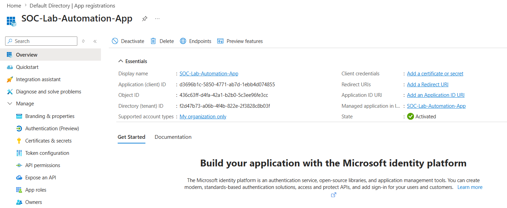
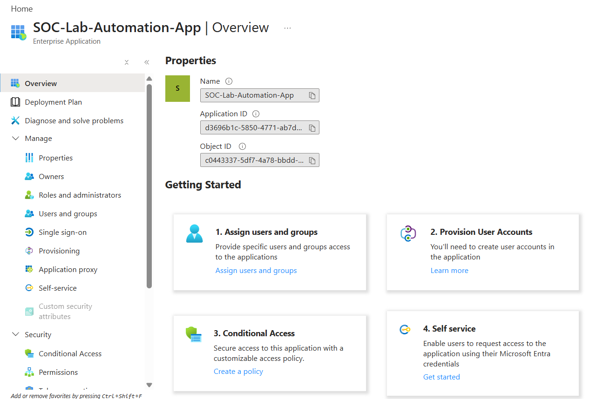
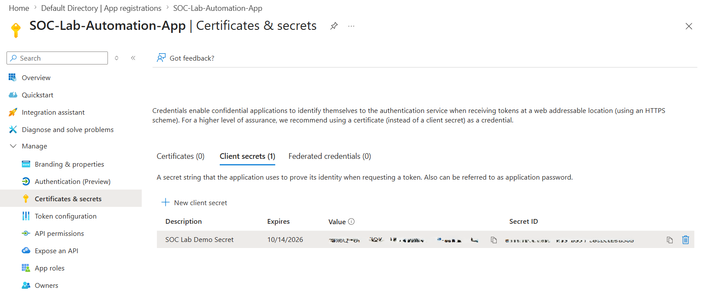
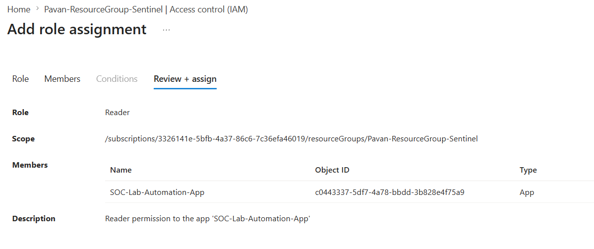
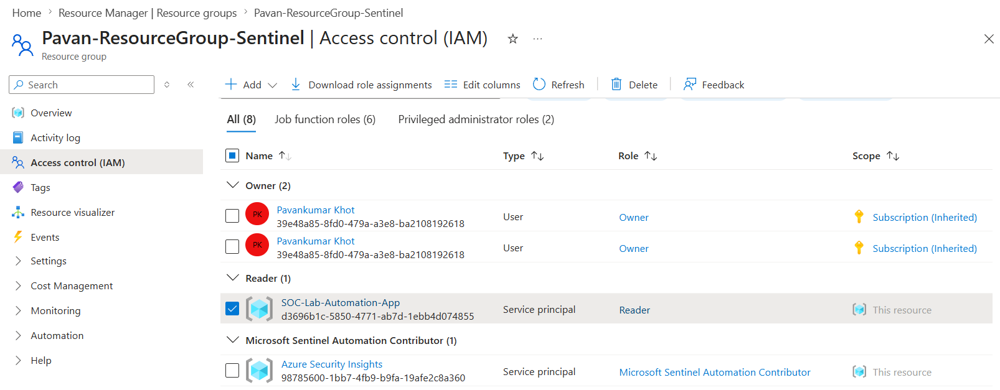
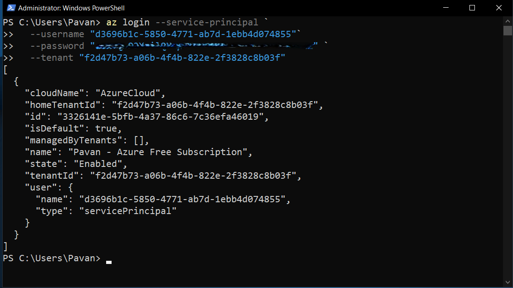
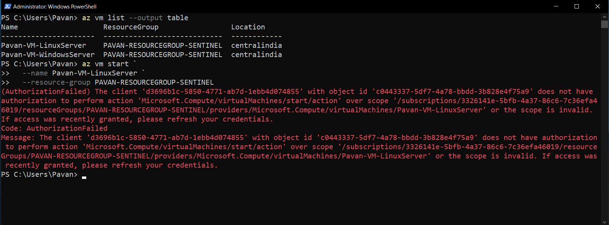

# 04-Service-Principals-and-App-Registrations

## Overview

Applications and automation workflows often need to authenticate with Azure without using a human user account. Microsoft Entra ID enables this through **App Registrations** and **Service Principals**, allowing applications to securely access Azure resources using their own identity.

In this module, I created an App Registration, explored the automatically generated Service Principal (Enterprise Application), configured client credentials, assigned Azure RBAC permissions, and validated authentication using Azure CLI.

---

## Learning Objectives

After completing this module, I was able to:

- Understand the relationship between App Registrations, Service Principals, and Enterprise Applications.
- Create and configure an App Registration in Microsoft Entra ID.
- Generate Client Secrets for application authentication.
- Assign Azure RBAC roles to a Service Principal.
- Authenticate to Azure using a Service Principal and Azure CLI.
- Validate Azure RBAC permissions using both successful and failed operations.
- Understand the Principle of Least Privilege (PoLP) for application identities.

---

## Architecture

```text
                     Microsoft Entra ID
                            │
                    App Registration
                            │
            (Application Definition)
                            │
        Automatically creates
                            │
                            ▼
      Service Principal (Enterprise Application)
                            │
                 Azure RBAC Assignment
                            │
                    Resource Group
                            │
                    Azure Resources
                            │
      Azure CLI / Logic Apps / Automation /
      Azure Functions / CI/CD Pipelines
```

---

## Why Service Principals?

Unlike human users, applications require a dedicated identity to securely authenticate with Azure services. A **Service Principal** acts as a non-human identity that can be granted only the permissions required to perform specific tasks, reducing security risks and supporting the Principle of Least Privilege (PoLP).

Common use cases include:

- Azure Logic Apps
- Azure Automation Accounts
- Azure Functions
- Microsoft Sentinel Playbooks
- GitHub Actions
- Azure DevOps Pipelines
- Terraform deployments
- Third-party integrations

---

## App Registration vs Service Principal

One of the most common areas of confusion in Microsoft Entra ID is understanding the difference between an **App Registration** and a **Service Principal**.

| App Registration | Service Principal |
|------------------|-------------------|
| Defines the application | Represents the application's identity in a tenant |
| Stores application configuration | Used for authentication and authorization |
| Contains API permissions, certificates, and client secrets | Receives Azure RBAC role assignments |
| Created manually | Automatically created when an App Registration is registered in the tenant |

The relationship can be visualized as:

```text
                Microsoft Entra ID
                       │
        App Registration (Application Object)
                       │
        Automatically creates
                       ▼
    Service Principal (Enterprise Application)
                       │
           Azure RBAC Role Assignment
                       │
               Azure Resource Access
```

This distinction is fundamental because **Azure RBAC permissions are assigned to the Service Principal—not the App Registration itself.**

---

# Practical Implementation

## Step 1: Create an App Registration

To create an application identity, I registered a new application in Microsoft Entra ID.

**Navigation**

```text
Microsoft Entra ID
    └── App registrations
            └── New registration
```

**Configuration**

| Setting | Value |
|---------|-------|
| Name | SOC-Lab-Automation-App |
| Supported account types | Accounts in this organizational directory only (Single tenant) |
| Redirect URI | None |

After registration, Microsoft Entra ID generated the following identifiers:

- **Application (Client) ID** – Unique identifier of the application.
- **Directory (Tenant) ID** – Unique identifier of the Microsoft Entra tenant.
- **Object ID** – Unique identifier of the App Registration object.

> **Note**
>
> These identifiers are **not secrets** and can safely be referenced when configuring application authentication. Sensitive credentials such as Client Secrets should never be committed to source control.

### Screenshot



---

## Step 2: Verify the Service Principal (Enterprise Application)

After creating the App Registration, Microsoft Entra ID automatically created a corresponding **Service Principal**, which appears under **Enterprise Applications**.

**Navigation**

```text
Microsoft Entra ID
    └── Enterprise applications
            └── SOC-Lab-Automation-App
```

This Service Principal represents the application's identity within my Microsoft Entra tenant and is the object that authenticates and receives Azure RBAC permissions.

### Key Learning

- App Registration defines the application.
- Service Principal represents the application inside the tenant.
- Azure RBAC permissions are assigned to the **Service Principal**, not the App Registration.

### Screenshot



---

## Step 3: Generate a Client Secret

Applications require credentials to authenticate securely. I generated a **Client Secret**, which acts as the application's password.

**Navigation**

```text
App Registration
    └── Certificates & secrets
            └── Client secrets
                    └── New client secret
```

The Client Secret is used together with:

- Application (Client) ID
- Directory (Tenant) ID

to perform non-interactive authentication.

> **Security Best Practice**
>
> Azure displays the **Client Secret Value only once** during creation. It should be stored securely and never committed to GitHub repositories or shared publicly.

### Screenshot



---

## Step 4: Assign Azure RBAC Permissions

To authorize the application to access Azure resources, I assigned the **Reader** role to the Service Principal at the Resource Group scope.

**Navigation**

```text
Resource Group
    └── Access Control (IAM)
            └── Add Role Assignment
```

**Role Assignment**

| Setting | Value |
|---------|-------|
| Role | Reader |
| Principal Type | Service Principal |
| Principal | SOC-Lab-Automation-App |
| Scope | SOC Lab Resource Group |

The Reader role allows the application to view Azure resources while preventing any modifications, making it ideal for demonstrating the Principle of Least Privilege (PoLP).

### Screenshot



---

## Step 5: Validate the RBAC Assignment

Finally, I verified that the Service Principal had successfully received the Reader role assignment by checking the Resource Group IAM role assignments.

This confirmed that the application's identity had been granted Azure RBAC permissions and was ready for authentication testing.

### Screenshot



---

# Optional Practical: Authenticate Using Azure CLI

Creating an App Registration and assigning Azure RBAC permissions does not verify that the application can actually authenticate. To validate the complete authentication flow, I used **Azure CLI** to sign in as the Service Principal and tested its permissions.

---

## Step 6: Authenticate Using the Service Principal

From my Azure Windows Server VM, I authenticated to Azure using the Service Principal credentials.

```powershell
az login --service-principal `
  --username "<Application-Client-ID>" `
  --password "<Client-Secret>" `
  --tenant "<Tenant-ID>"
```

A successful login returned a response similar to:

```json
"user": {
    "type": "servicePrincipal"
}
```

This confirms that Azure CLI authenticated using the **Service Principal** instead of a human user account.

### Screenshot



---

## Step 7: Validate Azure RBAC Permissions

After authentication, I validated the assigned **Reader** role by performing both a permitted and a restricted operation.

### Successful Read Operation

The following command successfully listed the virtual machines in my Resource Group:

```powershell
az vm list --output table
```

This confirmed that the Service Principal could perform **read** operations as expected.

---

### Restricted Write Operation

Next, I attempted to start a virtual machine:

```powershell
az vm start `
  --name Pavan-VM-WindowsServer `
  --resource-group PAVAN-RESOURCEGROUP-SENTINEL
```

Azure returned an **AuthorizationFailed** error because the Service Principal had only been assigned the **Reader** role.

This demonstrated that Azure RBAC correctly enforced the assigned permissions by allowing read operations while blocking write operations.

### Screenshot



---

# Key Takeaways

- App Registrations define application identities in Microsoft Entra ID.
- Every App Registration automatically creates a corresponding Service Principal within the tenant.
- Service Principals authenticate using the Application (Client) ID, Directory (Tenant) ID, and Client Secret.
- Azure RBAC permissions are assigned to the Service Principal, not the App Registration.
- Azure CLI can authenticate as a Service Principal without requiring a human user account.
- Azure RBAC successfully enforced the Principle of Least Privilege (PoLP) by allowing read operations while denying unauthorized write operations.

---

# Knowledge Check

### 1. What is the primary difference between an App Registration and a Service Principal?

**Answer:** An App Registration defines the application, whereas the Service Principal represents the application's identity within a Microsoft Entra tenant and receives Azure RBAC permissions.

---

### 2. Which object receives Azure RBAC role assignments?

**Answer:** The Service Principal (Enterprise Application).

---

### 3. Which three values are required to authenticate using a Service Principal?

**Answer:**

- Application (Client) ID
- Directory (Tenant) ID
- Client Secret

---

### 4. Why should Client Secrets never be committed to GitHub?

**Answer:** Client Secrets are sensitive credentials that can be used to authenticate as the application. Exposing them could allow unauthorized access to Azure resources.

---

### 5. Why did `az vm list` succeed while `az vm start` failed?

**Answer:** The Service Principal was assigned the **Reader** role, which permits read operations but blocks write and management actions, demonstrating Azure RBAC and the Principle of Least Privilege (PoLP).
