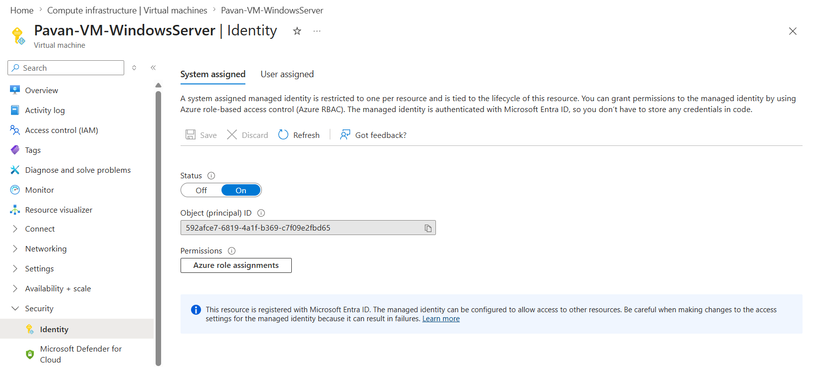
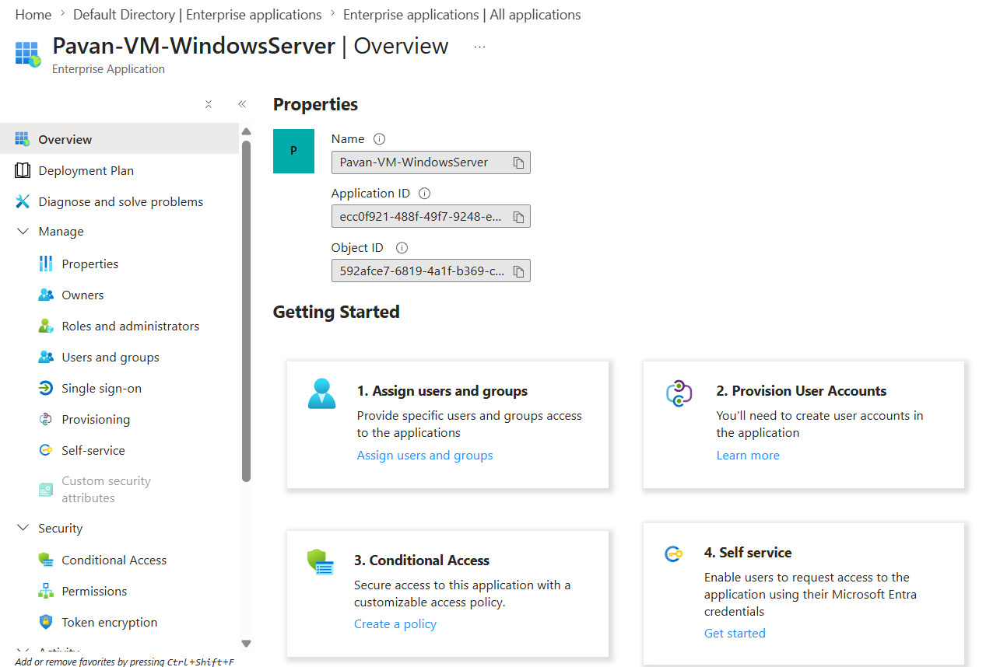
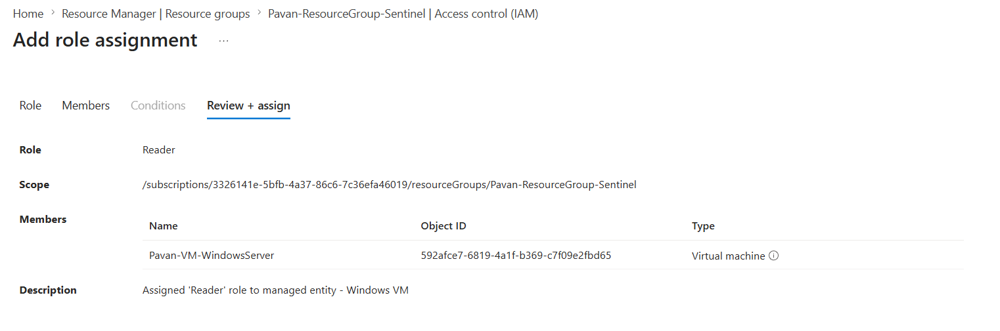
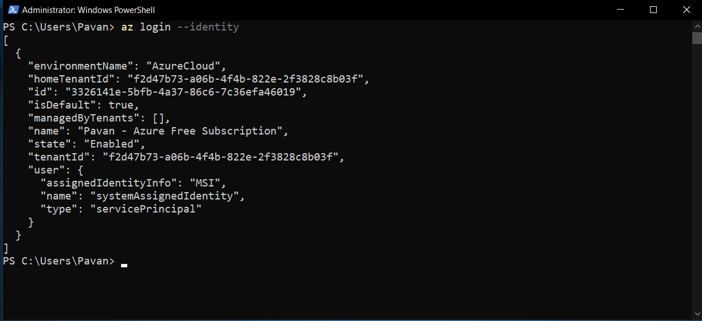
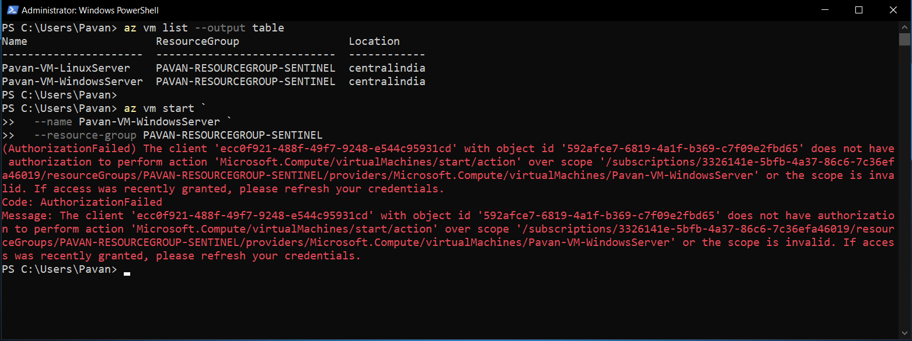

# 05-Managed-Identities

## Overview

Managing credentials for applications can introduce security risks, including secret exposure, credential rotation, and operational overhead. **Managed Identities** eliminate these challenges by providing Azure resources with an automatically managed identity that can securely authenticate to Azure services without storing or managing credentials.

In this module, I enabled a **System-assigned Managed Identity** on an Azure Virtual Machine, explored its automatically created Enterprise Application, assigned Azure RBAC permissions, and authenticated using Azure CLI without providing a username, password, or client secret.

---

## Learning Objectives

After completing this module, I was able to:

- Understand the purpose of Managed Identities.
- Differentiate between System-assigned and User-assigned Managed Identities.
- Enable a System-assigned Managed Identity on an Azure Virtual Machine.
- Verify the automatically created Enterprise Application in Microsoft Entra ID.
- Assign Azure RBAC permissions to a Managed Identity.
- Authenticate using Azure CLI without credentials.
- Validate Azure RBAC enforcement using read and write operations.
- Understand why Managed Identities are Microsoft's recommended authentication method for Azure-hosted resources.

---

## Architecture

```text
                  Microsoft Entra ID
                         │
        System-Assigned Managed Identity
                         │
      (Automatically Created by Azure)
                         │
               Enterprise Application
                         │
              Azure RBAC Assignment
                         │
                 Resource Group
                         │
                 Azure Resources
                         │
                  Azure Virtual Machine
                         │
                  Azure CLI (MSI)
                         │
                 az login --identity
```

---

## Why Managed Identities?

Traditionally, applications authenticate using **Service Principals** and **Client Secrets**. While effective, this approach requires securely storing, protecting, and periodically rotating credentials.

Managed Identities remove this operational burden by allowing Azure resources to obtain access tokens directly from Microsoft Entra ID without exposing or managing credentials.

### Common Use Cases

- Azure Virtual Machines
- Azure Functions
- Azure Logic Apps
- Azure Automation Accounts
- Azure App Service
- Azure Kubernetes Service (AKS)
- Microsoft Sentinel Playbooks

---

## System-assigned vs User-assigned Managed Identity

| System-assigned | User-assigned |
|-----------------|---------------|
| Identity is tied to a single Azure resource | Identity exists as a separate Azure resource |
| Automatically created when enabled | Created independently and attached to resources |
| Deleted automatically when the resource is deleted | Persists even if attached resources are deleted |
| One identity per resource | Can be shared across multiple Azure resources |
| Best for single-resource scenarios | Best for shared authentication scenarios |

> **In this lab, I implemented a System-assigned Managed Identity on an Azure Virtual Machine.**

---

## Managed Identity vs Service Principal

| Service Principal | Managed Identity |
|-------------------|------------------|
| Client Secret or Certificate required | No credentials required |
| Manual credential rotation | Automatic credential rotation |
| Manual lifecycle management | Azure-managed lifecycle |
| Suitable for applications running anywhere | Designed for Azure-hosted resources |
| Authentication using `az login --service-principal` | Authentication using `az login --identity` |

Managed Identities are internally implemented as **Service Principals**, but Azure manages their lifecycle and credentials automatically, making them the recommended authentication mechanism for Azure resources.

---

# Practical Implementation

## Step 1: Enable a System-assigned Managed Identity

To begin, I enabled a **System-assigned Managed Identity** on my Azure Windows Virtual Machine.

**Navigation**

```text
Virtual Machine
    └── Identity
            └── System assigned
                    └── Status = On
```

After saving the configuration, Azure automatically:

- Created a Managed Identity for the virtual machine.
- Generated a corresponding Enterprise Application in Microsoft Entra ID.
- Configured Azure to manage the identity's credentials automatically.

Unlike Service Principals, no App Registration or Client Secret was required.

### Screenshot



---

## Step 2: Verify the Enterprise Application

After enabling the Managed Identity, I verified that Azure had automatically created the corresponding **Enterprise Application** in Microsoft Entra ID.

**Navigation**

```text
Microsoft Entra ID
    └── Enterprise Applications
            └── Pavan-VM-WindowsServer
```

Unlike the previous module, no manual App Registration was created. Azure automatically provisioned the Enterprise Application that represents the Managed Identity within the tenant.

### Key Learning

- Every Managed Identity is backed by a Service Principal.
- Azure automatically creates and manages this identity.
- No Client Secret or certificate is required.

### Screenshot



---

## Step 3: Assign Azure RBAC Permissions

To allow the Managed Identity to access Azure resources, I assigned the **Reader** role at the Resource Group scope.

**Navigation**

```text
Resource Group
    └── Access Control (IAM)
            └── Add Role Assignment
```

**Configuration**

| Setting | Value |
|---------|-------|
| Role | Reader |
| Principal Type | Managed Identity |
| Managed Identity Type | Virtual Machine |
| Identity | Pavan-VM-WindowsServer |
| Scope | PAVAN-RESOURCEGROUP-SENTINEL |

Granting the Reader role allows the Managed Identity to view Azure resources while preventing modifications, demonstrating the Principle of Least Privilege (PoLP).

### Screenshot



---

## Step 4: Authenticate Using Azure CLI

To validate the Managed Identity, I connected to the Windows Virtual Machine and authenticated using Azure CLI.

```powershell
az login --identity
```

Unlike Service Principal authentication, no username, password, client secret, or certificate was required.

Azure CLI authenticated using the Managed Identity attached to the virtual machine and obtained an access token from Microsoft Entra ID automatically.

The output included:

```json
"user": {
    "assignedIdentityInfo": "MSI",
    "name": "systemAssignedIdentity",
    "type": "servicePrincipal"
}
```

> **Note**
>
> Although Azure CLI reports the identity type as **servicePrincipal**, the `assignedIdentityInfo: "MSI"` field confirms that authentication was performed using the Managed Identity. Internally, Managed Identities are implemented as specialized Service Principals whose credentials are fully managed by Azure.

### Screenshot



---

## Step 5: Validate Azure RBAC Permissions

After successfully authenticating, I validated the assigned **Reader** role by performing both a read operation and a write operation using Azure CLI.

### Read Operation

I listed the virtual machines within my Azure subscription:

```powershell
az vm list --output table
```

The command executed successfully, confirming that the Managed Identity had permission to read Azure resources.

### Write Operation

Next, I attempted to start one of the virtual machines:

```powershell
az vm start `
    --name Pavan-VM-WindowsServer `
    --resource-group PAVAN-RESOURCEGROUP-SENTINEL
```

Azure returned an **AuthorizationFailed** error because the Managed Identity was assigned only the **Reader** role.

This successfully demonstrated that Azure RBAC enforced the assigned permissions by allowing read operations while denying unauthorized management actions.

### Screenshot



---

# Key Takeaways

- Managed Identities provide Azure resources with a secure, automatically managed identity.
- System-assigned Managed Identities are created and deleted together with their Azure resource.
- Every Managed Identity is backed by a Service Principal in Microsoft Entra ID.
- Azure automatically manages credential generation and rotation, eliminating the need for Client Secrets or certificates.
- Azure RBAC permissions are assigned directly to the Managed Identity (Service Principal).
- Azure CLI can authenticate using `az login --identity` without requiring user credentials.
- Azure RBAC correctly enforced the **Reader** role by allowing read operations while blocking write operations, demonstrating the Principle of Least Privilege (PoLP).

---

# Knowledge Check

### 1. What problem do Managed Identities solve?

**Answer:** They eliminate the need to store, manage, and rotate credentials by providing Azure resources with an automatically managed identity.

---

### 2. What is the difference between a System-assigned and a User-assigned Managed Identity?

**Answer:** A System-assigned Managed Identity is tied to a single Azure resource and is deleted when the resource is deleted. A User-assigned Managed Identity is an independent Azure resource that can be attached to multiple Azure resources.

---

### 3. Why does `az login --identity` not require credentials?

**Answer:** Azure automatically retrieves an access token for the Managed Identity from Microsoft Entra ID using the Azure Instance Metadata Service (IMDS), eliminating the need for usernames, passwords, or client secrets.

---

### 4. Why does Azure CLI display `"type": "servicePrincipal"` after logging in with a Managed Identity?

**Answer:** Managed Identities are internally implemented as specialized Service Principals. The `assignedIdentityInfo: "MSI"` field confirms that authentication occurred using the Managed Identity.

---

### 5. Why did `az vm list` succeed while `az vm start` failed?

**Answer:** The Managed Identity was assigned the **Reader** role, which allows read operations but blocks management actions such as starting, stopping, or modifying virtual machines. This demonstrates Azure RBAC and the Principle of Least Privilege (PoLP).
