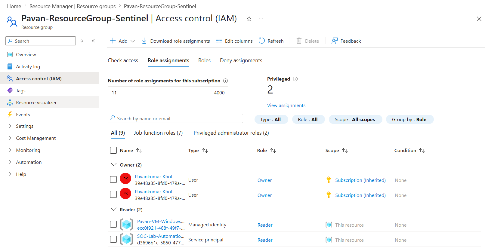
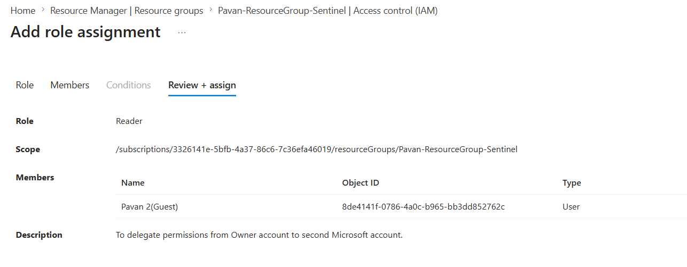
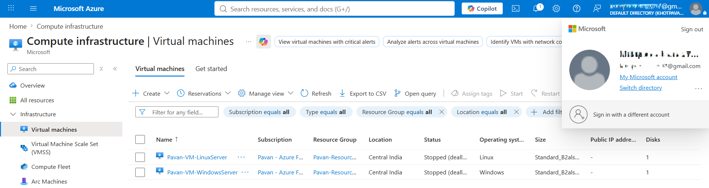
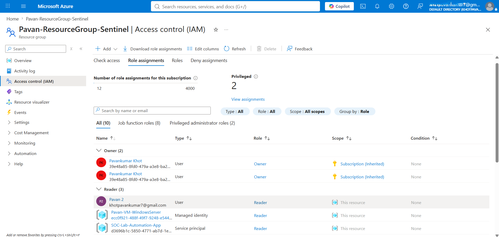

# 06-Permission-Delegation

## Overview

Azure Role-Based Access Control (Azure RBAC) enables organizations to securely delegate permissions by granting specific roles to users, groups, service principals, and managed identities. Instead of assigning permissions directly to resources, Azure evaluates role assignments at different scopes to determine what actions a security principal can perform.

In this module, I explored how Azure RBAC permission delegation works by assigning the **Reader** role to a secondary Microsoft Entra ID user at the Resource Group scope. I then validated the delegated permissions from the secondary account and examined how Azure calculates effective permissions based on the assigned role and scope.

---

## Learning Objectives

After completing this module, I was able to:

- Understand the concept of permission delegation in Azure RBAC.
- Delegate Azure permissions to another Microsoft Entra ID user.
- Understand Azure RBAC scopes and permission inheritance.
- Validate delegated permissions using a secondary user account.
- Analyze how Azure calculates effective permissions.
- Understand the relationship between Security Principals, Role Definitions, and Scopes.
- Apply the Principle of Least Privilege (PoLP) when delegating permissions.

---

## Permission Delegation Workflow

```text
                Resource Owner
                      │
                      ▼
          Creates Role Assignment
                      │
        ┌─────────────┴─────────────┐
        │                           │
 Security Principal            Role Definition
 (User / Group / SP / MI)        (Reader)
        │                           │
        └─────────────┬─────────────┘
                      │
                      ▼
                    Scope
              (Resource Group)
                      │
                      ▼
          Effective Permissions
                      │
                      ▼
          Azure Resource Access
```

---

## Azure RBAC Components

Azure RBAC determines permissions using three fundamental components:

| Component | Description |
|----------|-------------|
| **Security Principal** | The identity receiving permissions (User, Group, Service Principal, or Managed Identity). |
| **Role Definition** | A collection of allowed actions such as Reader, Contributor, or Owner. |
| **Scope** | The level at which permissions apply (Management Group, Subscription, Resource Group, or Resource). |

Azure combines these three components to calculate a user's **effective permissions** whenever they attempt to access an Azure resource.

---

## Azure RBAC Scope Hierarchy

Permissions assigned at a higher scope are automatically inherited by child resources.

```text
Management Group
        │
        ▼
Subscription
        │
        ▼
Resource Group
        │
        ▼
Resources
(VMs, Storage, Key Vault, Sentinel, etc.)
```

For this lab, permissions were delegated at the **Resource Group** scope, allowing the delegated user to access every resource contained within that Resource Group without assigning permissions individually.

---

# Practical Implementation

## Step 1: Verify Owner Permissions

Before delegating permissions, I verified that my primary Microsoft account had the **Owner** role assigned to the Resource Group.

The Owner role includes permission to:

- Create role assignments.
- Modify existing role assignments.
- Remove delegated permissions.
- Manage Azure resources.

This verification ensured that my account had sufficient privileges to delegate Azure RBAC permissions.

### Screenshot



---

## Step 2: Delegate Permissions to a Secondary User

To demonstrate Azure RBAC delegation, I assigned the **Reader** role to a secondary Microsoft Entra ID user at the Resource Group scope.

**Navigation**

```text
Resource Group
    └── Access Control (IAM)
            └── Add
                    └── Add role assignment
```

**Configuration**

| Setting | Value |
|---------|-------|
| Role | Reader |
| Assign access to | User, group, or service principal |
| Member | Secondary Microsoft Entra ID User |
| Scope | PAVAN-RESOURCEGROUP-SENTINEL |

After selecting the user, I completed the role assignment by clicking **Review + assign**.

Azure immediately created a new RBAC role assignment linking the selected user, the Reader role, and the Resource Group scope.

### Screenshot



---

## Step 3: Validate Scope Inheritance

Azure RBAC permissions are inherited from parent scopes to child resources.

Since the Reader role was assigned at the **Resource Group** scope, the delegated user automatically inherited read permissions for every resource inside that Resource Group.

This included:

- Windows Virtual Machine
- Linux Virtual Machine
- Any additional Azure resources created within the same Resource Group

No separate permissions were assigned directly to the individual virtual machines.

This demonstrates one of Azure RBAC's core design principles:

> **Permissions assigned at a parent scope automatically apply to child resources unless explicitly overridden.**

### Practical Validation

After signing in with the delegated Microsoft account, I verified that:

- The Resource Group was accessible.
- Both virtual machines were visible.
- Resource properties could be viewed successfully.

This confirmed that Azure correctly inherited the Reader permissions from the Resource Group to all contained resources.

### Screenshot



---

## Step 4: Analyze Effective Permissions

Finally, I reviewed the delegated user's role assignments to understand how Azure calculates effective permissions.

Azure evaluates access dynamically using three components:

```text
Security Principal
        +
Role Definition
        +
Scope
        =
Effective Permissions
```

For the delegated account, Azure evaluated:

| Component | Value |
|----------|-------|
| Security Principal | Secondary Microsoft Entra ID User |
| Role Definition | Reader |
| Scope | PAVAN-RESOURCEGROUP-SENTINEL |

Because the assigned role was **Reader**, the user could successfully access and view Azure resources but could not perform management operations such as creating, modifying, or deleting resources.

This demonstrates that Azure RBAC evaluates permissions dynamically during every authorization request instead of permanently assigning permissions to user accounts.

### Screenshot



---

# Key Takeaways

- Azure RBAC delegates permissions through **role assignments**, not by modifying user accounts.
- Every Azure RBAC permission is determined by three components: **Security Principal**, **Role Definition**, and **Scope**.
- Assigning permissions at a parent scope automatically grants inherited access to child resources.
- The **Owner** role can delegate permissions by creating, modifying, and removing Azure RBAC role assignments.
- Azure evaluates permissions dynamically whenever a user attempts to access a resource.
- Delegating permissions at the **Resource Group** scope simplifies administration while maintaining centralized access control.
- Applying the **Principle of Least Privilege (PoLP)** helps reduce security risks by granting only the permissions required to perform a task.

---

# Real-World Enterprise Scenario

Permission delegation is a fundamental administrative task in enterprise Azure environments.

For example, when a new SOC analyst joins an organization, an Azure administrator does not manually grant permissions to every individual resource. Instead, the administrator assigns an appropriate Azure RBAC role—such as **Reader** or **Microsoft Sentinel Reader**—at the required scope. Azure automatically applies those permissions to all relevant child resources through scope inheritance.

This approach provides:

- Centralized access management
- Simplified administration
- Consistent permission enforcement
- Improved scalability
- Better compliance with the Principle of Least Privilege (PoLP)

---

# Knowledge Check

### 1. What are the three components Azure RBAC uses to determine permissions?

**Answer:** Security Principal, Role Definition, and Scope.

---

### 2. What is permission delegation in Azure?

**Answer:** Permission delegation is the process of granting Azure RBAC roles to a security principal (user, group, service principal, or managed identity), allowing Azure to authorize access based on the assigned role and scope.

---

### 3. If the Reader role is assigned at the Resource Group scope, which resources inherit the permission?

**Answer:** All child resources within that Resource Group, such as Virtual Machines, Storage Accounts, Key Vaults, Log Analytics Workspaces, and Microsoft Sentinel resources.

---

### 4. Which Azure RBAC role is commonly used to delegate permissions to other users?

**Answer:** The **Owner** role can create, update, and remove Azure RBAC role assignments. Organizations may also use **User Access Administrator** or **Role Based Access Control Administrator** for delegated access management without granting full ownership.

---

### 5. Does Azure permanently assign permissions to a user account?

**Answer:** No. Azure stores role assignments separately and dynamically evaluates effective permissions during each authorization request based on the Security Principal, Role Definition, and Scope.

---

### 6. Why is assigning permissions at the Resource Group scope preferred over assigning permissions individually to each resource?

**Answer:** Assigning permissions at the Resource Group scope simplifies administration, ensures consistent access across related resources through inheritance, reduces configuration effort, and minimizes the risk of inconsistent permissions.

---

# Module Summary

In this module, I demonstrated how Azure RBAC delegates permissions by assigning the **Reader** role to a secondary Microsoft Entra ID user at the Resource Group scope. I verified the delegated access, observed permission inheritance across Azure resources, and analyzed how Azure dynamically calculates effective permissions using the Security Principal, Role Definition, and Scope.

This exercise reinforced core Azure RBAC concepts and highlighted how enterprise organizations securely delegate access while adhering to the Principle of Least Privilege (PoLP).
