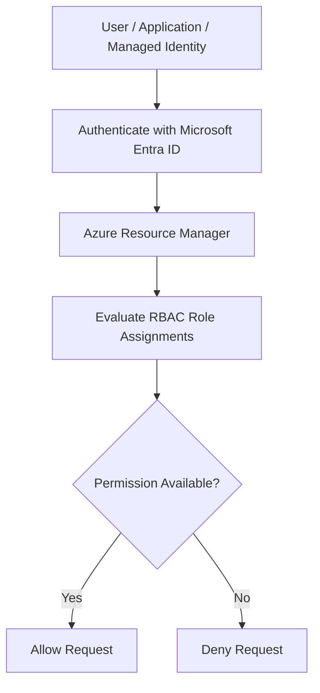

# Azure RBAC Fundamentals

## Overview

Azure Role-Based Access Control (Azure RBAC) is Azure's authorization system that controls **who** can access **which Azure resources** and **what actions** they are allowed to perform. It enables organizations to implement the **Principle of Least Privilege (PoLP)** by granting only the minimum permissions required for users, groups, applications, and managed identities.

Azure RBAC is one of the core security features in Azure and is used across almost every Azure service, including Microsoft Sentinel, Virtual Machines, Storage Accounts, Key Vaults, Networking resources, and Resource Groups.

This lab introduces the fundamental concepts of Azure RBAC that will serve as the foundation for the remaining modules covering Microsoft Sentinel roles, Custom RBAC Roles, Service Principals, Managed Identities, and Permission Delegation.

---

## Learning Objectives

After completing this lab, you will be able to:

- Explain the difference between Authentication and Authorization.
- Understand the purpose of Azure RBAC.
- Understand Azure Resource Hierarchy.
- Understand RBAC Scopes.
- Explain Permission Inheritance.
- Understand how Azure evaluates access requests.
- Locate and explore the Access Control (IAM) blade.
- Identify common built-in Azure RBAC roles.
- Prepare for implementing custom roles in later labs.

---

## Prerequisites

- Azure Subscription
- Owner permissions on the subscription
- Azure Resource Group containing your SOC Lab resources
- Microsoft Sentinel Workspace

---

# Authentication vs Authorization

Authentication and Authorization are often confused but serve completely different purposes.

| Authentication | Authorization |
|---------------|---------------|
| Verifies **who you are** | Determines **what you can do** |
| Performed by Microsoft Entra ID | Performed by Azure RBAC |
| Requires credentials | Requires Role Assignments |
| Happens first | Happens after successful authentication |

### Authentication Flow

```text
User
   │
Username + Password / MFA
   │
   ▼
Microsoft Entra ID
   │
Identity Verified
```

### Authorization Flow

```text
Authenticated User
        │
        ▼
Azure Resource Manager (ARM)
        │
Checks Azure RBAC
        │
        ▼
Allow or Deny
```

> **Important**
>
> Microsoft Entra ID answers **"Who are you?"**
>
> Azure RBAC answers **"What are you allowed to do?"**

---

# What is Azure RBAC?

Azure Role-Based Access Control (RBAC) is an Azure authorization framework that grants permissions through **Role Assignments**.

Every permission in Azure is granted through three components:

- Security Principal
- Role Definition
- Scope

A role assignment is simply the combination of these three components.

```text
Security Principal
        │
Assigned
        ▼
Role Definition
        │
At
        ▼
Scope
```

Example:

```text
User:
Pavan

Role:
Owner

Scope:
Subscription
```

This means the user **Pavan** has the **Owner** role for the selected Azure Subscription.

---

# Why Azure RBAC?

Without RBAC, every administrator would either have unrestricted access or no access at all.

Azure RBAC provides a controlled authorization model that enables organizations to:

- Enforce least privilege.
- Separate administrative responsibilities.
- Reduce insider threats.
- Limit accidental changes.
- Delegate permissions securely.
- Simplify access management.

### Example

Instead of giving every SOC analyst **Owner** permissions:

| Role | Responsibility |
|------|----------------|
| Reader | View resources |
| Sentinel Responder | Investigate incidents |
| Contributor | Manage resources |
| Owner | Full administrative control |

Each user receives only the permissions required for their job.

---

# Azure Resource Hierarchy

Azure resources are organized into a hierarchical structure.

```text
Management Group
        │
Subscription
        │
Resource Group
        │
Azure Resources
```

For this SOC Lab, the hierarchy is similar to:

```text
Subscription
│
└── Resource Group
      │
      ├── Microsoft Sentinel
      ├── Log Analytics Workspace
      ├── Windows VM
      ├── Ubuntu VM
      ├── Virtual Network
      └── Storage Account
```

Permissions assigned at higher levels are inherited by child resources unless explicitly restricted.

---

# RBAC Scopes

Azure RBAC permissions are always assigned at a **Scope**.

Azure supports four scopes.

| Scope | Description | Typical Use |
|--------|-------------|-------------|
| Management Group | Highest level | Enterprise governance |
| Subscription | Entire subscription | Subscription administrators |
| Resource Group | Collection of resources | Project or department access |
| Resource | Individual resource | Fine-grained permissions |

The hierarchy looks like this:

```text
Management Group
        │
Subscription
        │
Resource Group
        │
Virtual Machine
```

If a role is assigned at the **Subscription** scope, it automatically applies to all Resource Groups and resources within that subscription.

---

# Permission Inheritance

Azure RBAC follows an inheritance model.

Permissions assigned at a parent scope automatically apply to all child scopes.

Example:

```text
Subscription
    │
 Owner Assigned
    │
    ├── Resource Group A
    │      ├── VM
    │      ├── Storage
    │      └── Sentinel
    │
    └── Resource Group B
           └── SQL Database
```

Since the Owner role was assigned at the Subscription level, every child resource inherits that permission.

This reduces administrative overhead because permissions do not need to be assigned individually to every resource.

> **Lab Observation**
>
> In this lab environment, the user account is assigned the **Owner** role at the **Subscription** scope. Therefore, all resources within the SOC Lab Resource Group inherit the Owner permissions automatically.

---

# Azure RBAC Authorization Flow

Every operation performed in Azure follows the same authorization workflow. When a user attempts to perform an action, Azure first verifies the user's identity and then checks whether the requested action is permitted based on Azure RBAC role assignments.



For example, when a user attempts to delete a Virtual Machine:

```text
User
 │
 │ Delete Virtual Machine
 ▼
Azure Resource Manager
 │
 │ Checks RBAC Role Assignments
 ▼
Permission Available?
 │
 ├── Yes → Delete VM
 └── No  → Authorization Failed
```

> **Important**
>
> Azure Resource Manager (ARM) is responsible for evaluating Azure RBAC permissions. Individual Azure resources do not perform authorization checks themselves.

---

# Azure Resource Manager (ARM)

Azure Resource Manager (ARM) is Azure's deployment and management service. Every Azure resource request—whether made through the Azure Portal, Azure CLI, PowerShell, ARM Templates, Bicep, REST API, or SDKs—is processed through ARM.

ARM is responsible for:

- Managing Azure resources.
- Processing deployment requests.
- Evaluating Azure RBAC permissions.
- Enforcing resource locks and policies.
- Returning Allow or Deny responses.

Without ARM, Azure RBAC would not function because ARM is the component that evaluates every authorization request.

---

# Access Control (IAM)

Azure RBAC permissions are managed through the **Access Control (IAM)** blade available on most Azure resources.

Path:

```text
Azure Resource
      │
      ▼
Access Control (IAM)
```

The IAM blade provides centralized management of Azure RBAC permissions.

The most commonly used sections are:

| Section | Purpose |
|----------|---------|
| Overview | Summary of access management |
| Role Assignments | View who has access |
| Roles | View built-in and custom roles |
| Check Access | Verify effective permissions for a user |
| Deny Assignments | View explicit deny assignments (if applicable) |

Rather than each Azure service having its own permission model, Azure RBAC provides a centralized authorization system through the IAM blade.

---

# Built-in Azure Roles

Azure includes hundreds of built-in roles designed for different administrative scenarios. However, only a small number are commonly used in daily Azure administration.

| Role | Purpose |
|------|---------|
| Owner | Full management access, including permission management |
| Contributor | Manage resources but cannot assign RBAC roles |
| Reader | Read-only access |
| User Access Administrator | Manage RBAC role assignments only |

These four roles form the foundation of Azure RBAC and are frequently encountered in enterprise environments.

---

## Owner

The Owner role provides unrestricted administrative access.

Capabilities include:

- Create resources
- Modify resources
- Delete resources
- Assign RBAC roles
- Remove RBAC roles
- Delegate access to other users

This role should be assigned only to trusted administrators because it includes permission management capabilities.

---

## Contributor

The Contributor role can manage Azure resources but **cannot manage Azure RBAC permissions**.

Capabilities include:

- Create resources
- Modify resources
- Delete resources

Limitations:

- Cannot assign roles
- Cannot remove role assignments

This separation helps organizations enforce the Principle of Least Privilege.

---

## Reader

The Reader role provides view-only access.

Capabilities include:

- View resources
- View configuration
- View monitoring information

Limitations:

- Cannot modify resources
- Cannot create resources
- Cannot delete resources
- Cannot manage permissions

Reader is commonly assigned to auditors, security analysts, and monitoring teams.

---

## User Access Administrator

This role is dedicated to permission management.

Capabilities:

- Create role assignments
- Remove role assignments
- Delegate Azure RBAC permissions

Limitations:

- Cannot manage Azure resources
- Cannot create or delete Azure resources

Organizations often combine this role with Contributor instead of granting Owner permissions.

---

# Owner vs Contributor vs Reader

| Capability | Owner | Contributor | Reader |
|------------|:-----:|:-----------:|:------:|
| View Resources | ✅ | ✅ | ✅ |
| Create Resources | ✅ | ✅ | ❌ |
| Modify Resources | ✅ | ✅ | ❌ |
| Delete Resources | ✅ | ✅ | ❌ |
| Assign RBAC Roles | ✅ | ❌ | ❌ |

Understanding this comparison is essential for Azure administration and is a common interview topic for Azure security roles.

---

# Practical Lab

During this lab, the Access Control (IAM) blade was explored at the Resource Group scope.

The following observations were made:

- Azure RBAC permissions are managed through the IAM blade.
- Role assignments display the principal, assigned role, and assignment scope.
- Built-in Azure roles are available through the Roles section.
- Role inheritance is visible because permissions assigned at the Subscription scope automatically apply to child Resource Groups.

---

# Lab Observations

The following observations were recorded from the lab environment.

| Observation | Result |
|-------------|--------|
| Subscription Role | Owner |
| Assignment Scope | Subscription |
| Inheritance | Resource Group inherits Owner permissions |
| Existing Principal Types | User, Service Principal, Managed Identity |
| Existing Managed Identity | Enrich-Sentinel-Incident |

The presence of multiple principal types demonstrates that Azure RBAC supports authorization for both human users and non-human identities such as applications and managed identities.

---

# Validation

The following concepts were successfully validated during this lab:

- Azure resources are organized in a hierarchical structure.
- Azure RBAC permissions are assigned through the IAM blade.
- Subscription-level role assignments are inherited by child Resource Groups.
- Azure supports multiple principal types including Users, Service Principals, and Managed Identities.
- The current user possesses Owner permissions inherited throughout the SOC Lab environment.

### Suggested Screenshot

> **Access Control (IAM)** showing the current role assignment and inherited permissions.

This screenshot validates the practical observations without requiring unnecessary portal screenshots.

---

# Best Practices

Implementing Azure RBAC correctly is essential for maintaining a secure Azure environment. The following best practices are commonly followed in enterprise deployments.

| Best Practice | Description |
|---------------|-------------|
| Follow the Principle of Least Privilege | Grant only the permissions required to perform a task. |
| Assign roles at the lowest possible scope | Prefer Resource Group or Resource scope over Subscription whenever possible. |
| Use Microsoft Entra Groups | Assign roles to groups instead of individual users for easier management. |
| Minimize Owner assignments | Limit the Owner role to trusted administrators only. |
| Prefer Managed Identities | Use Managed Identities instead of storing credentials for Azure resources. |
| Review role assignments regularly | Periodically remove unused or excessive permissions. |
| Use Custom Roles when required | Create custom roles if built-in roles provide too many permissions. |
| Monitor Activity Logs | Audit all RBAC changes for security and compliance. |

> **Security Tip**
>
> In production environments, avoid assigning the **Owner** role unless absolutely necessary. Most administrators can perform their daily tasks using **Contributor**, **User Access Administrator**, or a carefully designed Custom Role.

---

# Common Mistakes

The following mistakes are frequently observed in Azure environments.

| Mistake | Impact |
|----------|--------|
| Assigning Owner to everyone | Excessive privileges and higher security risk |
| Assigning roles at Subscription scope unnecessarily | Users gain access to unrelated resources |
| Assigning permissions directly to users | Difficult to manage as the organization grows |
| Ignoring inherited permissions | Users may receive unintended access |
| Not auditing RBAC changes | Unauthorized permission changes may go unnoticed |

Understanding these mistakes helps build a more secure and maintainable Azure environment.

---

# Key Takeaways

- Azure RBAC is Azure's authorization system.
- Microsoft Entra ID authenticates identities, while Azure RBAC authorizes actions.
- Every role assignment consists of a **Security Principal**, **Role Definition**, and **Scope**.
- Azure Resource Manager (ARM) evaluates every authorization request.
- Azure resources are organized into a hierarchical structure consisting of Management Groups, Subscriptions, Resource Groups, and Resources.
- RBAC permissions are inherited from parent scopes to child scopes.
- Azure RBAC permissions are managed through the **Access Control (IAM)** blade.
- The four most important built-in roles are **Owner**, **Contributor**, **Reader**, and **User Access Administrator**.
- Azure RBAC supports multiple principal types including Users, Groups, Service Principals, and Managed Identities.
- Following the Principle of Least Privilege significantly improves Azure security.

---

# Knowledge Check

| Question | Answer |
|----------|--------|
| What is Azure RBAC? | Azure's authorization system used to control access to Azure resources. |
| Is Azure RBAC responsible for authentication? | No. Authentication is handled by Microsoft Entra ID. Azure RBAC performs authorization. |
| Which Azure component evaluates RBAC permissions? | Azure Resource Manager (ARM). |
| What are the four Azure RBAC scopes? | Management Group, Subscription, Resource Group, and Resource. |
| Does Azure RBAC support permission inheritance? | Yes. Child resources inherit permissions assigned at parent scopes. |
| Where are Azure RBAC permissions managed? | Through the **Access Control (IAM)** blade. |
| Which built-in role provides full administrative access including permission management? | Owner. |
| Which built-in role can manage Azure resources but cannot assign RBAC permissions? | Contributor. |
| Which built-in role provides read-only access? | Reader. |
| Which built-in role is responsible only for managing RBAC assignments? | User Access Administrator. |
| What are the three components of a Role Assignment? | Security Principal, Role Definition, and Scope. |
| Name four Azure security principals. | User, Group, Service Principal, and Managed Identity. |
| Why should roles be assigned at the lowest possible scope? | To enforce the Principle of Least Privilege and reduce unnecessary access. |
| Why is assigning the Owner role to every administrator considered a bad practice? | It grants unnecessary privileges and increases the attack surface. |
| Which principle should always guide Azure RBAC design? | Principle of Least Privilege (PoLP). |

---

# Next Module

The next lab focuses on **Microsoft Sentinel Roles**, where we will explore Sentinel-specific built-in roles such as:

- Microsoft Sentinel Reader
- Microsoft Sentinel Responder
- Microsoft Sentinel Contributor
- Microsoft Sentinel Automation Contributor

Unlike Azure RBAC fundamentals, the next module will include hands-on role assignments, permission validation, and practical SOC scenarios.

---

# References

- Microsoft Learn – Azure Role-Based Access Control (Azure RBAC)
- Microsoft Learn – Understand Scope for Azure RBAC
- Microsoft Learn – Built-in Azure Roles
- Microsoft Learn – Azure Resource Manager Overview
- Microsoft Learn – Microsoft Sentinel Roles

---

## Validation Evidence

### 1. Subscription-Level Owner Assignment


The current user is assigned the **Owner** role at the **Subscription** scope. This demonstrates that Azure RBAC permissions can be assigned at the Subscription level and are inherited by child resources.

---

### 2. Resource Group Inherited Permissions


The Resource Group inherits the **Owner** role from the parent Subscription, demonstrating Azure RBAC's permission inheritance model.

---

### 3. Azure Security Principals


The Role Assignments blade shows multiple Azure security principal types, including a **User**, **Service Principal**, and the **Enrich-Sentinel-Incident** Managed Identity.

---
## Module Summary

In this lab, we explored the foundational concepts of Azure RBAC, including authentication vs. authorization, Azure Resource Hierarchy, RBAC scopes, permission inheritance, Azure Resource Manager (ARM), Access Control (IAM), and the most commonly used built-in Azure roles. We also examined the current SOC Lab environment, verified inherited Owner permissions at the Subscription scope, and observed multiple Azure security principal types including Users, Service Principals, and Managed Identities.

This knowledge forms the foundation for the remaining RBAC modules, where these concepts will be applied through practical role assignments, custom roles, managed identities, service principals, permission delegation, and RBAC auditing.
