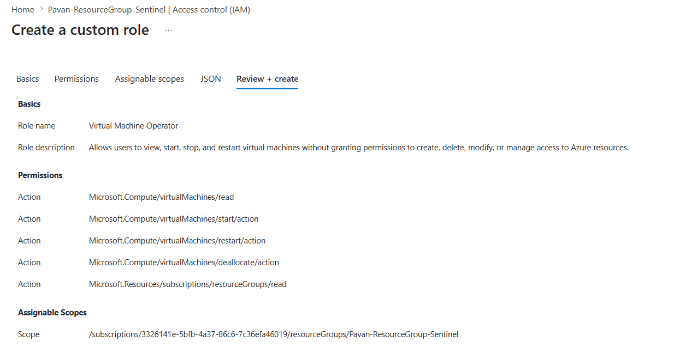
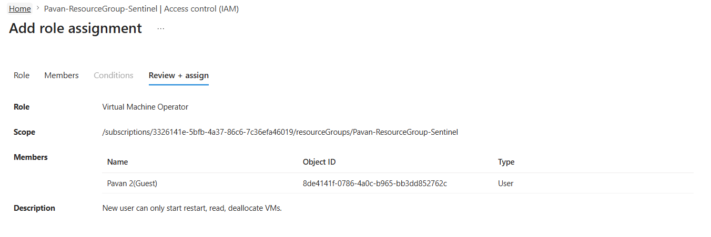
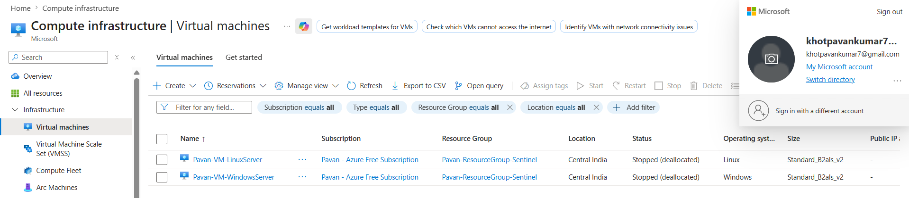
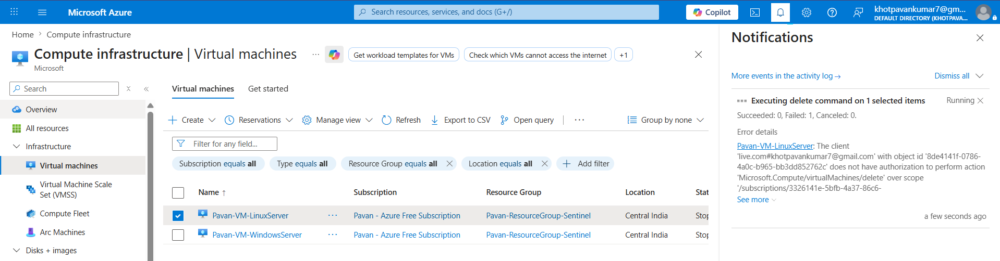

# 03 - Custom Roles and Least Privilege

## Overview

Azure provides numerous built-in roles that cover common administrative and operational tasks. However, enterprise environments often require more granular access control than built-in roles can provide. Azure Custom Roles enable organizations to implement the Principle of Least Privilege (PoLP) by granting users only the permissions necessary to perform their assigned responsibilities.

In this module, we design, implement, and validate a custom Azure RBAC role named **Virtual Machine Operator**. This role allows an operator to manage the power state of Azure Virtual Machines without permitting infrastructure modifications or administrative actions.

---

## Learning Objectives

After completing this module, you will understand:

- Azure Custom Roles and when to use them
- Azure RBAC Actions and permission granularity
- Principle of Least Privilege (PoLP)
- Assignable Scopes
- Resource-level permission delegation
- Role assignment and validation
- Troubleshooting custom RBAC permissions
- Security best practices for custom role design

---

## Why Custom Roles?

Built-in roles are designed for common scenarios, but they frequently provide more permissions than required.

Example:

| Requirement | Built-in Role | Problem |
|-------------|--------------|---------|
| Restart production VMs | Virtual Machine Contributor | Can also create, delete, resize, and modify VMs |
| Restart production VMs only | Custom Role | Grants only the required permissions |

Using custom roles minimizes the attack surface while maintaining operational efficiency.

---

## Principle of Least Privilege (PoLP)

The Principle of Least Privilege states that every identity should receive only the minimum permissions required to perform its job.

Benefits include:

- Reduced attack surface
- Prevention of accidental changes
- Reduced impact of compromised accounts
- Easier auditing
- Improved compliance

This module demonstrates PoLP by allowing VM power operations while preventing infrastructure modifications.

---

# Lab Scenario

The Infrastructure Team wants the Operations Team to perform routine VM operational tasks during incidents without granting administrative control.

Required permissions:

- View Virtual Machines
- Start Virtual Machines
- Restart Virtual Machines
- Stop (Deallocate) Virtual Machines

Restricted permissions:

- Create Virtual Machines
- Delete Virtual Machines
- Resize Virtual Machines
- Modify VM configuration
- Manage networking
- Assign RBAC permissions

---

# Architecture

```
                    Azure Subscription
                           │
                    Resource Group
                           │
             Virtual Machine Operator
                    (Custom Role)
                           │
                 Assigned to User
                           │
      ┌───────────────────────────────────┐
      │                                   │
      │   Allowed Operations              │
      │   • Read VM                       │
      │   • Start VM                      │
      │   • Restart VM                    │
      │   • Deallocate VM                 │
      │                                   │
      │   Blocked Operations              │
      │   • Delete VM                     │
      │   • Resize VM                     │
      │   • Modify Configuration          │
      │   • RBAC Management               │
      └───────────────────────────────────┘
```

---

## Implementation Steps

1. Create a new Custom Role.
2. Configure least-privilege permissions.
3. Restrict the role to the SOC Lab Resource Group.
4. Assign the role to a secondary test user.
5. Validate allowed operations.
6. Validate denied operations.
7. Document findings and security observations.

---

## Screenshots

### Custom Role Created



### Role Assignment



---

# Implementation

## Step 1 - Create the Custom Role

Navigate to:

```
Resource Group
    └── Access Control (IAM)
            └── Roles
                    └── Create
                            └── Custom Role
```

Configure the following:

| Setting | Value |
|----------|-------|
| Role Name | Virtual Machine Operator |
| Description | Allows users to view, start, stop, and restart Azure Virtual Machines without allowing infrastructure changes or RBAC management. |
| Baseline Permissions | Start from scratch |
| Assignable Scope | SOC Lab Resource Group |

---

## Step 2 - Configure Permissions

The following permissions were added to the custom role.

| Permission | Purpose |
|------------|---------|
| Microsoft.Compute/virtualMachines/read | View Virtual Machine properties |
| Microsoft.Compute/virtualMachines/start/action | Start Virtual Machine |
| Microsoft.Compute/virtualMachines/restart/action | Restart Virtual Machine |
| Microsoft.Compute/virtualMachines/deallocate/action | Stop (Deallocate) Virtual Machine |
| Microsoft.Resources/subscriptions/resourceGroups/read | Allow Azure Portal to enumerate Resource Groups |

These permissions provide sufficient access for routine VM operations while preventing infrastructure modifications.

---

## Understanding the Permission Set

### Read Permission

```
Microsoft.Compute/virtualMachines/read
```

Allows users to:

- View VM Overview
- View Networking
- View Disks
- View Extensions
- View Boot Diagnostics
- View Monitoring information

Does **not** allow any configuration changes.

---

### Action Permissions

```
start/action
restart/action
deallocate/action
```

These are **management actions**, not write permissions.

Azure RBAC distinguishes between:

| Permission Type | Example | Purpose |
|-----------------|---------|---------|
| Read | virtualMachines/read | View resource |
| Action | start/action | Execute an operation |
| Write | virtualMachines/write | Modify resource configuration |
| Delete | virtualMachines/delete | Delete resource |

Because we intentionally omitted **write** and **delete** permissions, the operator cannot modify or remove the VM.

---

## Why Resource Group Read Permission Was Required

Initially, only VM permissions were assigned.

Although the user had permission to manage VM power operations, the Azure Portal could not enumerate resources because the role lacked Resource Group read access.

Adding the following permission resolved the issue:

```
Microsoft.Resources/subscriptions/resourceGroups/read
```

This demonstrates that Azure Portal navigation often requires additional read permissions beyond the target resource itself.

---

## Role Assignment

The custom role was assigned to a secondary Microsoft Entra ID user at the **Resource Group** scope.

Using Resource Group scope instead of Subscription scope follows the Principle of Least Privilege and limits the blast radius of the assigned permissions.

---

## Validation

The secondary user signed into the Azure Portal and attempted multiple operations against the target Virtual Machine.

### Successful Operations

| Operation | Result |
|-----------|--------|
| View Resource Group | ✅ Success |
| View Virtual Machine | ✅ Success |
| Start Virtual Machine | ✅ Success |
| Restart Virtual Machine | ✅ Success |
| Stop (Deallocate) Virtual Machine | ✅ Success |

---

### Blocked Operations

| Operation | Result |
|-----------|--------|
| Delete Virtual Machine | ❌ Authorization Failed |
| Resize Virtual Machine | ❌ Permission Denied |
| Modify VM Configuration | ❌ Permission Denied |
| Assign RBAC Roles | ❌ Permission Denied |

The successful and failed operations confirm that the custom role correctly enforces least privilege.

---

## Validation Screenshots

### Successful VM Operation



### Authorization Failure



---

# Troubleshooting

## Issue 1 - Incorrect Permission Selected

During implementation, the following permission was mistakenly added:

```
Microsoft.Compute/virtualMachineScaleSets/read
```

instead of

```
Microsoft.Compute/virtualMachines/read
```

As a result, the assigned user could not view any Virtual Machines.

### Root Cause

Virtual Machines and Virtual Machine Scale Sets are different Azure resource types with separate RBAC permissions.

### Resolution

Replace:

```
Microsoft.Compute/virtualMachineScaleSets/read
```

with

```
Microsoft.Compute/virtualMachines/read
```

---

## Issue 2 - Resource Group Not Visible

Initially, the custom role did not include:

```
Microsoft.Resources/subscriptions/resourceGroups/read
```

Without this permission, Azure Portal was unable to enumerate Resource Groups and display the contained Virtual Machines.

### Resolution

Grant Resource Group read permission while keeping all modification permissions restricted.

---

## Security Best Practices

- Follow the Principle of Least Privilege.
- Grant only the permissions required for operational tasks.
- Assign roles at the smallest practical scope.
- Avoid Subscription-level assignments unless necessary.
- Validate custom roles using a dedicated test account.
- Periodically review and remove unused custom roles.
- Document all custom roles and their intended use cases.
- Prefer Action permissions over Write permissions whenever possible.

# Key Takeaways

- Azure Custom Roles provide granular permission control beyond built-in roles.
- The Principle of Least Privilege (PoLP) reduces the attack surface by granting only the permissions required for a specific job function.
- Azure RBAC permissions consist of different operation types such as **Read**, **Write**, **Action**, and **Delete**, each serving a distinct purpose.
- Assigning roles at the **Resource Group** scope limits the impact of compromised accounts and accidental changes.
- Azure Portal navigation often requires additional read permissions on parent resources.
- Visible buttons in the Azure Portal do not guarantee authorization; Azure Resource Manager validates permissions when an operation is executed.
- Always validate custom roles using a separate test account before deploying them in production.

---

# Best Practices

| Recommendation | Reason |
|----------------|--------|
| Prefer built-in roles whenever they satisfy the requirement | Easier to maintain and supported by Microsoft |
| Create custom roles only when built-in roles grant excessive permissions | Simplifies administration and reduces complexity |
| Assign roles at the lowest practical scope | Minimizes the blast radius |
| Grant Action permissions instead of Write whenever possible | Allows operational tasks without configuration changes |
| Test every custom role using a non-administrative account | Confirms effective permissions and prevents privilege escalation |
| Maintain documentation for every custom role | Simplifies audits, troubleshooting, and future maintenance |
| Review custom roles periodically | Remove obsolete permissions and unused roles |

---

# SC-200 Exam Tips

> **Exam Tip 1**

Microsoft recommends using **built-in roles** whenever possible. Create a custom role only when built-in roles cannot satisfy the required level of access.

> **Exam Tip 2**

Azure RBAC is evaluated at the time an operation is executed. A user may see an action in the Azure Portal but still receive an **Authorization Failed** error if the required permission is missing.

> **Exam Tip 3**

Always understand the difference between:

- Read
- Write
- Action
- Delete

Many Azure operations such as **Start**, **Restart**, and **Deallocate** are **Action** permissions rather than **Write** permissions.

> **Exam Tip 4**

Permissions are inherited based on scope:

```
Management Group
        │
Subscription
        │
Resource Group
        │
Resource
```

Assignments made at a higher scope are inherited by lower scopes unless restricted.

---

# Knowledge Check

## 1. Why would an organization create a Custom Role instead of using a built-in role?

**Answer:**

To implement the Principle of Least Privilege by granting only the permissions required for a specific job function when built-in roles provide excessive access.

---

## 2. What is the difference between `Read` and `Action` permissions?

**Answer:**

- **Read** allows viewing resource information.
- **Action** allows executing specific operations (such as Start or Restart) without modifying the resource configuration.

---

## 3. Why was `Microsoft.Resources/subscriptions/resourceGroups/read` required in this lab?

**Answer:**

Azure Portal requires Resource Group read permission to enumerate and display resources. Without it, users may be unable to view resources even if they have permissions on the individual resource.

---

## 4. What happened when the secondary user attempted to delete the Virtual Machine?

**Answer:**

Azure denied the operation with an **Authorization Failed** error because the custom role did not include the `Microsoft.Compute/virtualMachines/delete` permission.

---

## 5. Why did selecting `Microsoft.Compute/virtualMachineScaleSets/read` not work?

**Answer:**

Virtual Machine Scale Sets and Virtual Machines are different Azure resource types with separate RBAC permissions. Access to one does not grant access to the other.

---

## 6. What is the advantage of assigning a role at the Resource Group scope instead of the Subscription scope?

**Answer:**

Resource Group scope limits access to only the resources within that Resource Group, reducing the blast radius and following the Principle of Least Privilege.

---

## 7. Does seeing a button in the Azure Portal mean a user has permission to perform that action?

**Answer:**

No. The Azure Portal may display actions regardless of RBAC permissions. Authorization is enforced by Azure Resource Manager when the operation is executed.

---

# References

- Azure Role-Based Access Control (Azure RBAC)
- Azure Custom Roles
- Azure Resource Manager (ARM)
- Microsoft Entra ID
- Principle of Least Privilege (PoLP)

---

# Conclusion

In this module, we designed, implemented, and validated a custom Azure RBAC role that enables operators to perform essential Virtual Machine lifecycle operations while preventing unauthorized infrastructure changes.

Beyond creating a functional custom role, this lab demonstrated real-world RBAC troubleshooting, iterative permission refinement, scope-based access control, and least-privilege design. These are fundamental skills for Azure administrators and SOC engineers responsible for securing cloud environments and are directly applicable to enterprise deployments and the SC-200 certification.
