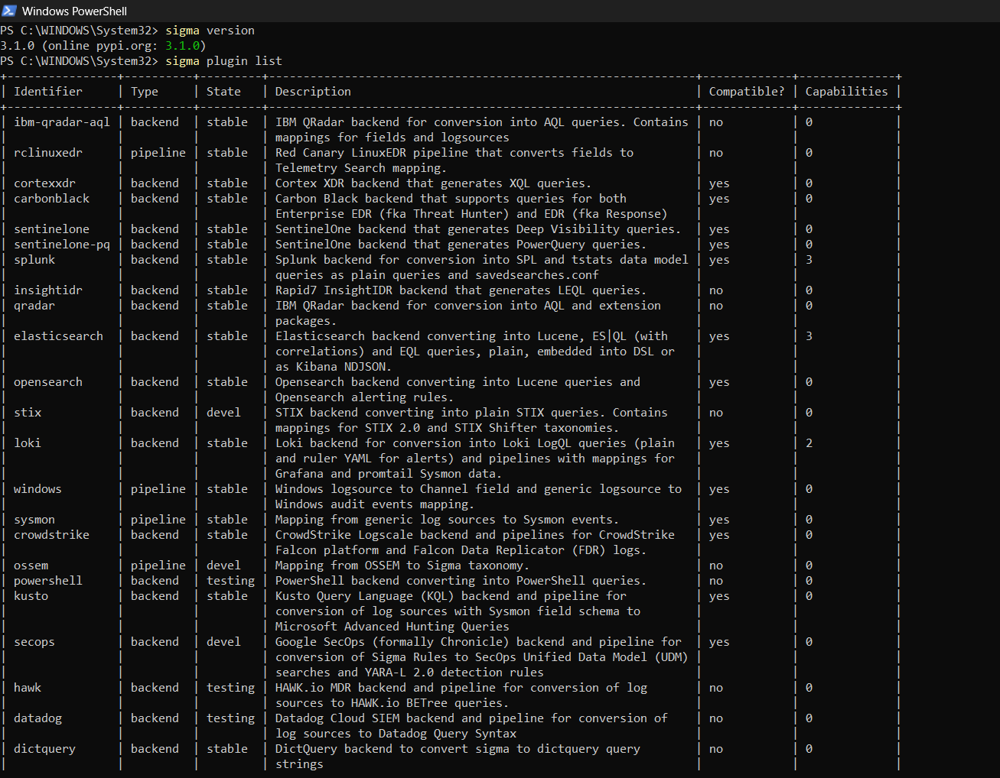
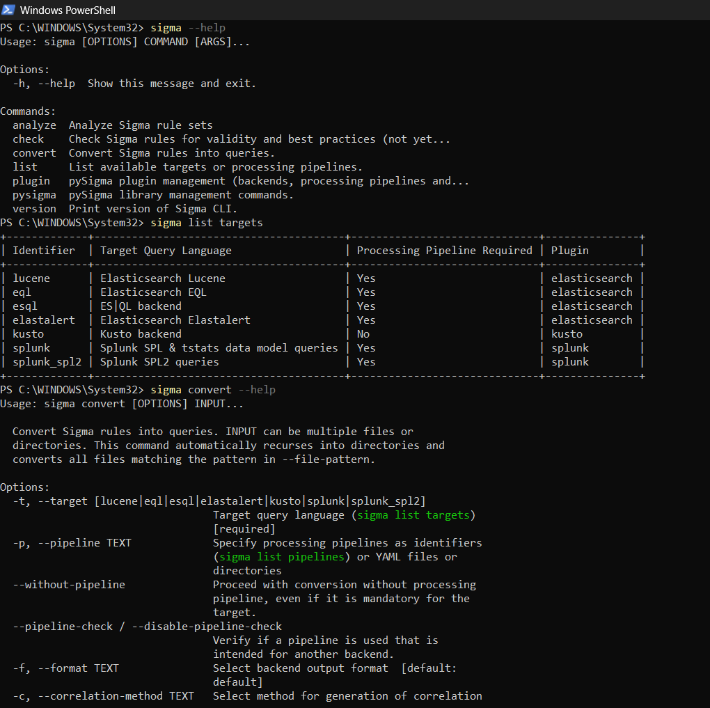
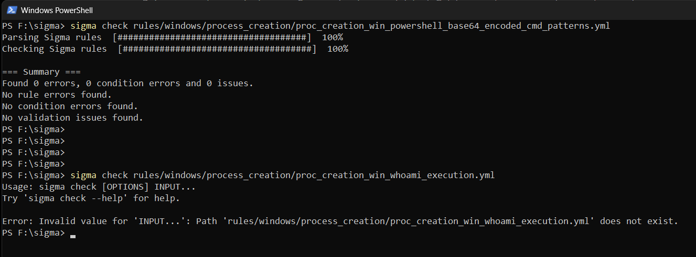
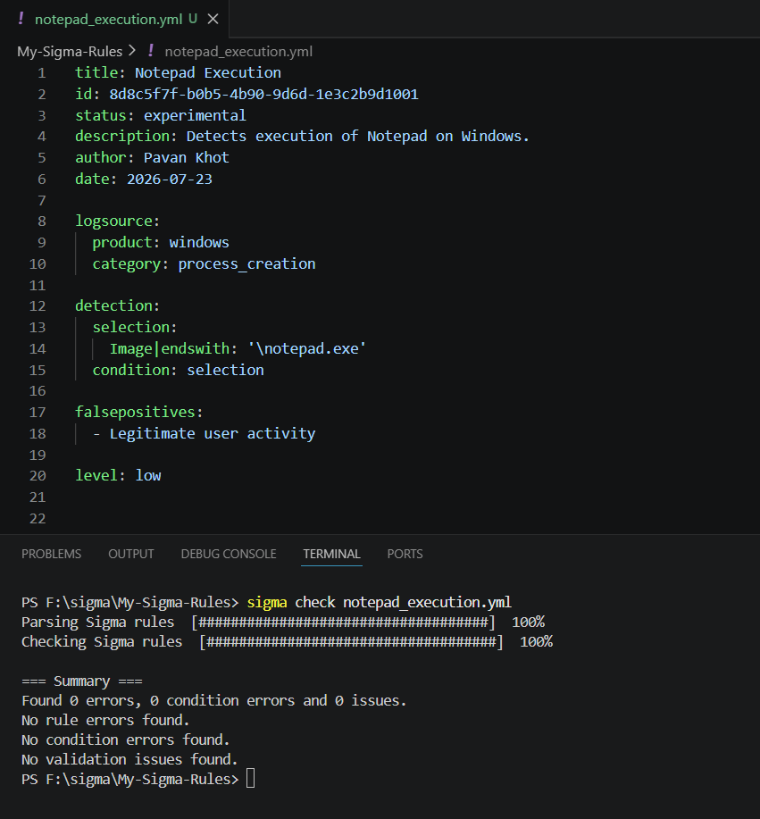
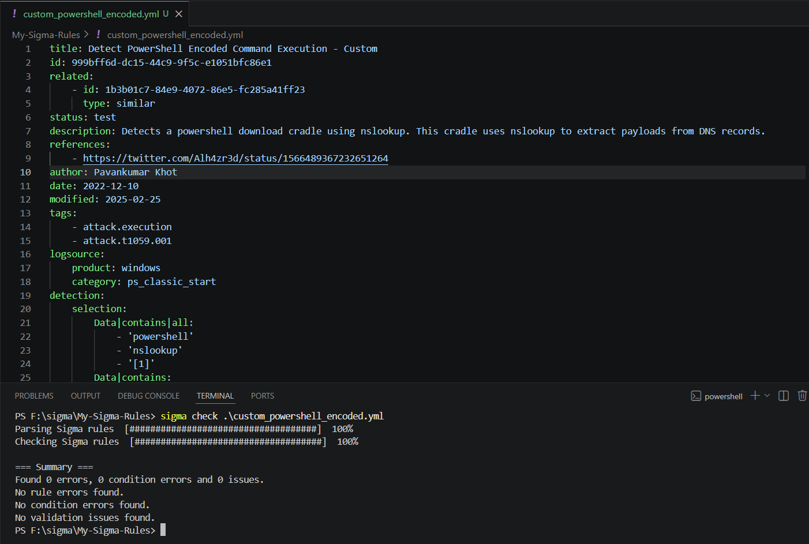
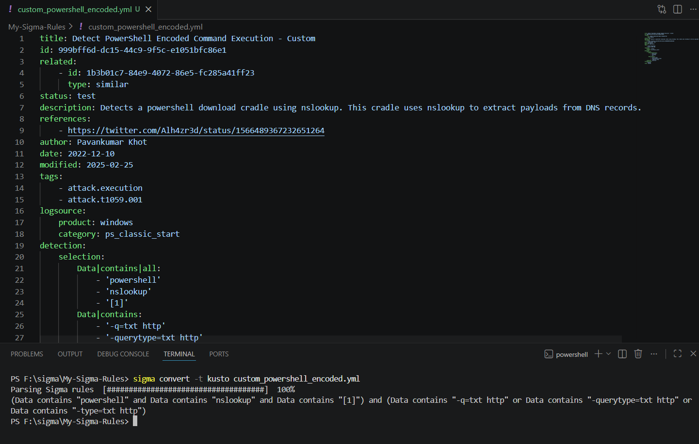

# 02 - Building & Converting Sigma Rules

## Overview

This module focuses on the practical use of Sigma rules. You will install the Sigma CLI, validate existing rules, create your own Sigma rule, customize an existing community rule, and convert it into Microsoft Sentinel Kusto Query Language (KQL).

By the end of this module, you'll understand the complete workflow of creating, validating, and converting Sigma rules before deploying them into Microsoft Sentinel.

---

## Learning Objectives

After completing this module, you will be able to:

- Install and configure Sigma CLI.
- Validate Sigma rules.
- Create a custom Sigma rule.
- Modify an existing SigmaHQ rule.
- Convert Sigma rules into Microsoft Sentinel KQL.
- Understand the generated KQL query.

---

# 1. Install Sigma CLI

## Theory

Sigma CLI is the official command-line utility used to validate and convert Sigma rules. It is built on top of the pySigma framework and supports multiple SIEM backends through plugins. In this lab, we'll use the **Kusto backend** to generate Microsoft Sentinel KQL.

## Commands

### Verify Python Installation

```powershell
python --version
```

**Description:** Verifies that Python is installed.

---

### Verify pip

```powershell
python -m pip --version
```

**Description:** Displays the installed pip version.

---

### Upgrade pip

```powershell
python -m pip install --upgrade pip
```

**Description:** Upgrades pip to the latest version.

---

### Install Sigma CLI

```powershell
python -m pip install sigma-cli
```

**Description:** Installs the Sigma CLI.

---

### Install Kusto Backend

```powershell
python -m pip install pysigma-backend-kusto
```

**Description:** Installs the Microsoft Sentinel (Kusto) backend.

---

### Verify Installation

```powershell
sigma version
```

**Description:** Confirms that Sigma CLI is installed successfully.

## Verification

- Python installed successfully.
- Sigma CLI installed successfully.
- `sigma version` returns the installed version.

## Screenshot



---

# 2. Explore Sigma CLI

## Theory

The Sigma CLI provides commands for rule validation, conversion, and backend management. Before working with Sigma rules, it's useful to explore its available capabilities.

## Commands

### Display Help

```powershell
sigma --help
```

**Description:** Displays all available Sigma CLI commands.

---

### Display Conversion Help

```powershell
sigma convert --help
```

**Description:** Displays all available conversion options.

---

### List Supported Targets

```powershell
sigma list targets
```

**Description:** Lists all supported conversion targets.

---

### List Available Pipelines

```powershell
sigma list pipelines
```

**Description:** Lists all available processing pipelines.

## Verification

- Help menu displayed successfully.
- Supported targets listed.
- Processing pipelines listed.

## Screenshot



---

# 3. Validate Existing Sigma Rules

## Theory

Validation ensures that a Sigma rule follows the correct YAML syntax and Sigma specification before it is converted or deployed.

## Commands

### Clone SigmaHQ Repository

```powershell
git clone https://github.com/SigmaHQ/sigma.git
```

**Description:** Downloads the official Sigma rule repository.

---

### Navigate to Repository

```powershell
cd sigma
```

**Description:** Changes the current directory to the Sigma repository.

---

### Validate PowerShell Rule

```powershell
sigma check rules/windows/process_creation/proc_creation_win_powershell_base64_encoded_cmd_patterns.yml
```

**Description:** Validates the selected PowerShell Sigma rule.

---

### Validate Another Rule

```powershell
sigma check rules/windows/process_creation/proc_creation_win_whoami_execution.yml
```

**Description:** Validates another Sigma rule.

## Verification

- PowerShell rule validated successfully.
- Additional rule validated successfully.

## Screenshot



---

# 4. Create Your First Sigma Rule

## Theory

Detection Engineers frequently create custom Sigma rules for organization-specific detections. This exercise demonstrates the minimum structure required for a valid Sigma rule.

## Commands

### Create Working Directory

```powershell
mkdir My-Sigma-Rules
cd My-Sigma-Rules
```

**Description:** Creates a dedicated folder for custom Sigma rules.

---

### Create Rule File

Create a new file named:

```text
notepad_execution.yml
```

**Description:** Creates a custom Sigma rule.

---

### Validate the Rule

```powershell
sigma check notepad_execution.yml
```

**Description:** Validates the custom Sigma rule.

## Verification

- Custom Sigma rule created.
- Rule validated successfully.

## Screenshot



---

# 5. Modify an Existing Sigma Rule

## Theory

Instead of creating every rule from scratch, Detection Engineers often customize community-maintained Sigma rules to align with their environment and detection requirements.

## Commands

### Copy Existing Rule

Copy the PowerShell rule into your custom rules directory.

Rename it to:

```text
custom_powershell_encoded.yml
```

**Description:** Creates a customized version of the original Sigma rule.

---

### Validate the Modified Rule

```powershell
sigma check custom_powershell_encoded.yml
```

**Description:** Validates the modified Sigma rule.

## Verification

- Rule customized successfully.
- Modified rule validated successfully.

## Screenshot



---

# 6. Convert Sigma Rules into Microsoft Sentinel KQL

## Theory

Sigma rules are platform-independent. Using the Kusto backend, the Sigma CLI converts a Sigma rule into Microsoft Sentinel KQL while preserving the original detection logic.

## Commands

### Convert Sigma Rule

```powershell
sigma convert -t kusto custom_powershell_encoded.yml
```

**Description:** Converts the Sigma rule into Microsoft Sentinel KQL.

## Understanding the Generated Query

The generated KQL detects:

- PowerShell execution
- `nslookup` execution
- DNS TXT record queries
- Command-line patterns defined in the Sigma rule

Although the syntax changes, the original detection logic remains unchanged.

## Verification

- KQL generated successfully.
- Generated query reviewed.

## Screenshot



---

# Module Summary

In this module, you successfully:

- Installed and configured Sigma CLI.
- Explored the Sigma CLI.
- Validated existing Sigma rules.
- Created a custom Sigma rule.
- Modified an existing SigmaHQ rule.
- Converted a Sigma rule into Microsoft Sentinel KQL.

The next module focuses on deploying the generated KQL into Microsoft Sentinel, creating Analytics Rules, validating detections, and generating security alerts.
