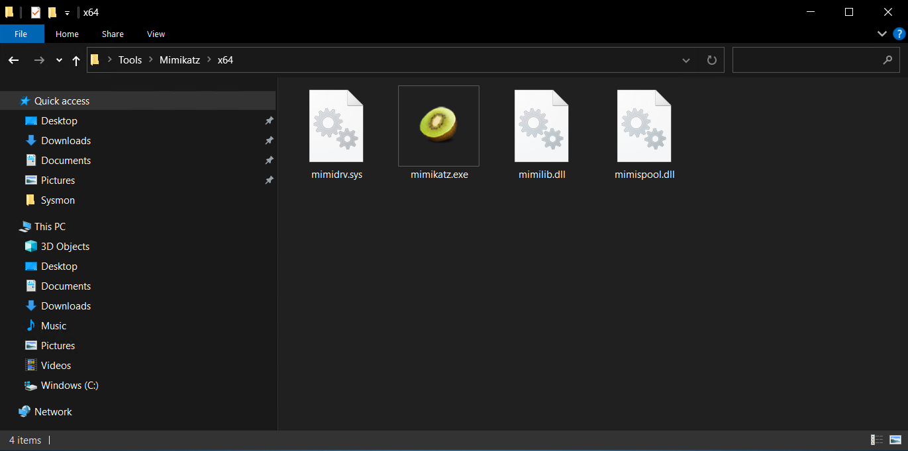
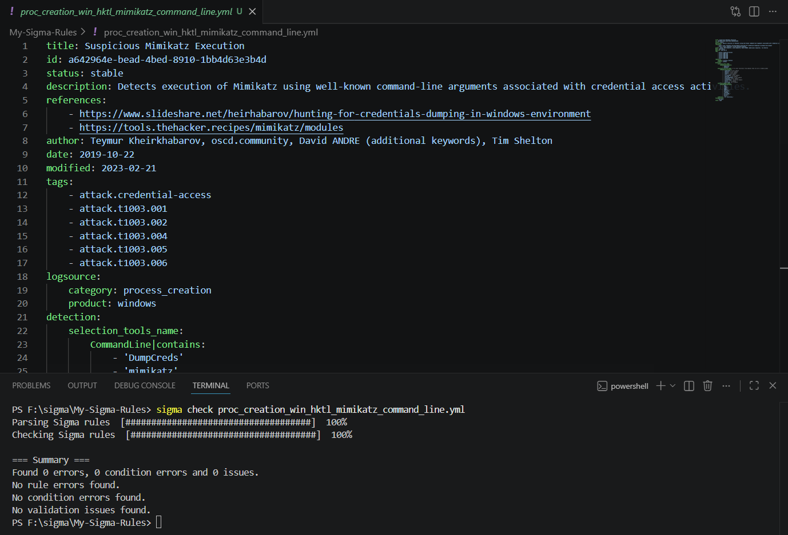
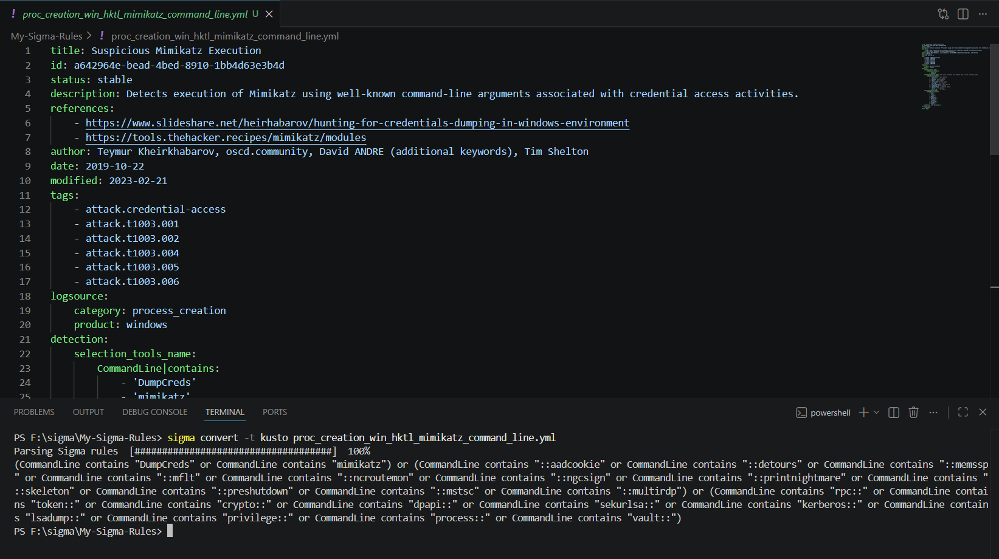
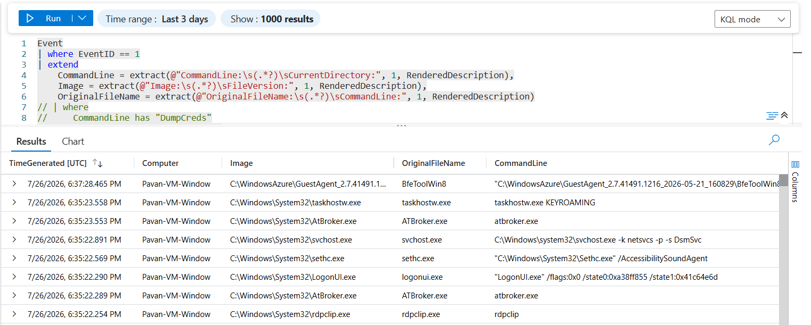
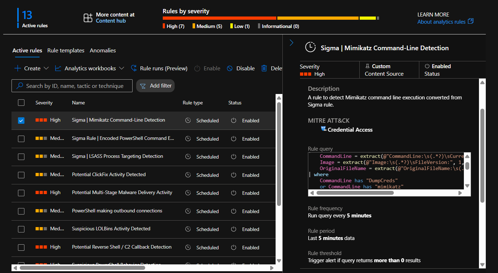
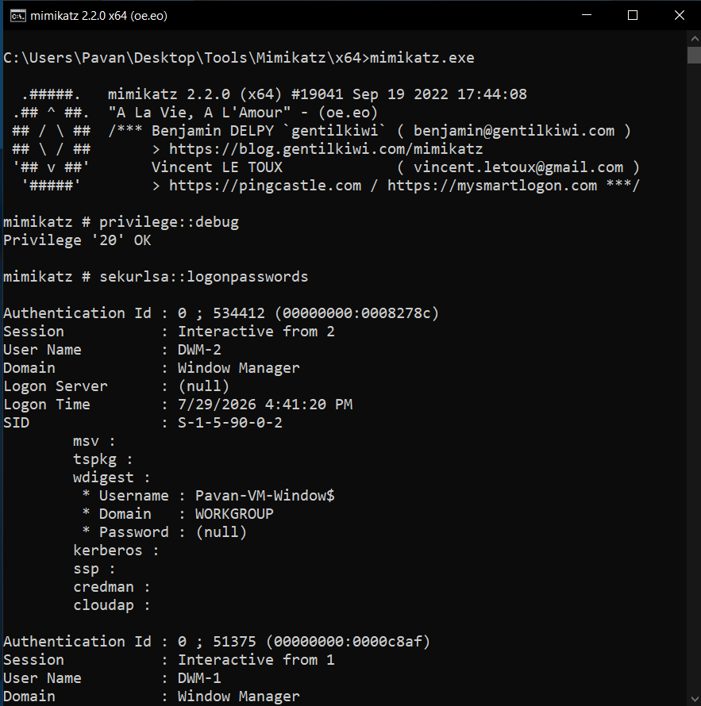
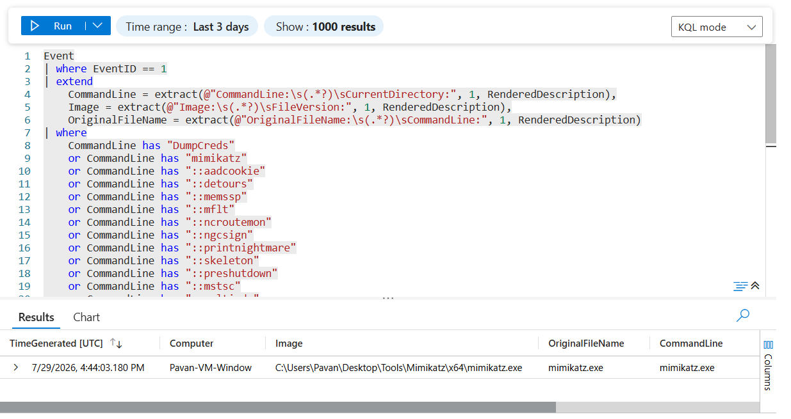
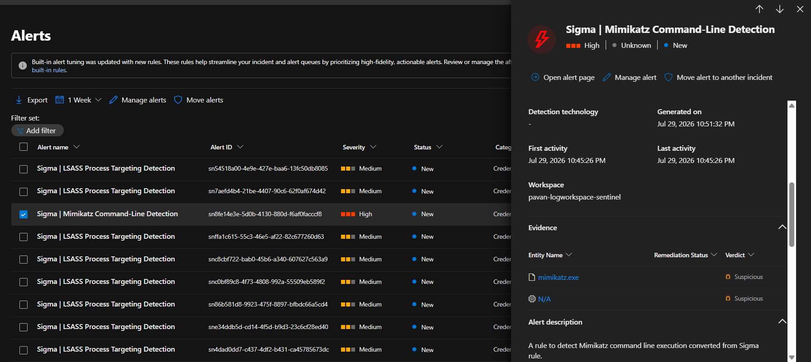
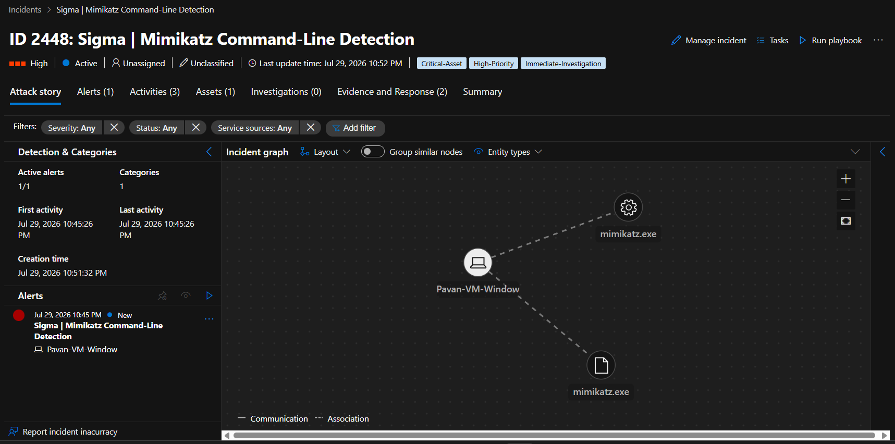
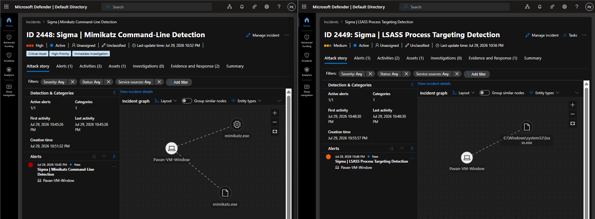

# 05 - End-to-End Detection Engineering: LSASS Credential Dumping

## Objective

The objective of this module is to validate a complete detection engineering workflow by simulating an LSASS credential dumping attack using Mimikatz and detecting it in Microsoft Sentinel using Sigma-based analytics rules.

Unlike the previous module, which focused on building a custom detection for LSASS process targeting, this module demonstrates how multiple independent detections can identify different stages of the same attack, providing layered detection coverage and improving overall visibility during incident response.

---

## Detection Architecture

```text
                           Mimikatz
                               │
                               ▼
                 Process Creation (Event ID 1)
                               │
                               ▼
       Sigma | Mimikatz Command-Line Detection
                               │
                               │
                               ├──────────────────────────────┐
                               │                              │
                               ▼                              ▼
                  LSASS Memory Access          Process Access (Event ID 10)
                                                      │
                                                      ▼
          Sigma | LSASS Process Targeting Detection
                                                      │
                                                      ▼
                              Microsoft Sentinel Alerts
                                                      │
                                                      ▼
                                   Incident Investigation
```

---

## Prerequisites

Before starting this module, ensure the following requirements are met:

- Microsoft Sentinel workspace is deployed and operational.
- Windows Server VM is connected using Azure Monitor Agent (AMA).
- Sysmon is installed and configured.
- Sysmon Event ID 1 (Process Creation) logging is enabled.
- Sysmon Event ID 10 (Process Access) logging is enabled.
- Microsoft Sentinel is successfully ingesting Sysmon telemetry into the **Event** table.
- Module **04 - Custom Detection Engineering: Detecting LSASS Targeting** has been completed successfully.
- Mimikatz is downloaded and extracted on the Windows VM.
- Microsoft Defender Real-Time Protection is disabled (lab environment only).

---

> [!WARNING]
> **This module executes Mimikatz to simulate an LSASS credential dumping attack. Perform these steps only in an isolated lab environment under your control or with explicit authorization. Never execute these techniques against production systems.**


---

## Step 1 – Prepare Mimikatz

Download the latest Mimikatz release from the official repository and extract it to the Windows VM.

Example directory:

```text
C:\Tools\Mimikatz\
```

This module uses Mimikatz solely for generating controlled telemetry to validate Microsoft Sentinel detections.

### Screenshot



---

## Step 2 – Analyze the Sigma Rule

This module uses the following Sigma rule from the SigmaHQ repository:

```text
proc_creation_win_hktl_mimikatz_command_line.yml
```

The rule detects well-known Mimikatz command-line arguments and module names associated with credential dumping activities.

Detection coverage includes:

- `mimikatz`
- `DumpCreds`
- `sekurlsa::`
- `privilege::`
- `lsadump::`
- `kerberos::`
- `token::`
- `vault::`
- Multiple additional Mimikatz modules

The rule was validated locally using Sigma CLI before conversion.

```bash
sigma check proc_creation_win_hktl_mimikatz_command_line.yml
```

Validation Result:

```text
Found 0 errors, 0 condition errors and 0 issues.
```

### Screenshot



---

## Step 3 – Convert the Sigma Rule to KQL

After validating the Sigma rule, convert it into Kusto Query Language (KQL) using the Sigma CLI.

```bash
sigma convert -t kusto proc_creation_win_hktl_mimikatz_command_line.yml
```

The generated query detects well-known Mimikatz command-line arguments by searching the `CommandLine` field for commonly used modules and keywords.

Although the Sigma conversion is accurate, the generated query cannot be used directly in Microsoft Sentinel because the required fields are embedded inside the **RenderedDescription** field of the **Event** table.

### Screenshot



---

## Step 4 – Adapt the KQL Query for Microsoft Sentinel

Since Sysmon Process Creation events are stored in the **Event** table, the relevant fields must first be extracted from **RenderedDescription** before applying the Sigma detection logic.

The following fields were extracted:

- CommandLine
- Image
- OriginalFileName

The adapted KQL query:

```kusto
Event
| where EventID == 1
| extend
    CommandLine = extract(@"CommandLine:\s(.*?)\sCurrentDirectory:", 1, RenderedDescription),
    Image = extract(@"Image:\s(.*?)\sFileVersion:", 1, RenderedDescription),
    OriginalFileName = extract(@"OriginalFileName:\s(.*?)\sCommandLine:", 1, RenderedDescription)
| where
    CommandLine has "DumpCreds"
    or CommandLine has "mimikatz"
    or CommandLine has "::aadcookie"
    or CommandLine has "::detours"
    or CommandLine has "::memssp"
    or CommandLine has "::mflt"
    or CommandLine has "::ncroutemon"
    or CommandLine has "::ngcsign"
    or CommandLine has "::printnightmare"
    or CommandLine has "::skeleton"
    or CommandLine has "::preshutdown"
    or CommandLine has "::mstsc"
    or CommandLine has "::multirdp"
    or CommandLine has "rpc::"
    or CommandLine has "token::"
    or CommandLine has "crypto::"
    or CommandLine has "dpapi::"
    or CommandLine has "sekurlsa::"
    or CommandLine has "kerberos::"
    or CommandLine has "lsadump::"
    or CommandLine has "privilege::"
    or CommandLine has "process::"
    or CommandLine has "vault::"
| project TimeGenerated, Computer, Image, OriginalFileName, CommandLine
```

Executing the adapted query successfully returned Mimikatz process creation events from the Sentinel **Event** table, confirming that the Sigma rule had been successfully adapted for the lab environment.

### Screenshot



---

## Step 5 – Create the Microsoft Sentinel Analytics Rule

Create a new **Scheduled Analytics Rule** using the adapted KQL query.

### Rule Configuration

| Property | Value |
|----------|-------|
| Rule Name | **Sigma \| Mimikatz Command-Line Detection** |
| Severity | High |
| MITRE ATT&CK | Credential Access |
| Query Frequency | 5 Minutes |
| Lookup Period | 5 Minutes |
| Trigger | Results greater than 0 |
| Event Grouping | Group all events into a single alert |
| Incident Creation | Enabled |

The analytics rule enriches alerts with the following custom details:

- Image
- OriginalFileName
- CommandLine

These fields provide additional context during incident investigation and simplify analyst triage.

### Screenshot



---

## Step 6 – Simulate LSASS Credential Dumping

Launch **Mimikatz** with administrative privileges and execute the following commands to simulate a credential dumping attack.

```text
privilege::debug
sekurlsa::logonpasswords
```

The `privilege::debug` command enables the required debug privilege, while `sekurlsa::logonpasswords` attempts to access credentials stored in the LSASS process.

Although the output displayed **Password : (null)** in this lab environment, the objective was not to retrieve credentials but to generate telemetry for validating the deployed detections.

This behavior is expected on modern Windows Server versions due to built-in security protections such as LSA Protection, Credential Guard, or the absence of cached credentials.

### Screenshot



---

## Step 7 – Validate Telemetry in Microsoft Sentinel

After executing Mimikatz, verify that the Sysmon **Process Creation (Event ID 1)** event has been successfully ingested into Microsoft Sentinel.

Execute the adapted KQL query in the **Logs** blade and confirm that the event contains the extracted fields:

- Computer
- Image
- OriginalFileName
- CommandLine
- TimeGenerated

Successful query results confirm that:

- Sysmon generated the telemetry.
- Azure Monitor Agent successfully collected the event.
- Microsoft Sentinel ingested the event.
- The Sigma detection logic correctly identified the Mimikatz execution.

### Screenshot



---

## Step 8 – Validate Alert Generation

After the scheduled analytics rule completed its evaluation cycle, Microsoft Sentinel generated an alert for the simulated Mimikatz execution.

The alert was created by the **Sigma | Mimikatz Command-Line Detection** analytics rule, confirming that the adapted Sigma rule successfully detected the malicious process creation event.

This validates the complete detection pipeline from telemetry generation to alert creation.

### Screenshot



---

## Step 9 – Validate Incident Creation

The generated alert was automatically converted into a Microsoft Sentinel incident.

The incident includes:

- Alert details
- Severity
- Related entities
- MITRE ATT&CK mapping
- Investigation timeline

Automatic incident creation demonstrates that the analytics rule is fully integrated into the Microsoft Sentinel incident management workflow.

### Screenshot



---

## Step 10 – Validate Layered Detection Engineering

In addition to the newly created Mimikatz detection, the analytics rule developed in the previous module also triggered successfully.

Both analytics rules independently detected different stages of the same attack.

### Detection 1

**Sigma | Mimikatz Command-Line Detection**

Detects execution of the Mimikatz tool using Sysmon **Event ID 1 (Process Creation)**.

### Detection 2

**Sigma | LSASS Process Targeting Detection**

Detects attempts to access the LSASS process using Sysmon **Event ID 10 (Process Access)**.

This demonstrates a layered detection strategy where:

- One rule identifies execution of a known offensive tool.
- The second rule identifies the malicious behavior regardless of the tool being used.

This defense-in-depth approach improves detection coverage and provides stronger visibility during incident investigation.

### Screenshot



---

## Conclusion

In this module, a complete detection engineering workflow was successfully implemented by adapting a Sigma rule for Microsoft Sentinel, deploying it as a Scheduled Analytics Rule, and validating it through a controlled Mimikatz credential dumping simulation.

The lab demonstrated the complete detection lifecycle:

- Sigma rule validation
- Sigma-to-KQL conversion
- Query adaptation for Microsoft Sentinel
- Analytics rule deployment
- Attack simulation
- Telemetry validation
- Alert generation
- Incident creation
- Layered detection using complementary analytics rules

By correlating both **Mimikatz Command-Line Detection** and **LSASS Process Targeting Detection**, the lab illustrates how combining tool-based and behavior-based detections significantly improves detection capability and provides a more resilient approach to identifying credential dumping attacks.
