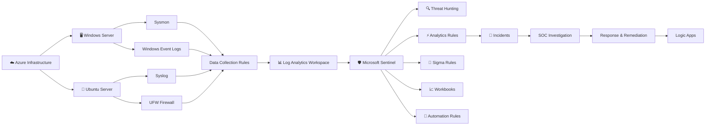
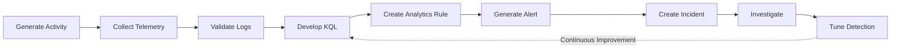
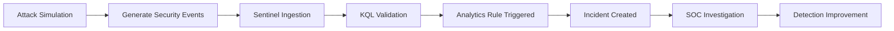

<div align="center">

# 🛡️ Azure SOC Simulation Project

### Building an Enterprise-Grade Security Operations Center on Microsoft Azure

*A hands-on cybersecurity project covering telemetry engineering, detection engineering, threat hunting, incident response, automation, and attack simulation using Microsoft Sentinel.*

<p>


</p>

<p>


</p>

</div>

---

> [!IMPORTANT]
>
> This repository documents the complete process of designing, building, and operating a cloud-native **Security Operations Center (SOC)** on **Microsoft Azure** using **Microsoft Sentinel** and **Microsoft Defender XDR**.
>
> The project follows the same operational lifecycle used in modern SOC environments—from infrastructure deployment and telemetry engineering to detection development, threat hunting, incident investigation, automation, and attack simulation.

---

## 📊 Project Snapshot

| Category | Overview |
|-----------|----------|
| 🎯 Goal | Build and document an enterprise-inspired Security Operations Center |
| ☁️ Platform | Microsoft Azure |
| 🛡️ SIEM | Microsoft Sentinel |
| 🖥️ Operating Systems | Windows Server & Ubuntu Linux |
| 📡 Telemetry | Windows Events • Sysmon • Syslog • UFW |
| 🔍 Detection | KQL • Analytics Rules • Sigma Rules |
| ⚔️ Validation | Controlled Attack Simulations |
| 🤖 Automation | Automation Rules • Logic Apps |
| 📚 Approach | Documentation-First Learning |

---

## 🌟 Repository Highlights

| 🏗️ Build | 📡 Collect | 🔍 Detect | 🧪 Validate |
|:---------:|:---------:|:---------:|:-----------:|
| Azure Infrastructure | Windows & Linux Telemetry | KQL & Sigma Rules | Attack Simulations |

| 🚨 Investigate | 🤖 Automate | 📖 Document | 🎯 Improve |
|:--------------:|:-----------:|:-----------:|:----------:|
| Threat Hunting | Logic Apps | Step-by-Step Guides | Detection Engineering |

---

## 💼 Skills Demonstrated

| Domain | Technologies & Concepts |
|---------|-------------------------|
| ☁️ Cloud | Azure • Azure Monitor • Log Analytics • Data Collection Rules |
| 🛡️ Security | Microsoft Sentinel • Defender XDR • Microsoft Entra ID |
| 📡 Telemetry | Sysmon • Windows Event Logs • Syslog • UFW Firewall |
| 🔍 Detection | KQL • Sigma Rules • Analytics Rules • MITRE ATT&CK |
| 🚨 SOC Operations | Threat Hunting • Incident Response • Investigation • Automation |

---

## 🎯 Project Philosophy

Unlike repositories that focus primarily on product configuration, this project emphasizes the complete engineering workflow behind modern security operations.

Every module is built around four principles:

| 📖 Learn | 🛠️ Build | 🧪 Validate | 📚 Document |
|:---------:|:---------:|:-----------:|:-----------:|
| Understand the concept | Configure the solution | Verify using live telemetry | Create reusable documentation |

---

> [!NOTE]
>
> Every module is independently documented with architecture, implementation, validation, troubleshooting, detection logic, lessons learned, and practical references to create a reusable knowledge base rather than a collection of isolated lab exercises.

---

⬇️ **Continue below to explore the complete SOC architecture, learning roadmap, and interactive module dashboard.**

---

# 🗺️ SOC Learning Journey

The repository follows the lifecycle of building and operating a modern Security Operations Center. Each phase builds upon the previous one, gradually introducing new concepts, technologies, and practical implementations.


# 📚 Repository Modules

> [!TIP]
> The project is organized into six learning phases. Each phase builds upon the previous one, guiding you from Azure infrastructure deployment to advanced SOC operations.

<table>

<tr>

<td width="33%" valign="top">

### ☁️ Foundation

- Azure Environment Setup
- Microsoft Sentinel
- Data Connectors
- Log Analytics

</td>

<td width="33%" valign="top">

### 📡 Telemetry Engineering

- Windows Telemetry
- Linux Telemetry
- Sysmon
- Data Collection Rules

</td>

<td width="33%" valign="top">

### 🔍 Detection Engineering

- KQL
- Analytics Rules
- Detection Validation
- Detection Tuning

</td>

</tr>

<tr>

<td valign="top">

### 📜 Sigma Rules

- Sigma Fundamentals
- Rule Conversion
- Sentinel Deployment
- Rule Validation

</td>

<td valign="top">

### ⚔️ Attack Simulations

- Credential Access
- PowerShell
- LSASS Credential Dumping
- Multi-Stage Malware

</td>

<td valign="top">

### 🤖 Automation

- Automation Rules
- Logic Apps
- Incident Response
- SOC Automation

</td>

</tr>

</table>

---

# 🎯 Learning Approach

```text
📖 Learn  →  🛠️ Build  →  🧪 Validate  →  🔍 Detect  →  🚨 Investigate  →  📈 Improve  →  📚 Document
```

| Phase | Objective |
|--------|-----------|
| 📖 Learn | Understand the security concept and its purpose |
| 🛠️ Build | Deploy and configure the solution |
| 🧪 Validate | Verify telemetry and expected behavior |
| 🔍 Detect | Develop and test detection logic |
| 🚨 Investigate | Analyze alerts and incidents |
| 📈 Improve | Tune detections and reduce noise |
| 📚 Document | Produce reusable implementation guides |

---

# 🧭 Explore the Repository

| Category | Focus | Technologies |
|----------|-------|--------------|
| ☁️ Infrastructure | Azure Resources & Networking | Azure |
| 🛡️ SIEM | Security Monitoring | Microsoft Sentinel |
| 📡 Telemetry | Windows & Linux Logging | Sysmon, Syslog, UFW |
| 🔍 Hunting | Threat Investigation | KQL |
| ⚡ Detection | Analytics Engineering | KQL, Sigma |
| ⚔️ Validation | Attack Simulation | PowerShell, Windows |
| 🤖 Automation | Response Workflows | Logic Apps |

> [!TIP]
> While modules can be completed independently, following them in order provides a structured progression from Azure fundamentals to advanced detection engineering and automation.

---
---

# 🏛️ SOC Architecture

The project simulates the complete lifecycle of a modern cloud-native Security Operations Center (SOC), from telemetry collection and detection engineering to incident investigation, automation, and response.



---

# 🔄 Detection Engineering Pipeline

Every detection in this repository follows a structured engineering workflow rather than simply enabling pre-built analytics.



---

# ⚔️ Attack Simulation Workflow

Attack simulations are used to validate telemetry, detections, and investigation procedures in a controlled lab environment.



---

# 📊 Security Operations Lifecycle

```text
Collect Telemetry → Detect → Investigate → Respond → Recover → Improve
```

This repository demonstrates each stage of the SOC lifecycle using practical implementations, custom detections, and documented validation procedures.

---

> [!TIP]
> The project emphasizes **engineering detections** rather than simply enabling them. Every alert is backed by telemetry validation, KQL development, attack simulation, and iterative tuning to better reflect real-world SOC practices.

---

---

# 🚀 Core Capabilities

<table>

<tr>

<td width="50%" valign="top">

### 📡 Telemetry Engineering

- Windows Event Logs
- Linux Syslog
- Sysmon Configuration
- UFW Firewall Logging
- Data Collection Rules (DCR)
- Log Validation

</td>

<td width="50%" valign="top">

### 🔍 Threat Hunting

- Kusto Query Language (KQL)
- Threat Hunting Queries
- Event Correlation
- IOC Investigation
- Log Analysis
- MITRE ATT&CK Mapping

</td>

</tr>

<tr>

<td valign="top">

### ⚡ Detection Engineering

- Scheduled Analytics Rules
- Near Real-Time (NRT) Rules
- Custom KQL Detections
- Sigma Rule Conversion
- Detection Validation
- Detection Tuning

</td>

<td valign="top">

### ⚔️ Attack Simulation

- PowerShell Abuse
- LSASS Credential Dumping
- Credential Access
- Malware Simulation
- Detection Verification
- Incident Generation

</td>

</tr>

<tr>

<td valign="top">

### 🤖 Automation

- Automation Rules
- Logic Apps
- Incident Enrichment
- Automated Response
- Workflow Orchestration
- Playbook Integration

</td>

<td valign="top">

### 📚 Documentation

- Architecture Diagrams
- Step-by-Step Guides
- Troubleshooting
- Validation Procedures
- Lessons Learned
- Knowledge Checks

</td>

</tr>

</table>

---

# 🛠️ Technology Stack

| Category | Technologies |
|----------|--------------|
| ☁️ Cloud | Microsoft Azure, Azure Monitor, Log Analytics |
| 🛡️ Security | Microsoft Sentinel, Microsoft Defender XDR, Microsoft Entra ID |
| 💻 Operating Systems | Windows Server 2022, Ubuntu Server |
| 📡 Telemetry | Sysmon, Windows Event Logs, Syslog, UFW |
| 🔍 Detection | KQL, Sigma Rules, Analytics Rules |
| 🤖 Automation | Automation Rules, Logic Apps |
| 📊 Frameworks | MITRE ATT&CK, Security Operations Center (SOC) |

---

# 📈 Skills Demonstrated

<table>

<tr>

<td width="33%" align="center">

### Cloud Security

Azure Administration

Sentinel Deployment

Identity & Access

Infrastructure

</td>

<td width="33%" align="center">

### Detection

Threat Hunting

Detection Engineering

KQL

Sigma Rules

</td>

<td width="33%" align="center">

### Operations

Incident Investigation

Automation

Telemetry Analysis

Documentation

</td>

</tr>

</table>

---

> [!NOTE]
> Every capability shown above is backed by practical implementation, validation, and documentation within the corresponding project modules.

---

---

# 🎯 Project Deliverables

The repository focuses on building practical SOC capabilities rather than simply configuring Azure services. Each module contributes to one or more real-world security engineering outcomes.

| Category | Deliverables |
|----------|--------------|
| ☁️ Azure Infrastructure | Resource Groups, Networking, Virtual Machines, IAM & RBAC |
| 🛡️ Microsoft Sentinel | Workspace Deployment, Data Connectors, Incident Management |
| 📡 Telemetry Engineering | Windows Event Logs, Sysmon, Linux Syslog, UFW, Data Collection Rules |
| 🔍 Threat Hunting | KQL Queries, Log Correlation, IOC Analysis, Threat Investigation |
| ⚡ Detection Engineering | Scheduled Rules, NRT Rules, Custom Analytics, Detection Tuning |
| 📜 Sigma Rules | Rule Development, Conversion, Deployment & Validation |
| ⚔️ Attack Simulations | PowerShell, Credential Access, LSASS Dumping, Multi-Stage Attack Scenarios |
| 🤖 Automation | Automation Rules, Logic Apps, Incident Enrichment & Response |
| 📊 Documentation | Architecture Diagrams, Validation Steps, Troubleshooting, Knowledge Checks |

---

# 📈 Engineering Workflow

Every module follows a repeatable engineering process to ensure implementations are validated before moving to the next phase.


---

# 🧩 Key Components

| Component | Purpose |
|-----------|---------|
| 📊 Log Analytics Workspace | Centralized storage and querying of telemetry |
| 🛡️ Microsoft Sentinel | SIEM platform for monitoring, analytics, and incident management |
| 📡 Data Collection Rules | Secure telemetry ingestion from Windows and Linux endpoints |
| 💻 Windows Server | Security Event Logs, Sysmon, PowerShell logging |
| 🐧 Ubuntu Server | Syslog, UFW firewall logging, Linux telemetry |
| 🔍 KQL | Threat hunting, investigations, and custom detections |
| 📜 Sigma Rules | Portable detection engineering and rule conversion |
| 🤖 Logic Apps | Automated investigation and response workflows |

---

> [!TIP]
> Rather than treating each module as an isolated lab, this project demonstrates how infrastructure, telemetry, detections, investigations, and automation work together to build an operational Security Operations Center.

---

---

# 🏆 Why This Project Stands Out

Unlike repositories that primarily demonstrate product configuration, this project emphasizes the complete engineering lifecycle behind modern Security Operations Centers (SOCs).

<table>

<tr>

<td width="25%" align="center">

### 🏗️ Build

Deploy and configure enterprise-grade Azure security infrastructure.

</td>

<td width="25%" align="center">

### 📡 Collect

Generate, ingest, and validate Windows and Linux security telemetry.

</td>

<td width="25%" align="center">

### 🔍 Detect

Engineer custom detections using KQL, Sigma Rules, and Microsoft Sentinel.

</td>

<td width="25%" align="center">

### 🚨 Respond

Investigate incidents, tune detections, and automate response workflows.

</td>

</tr>

</table>

---

# ✅ Validation-Driven Development

Every implementation in this repository follows a structured validation process before being considered complete.

```text
Configuration
      │
      ▼
Telemetry Generation
      │
      ▼
Log Ingestion
      │
      ▼
KQL Validation
      │
      ▼
Detection Development
      │
      ▼
Alert Generation
      │
      ▼
Incident Investigation
      │
      ▼
Documentation
```

---

# 📖 Documentation Standards

Each module follows a consistent documentation structure to ensure repeatability, clarity, and long-term maintainability.

| Section | Purpose |
|---------|---------|
| 🎯 Objective | Define the learning goal and expected outcome |
| 📚 Background | Explain the underlying concepts |
| 🛠️ Implementation | Step-by-step deployment and configuration |
| ✅ Validation | Verify telemetry and expected behavior |
| 🔍 Detection Logic | Explain the KQL queries or analytics rules |
| 🛠️ Troubleshooting | Common issues and their resolutions |
| 💡 Lessons Learned | Practical observations and key takeaways |
| ❓ Knowledge Check | Review questions for reinforcement |

---

# 📊 Repository Principles

| Principle | Description |
|-----------|-------------|
| 📖 Documentation First | Every implementation is fully documented. |
| 🧪 Validate Everything | Configurations are verified using live telemetry. |
| 🎯 Practical Learning | Focus on real-world SOC engineering practices. |
| 🔄 Continuous Improvement | Detections are refined through testing and tuning. |
| ♻️ Reusability | Modules are designed as reusable technical references. |

---

> [!IMPORTANT]
> Every alert, detection, investigation, and automation workflow included in this repository has been implemented in a controlled lab environment for educational and defensive security purposes.

---
---

# 📂 Interactive Module Directory

> [!TIP]
> The project is organized as a progressive learning path. Each module builds upon the previous one, taking you from Azure deployment to advanced detection engineering and SOC automation.

| Module | Focus Area | Key Topics |
|:------:|------------|------------|
| **01** | ☁️ **Azure Setup** | Subscription, Resource Groups, Networking |
| **02** | 🛡️ **Sentinel Configuration** | Log Analytics Workspace, Microsoft Sentinel |
| **03** | 🔌 **Data Connectors** | Azure & Microsoft Security Data Sources |
| **04** | ✅ **Security Data Validation** | Verify Telemetry & Log Ingestion |
| **05** | 💻 **Virtual Machines Deployment** | Windows Server & Ubuntu Configuration |
| **06** | 📡 **Endpoint Telemetry Validation** | Windows Events, Sysmon, Linux Syslog |
| **07** | 📥 **Custom Log Ingestion** | Data Collection Rules & Custom Tables |
| **08** | ⚡ **Scheduled Query Analytics Rules** | Scheduled Detection Engineering |
| **09** | 🚨 **NRT Analytics Rules & Incident Creation** | Near Real-Time Detection |
| **10** | 🔍 **Incident Investigation & Analysis** | Alert Triage & Investigation |
| **11** | 📊 **Workbooks & Visualization** | Dashboards & Operational Visibility |
| **12** | 🤖 **Automation Rules** | Incident Automation & SOC Efficiency |
| **13** | 🔄 **Logic Apps & Playbooks** | Automated Investigation & Response |
| **14** | 📋 **Watchlists** | Context Enrichment & Detection |
| **15** | ⚔️ **Attack Simulations** | Detection Validation Using Realistic Attacks |
| **16** | 🛡️ **Network Security & Firewalling** | Windows Firewall, UFW & Network Monitoring |
| **17** | 👥 **Advanced RBAC & Permissions** | Identity, Roles & Least Privilege |
| **18** | 📜 **Detection Engineering with Sigma Rules** | Sigma Development, Conversion & Validation |

---

### ⭐ Additional Resources

| Resource | Description |
|----------|-------------|
| ⭐ **KQL Mastery** | Comprehensive Kusto Query Language reference with practical examples |
| 🏗️ **Architecture Flowcharts** | Visual representation of the SOC architecture and workflows |
| 📄 **Project Documentation** | Supporting diagrams, tables, and reference material |
