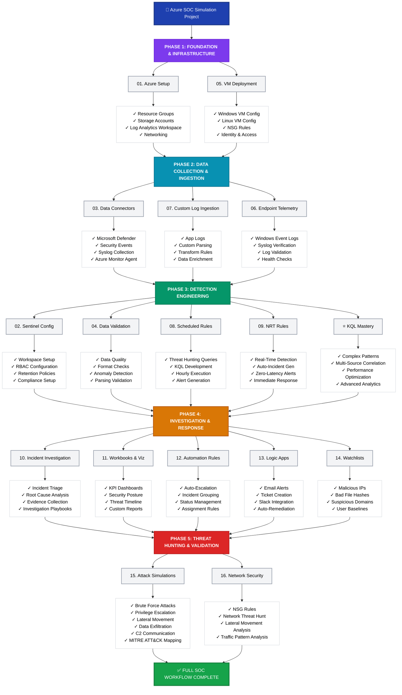

This flowchart visualizes your entire Azure SOC Simulation project in a structured, easy-to-understand format showing all 16 modules and their key features.

**Flowchart Highlights:**
- 🏗️ **5 Phases** from infrastructure to threat hunting
- 📦 **16 Modules** with specific implementations
- 🎯 **Color-coded** for easy visual navigation
- ✓ **Detailed features** under each module
- 🔄 **Flow progression** from setup to complete SOC operations
